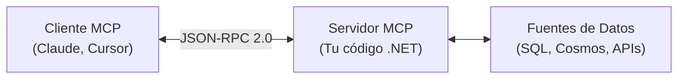
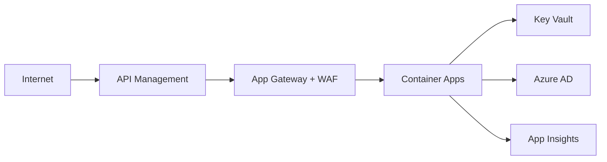

# Agenda del Taller: Model Context Protocol (MCP) en C#

**Evento**: Data Saturday Madrid 2025  
**Duración**: 180 minutos (3 horas)  
**Nivel**: Intermedio  
**Requisitos previos**: C# básico, .NET 10.0 instalado, Visual Studio Code

---

## 📋 Resumen Ejecutivo

Este taller intensivo de 3 horas te enseñará a crear servidores MCP (Model Context Protocol) en C# para conectar modelos de IA con tus fuentes de datos. A través de 4 ejercicios progresivos, aprenderás desde los fundamentos hasta la orquestación multi-fuente y seguridad empresarial.

**Al finalizar, serás capaz de**:

-   ✅ Crear servidores MCP desde cero en .NET
-   ✅ Implementar recursos (data sources) y herramientas (acciones)
-   ✅ Añadir autenticación JWT y rate limiting
-   ✅ Orquestar múltiples servidores MCP en arquitecturas distribuidas
-   ✅ Desplegar servidores MCP en Azure de forma segura

---

## 🗓️ Agenda Detallada (180 minutos)

| Bloque                                                                     | Tiempo      | Duración | Tipo            | Contenido                                       |
| -------------------------------------------------------------------------- | ----------- | -------- | --------------- | ----------------------------------------------- |
| **[1. Apertura](#bloque-1-apertura-10-min)**                               | 0-10 min    | 10 min   | Presentación    | Bienvenida, objetivos, logística                |
| **[2. Fundamentos MCP](#bloque-2-fundamentos-25-min)**                     | 10-35 min   | 25 min   | Teoría          | ¿Qué es MCP? Arquitectura, flujos, casos de uso |
| **[3. Anatomía + Ejercicio 1](#bloque-3-anatomia-30-min)**                 | 35-65 min   | 30 min   | Demo + Práctica | Crear servidor MCP con recursos estáticos       |
| **🔄 Descanso**                                                            | 65-68 min   | 3 min    | -               | Breve pausa                                     |
| **[4. Ejercicio 2: Consultas Paramétricas](#bloque-4-ejercicio-2-20-min)** | 68-88 min   | 20 min   | Ejercicio       | Añadir herramientas con parámetros              |
| **[5. Ejercicio 3: Seguridad](#bloque-5-ejercicio-3-20-min)**              | 88-108 min  | 20 min   | Ejercicio       | JWT, scopes, rate limiting                      |
| **🔄 Descanso**                                                            | 108-113 min | 5 min    | -               | Café, networking                                |
| **[6. Seguridad y Gobernanza](#bloque-6-seguridad-15-min)**                | 113-128 min | 15 min   | Sesión          | Azure AD, Key Vault, GDPR, arquitectura         |
| **[7. Ejercicio 4: Analista Virtual](#bloque-7-ejercicio-4-25-min)**       | 128-153 min | 25 min   | Ejercicio Grupo | Orquestación multi-fuente                       |
| **🔄 Descanso**                                                            | 153-156 min | 3 min    | -               | Formar equipos                                  |
| **[8. Orquestación Multi-Fuente](#bloque-8-orquestacion-15-min)**          | 156-171 min | 15 min   | Sesión          | Patrones: paralelo, secuencial, caching         |
| **[9. Roadmap y Casos B2B](#bloque-9-roadmap-10-min)**                     | 171-181 min | 10 min   | Business        | ROI, casos reales, monetización                 |
| **[10. Cierre y Retrospectiva](#bloque-10-cierre-10-min)**                 | 181-191 min | 10 min   | Cierre          | Retrospectiva 3-2-1, Q&A, próximos pasos        |
| **Buffer**                                                                 | 196-200 min | 4 min    | -               | Tiempo reserva para atrasos                     |

**Tiempo total**: 196 minutos efectivos + 4 min buffer = **200 min (3h 20m asignados)**

---

## 📚 Bloques Detallados

### Bloque 1: Apertura (10 min)

**Objetivo**: Presentar taller, instructor, y establecer expectativas.

**Contenido**:

-   Bienvenida y presentación del instructor
-   Objetivos del taller y agenda
-   Logística (WiFi, repositorio GitHub, descansos)
-   Verificación de requisitos técnicos (dotnet --version, VS Code)

**Entregable**: Repositorio clonado y verificación completada.

**[📄 Documentación completa →](./modules/01b-apertura.md)**

---

### Bloque 2: Fundamentos MCP (25 min)

**Objetivo**: Comprender qué es MCP, por qué existe, y cómo funciona.

**Contenido**:

-   Definición de MCP (Model Context Protocol)
-   Analogía USB-C: "Un servidor, múltiples clientes"
-   Arquitectura cliente-servidor
-   Flujo de comunicación (initialize → discover → execute)
-   JSON-RPC 2.0 como protocolo base
-   MCP vs Plugins tradicionales
-   Casos de uso empresariales: CRM enrichment, DevOps, compliance

**Diagrama clave**:



**[📄 Documentación completa →](./modules/02b-fundamentos.md)**

---

### Bloque 3: Anatomía de un Proveedor (20 min)

**Objetivo**: Ver en vivo cómo crear un servidor MCP completo desde cero.

**Contenido** (Live Coding):

1. Crear proyecto .NET 10.0 `DemoServer`
2. Añadir referencia a `ModelContextProtocol`
3. Crear modelos de datos (`Customer`)
4. Implementar endpoint `/mcp` con routing manual
5. Handlers: `initialize`, `resources/list`, `resources/read`
6. Probar con PowerShell `Invoke-RestMethod`

**Código resultado**: `DemoServer` funcional con recursos estáticos.

**[📄 Documentación completa →](./modules/03b-anatomia-proveedor.md)**

---

### 🔄 Descanso 1 (5 min)

Café, networking, verificar que todos siguen el ritmo.

---

### Bloque 3 (continuación): Ejercicio Práctico Guiado

**Objetivo**: Implementar tu primer servidor MCP con recursos JSON.

**Tarea**: Crear `Exercise1Server` que expone:

-   **Recurso**: `customers` (lee `data/customers.json`)
-   **Recurso**: `products` (lee `data/products.json`)
-   Handlers: `initialize`, `resources/list`, `resources/read`

**Criterios de éxito**:

-   [ ] Servidor responde a `initialize`
-   [ ] `resources/list` devuelve 2 recursos
-   [ ] `resources/read` con uri `customers` devuelve JSON válido

**Tiempo**: 15 minutos guiados con checkpoints cada 3 minutos.

**[📄 Documentación completa →](./modules/03b-anatomia-proveedor.md)** _(Fusionado: Demostración + Ejercicio guiado)_

---

### Bloque 4: Ejercicio 2 - Consultas Paramétricas (20 min)

**Objetivo**: Añadir herramientas (tools) con parámetros.

**Tarea**: Crear `Exercise2Server` con 3 herramientas:

1. **`search_customers`**: Busca clientes por nombre o ciudad
2. **`get_order_details`**: Obtiene detalles de un pedido (con join)
3. **`calculate_metrics`**: Calcula ventas totales, promedio, o top productos

**Conceptos nuevos**:

-   Diferencia entre `resources` (data sources) y `tools` (acciones)
-   JSON Schema para validar parámetros
-   Método `tools/list` y `tools/call`

**Tiempo**: 20 minutos semi-independientes con soporte roaming.

**[📄 Documentación completa →](./modules/05b-ejercicio-2-consultas-parametricas.md)**

---

### 🔄 Descanso 2 (3 min)

Pausa breve, estirar piernas.

---

### Bloque 5: Ejercicio 3 - Seguridad (20 min)

**Objetivo**: Implementar autenticación JWT, scopes, y rate limiting.

**Tarea**: Crear `Exercise3Server` con:

-   **JwtAuthenticationService**: Generar y validar JWT tokens
-   **ScopeAuthorizationService**: Verificar scopes (read/write/admin)
-   **RateLimitingService**: 10 req/min base, 50 req/min premium
-   **Middlewares**: `AuthenticationMiddleware` y `RateLimitingMiddleware`
-   **Endpoint `/auth/token`**: Generar tokens para testing

**Conceptos nuevos**:

-   JWT structure (Header.Payload.Signature)
-   Scope-based authorization (least privilege)
-   Rate limiting con sliding window

**Pruebas**:

-   Generar token con scope "read"
-   Acceder a `resources/read` → ✅ Éxito
-   Intentar `tools/call` → ❌ 401 Unauthorized (requiere "write")

**Tiempo**: 20 minutos con plantillas pre-creadas.

**[📄 Documentación completa →](./modules/06b-ejercicio-3-seguridad.md)**

---

### Bloque 6: Seguridad y Gobernanza (15 min)

**Objetivo**: Mejores prácticas empresariales para producción.

**Contenido** (Sesión):

-   **Anti-patterns**: Hardcoded secrets, validación deshabilitada
-   **Azure AD integration**: Delegar autenticación a Azure AD/Entra ID
-   **Azure Key Vault**: Gestión centralizada de secretos
-   **Refresh tokens**: Access token 15 min + Refresh token 7 días
-   **Auditoría**: Logging estructurado con Application Insights
-   **GDPR**: Derecho al olvido, portabilidad, consentimiento
-   **Arquitectura Azure**: APIM → AppGW + WAF → Container Apps → Key Vault

**Diagrama arquitectura**:



**Checklist producción**: 30+ items (autenticación, autorización, comunicación, auditoría, infraestructura, compliance).

**[📄 Documentación completa →](./modules/07b-seguridad-gobernanza.md)**

---

### 🔄 Descanso 3 (3 min)

Formar equipos de 3-5 personas para Ejercicio 4.

---

### Bloque 7: Ejercicio 4 - Analista Virtual (25 min)

**Objetivo**: Orquestar 3 servidores MCP para responder preguntas de negocio en español.

**Tarea** (En grupo):
Crear `Exercise4VirtualAnalyst` que:

1. **Parsea queries en español**: "¿Cuántos clientes nuevos en Madrid?"
2. **Identifica intent**: `new_customers`, `abandoned_carts`, `order_status`, `sales_summary`
3. **Orquesta llamadas**:
    - SQL MCP Server (datos transaccionales)
    - Cosmos MCP Server (comportamiento usuarios)
    - REST API MCP Server (inventario, envíos)
4. **Patrones de ejecución**:
    - Paralelo: Consultas independientes simultáneas
    - Secuencial: Resultado N usado en consulta N+1
5. **Caching**: TTL 5 minutos para queries frecuentes

**Rúbrica** (grupos evaluados):

-   40% Funcionalidad (parser + orquestación)
-   30% Arquitectura (código modular)
-   20% Performance (uso correcto de paralelismo)
-   10% Documentación

**Tiempo**: 25 minutos (desafío más complejo del taller).

**[📄 Documentación completa →](./modules/08-ejercicio-4-analista-virtual.md)**

---

### Bloque 8: Orquestación Multi-Fuente (15 min)

**Objetivo**: Teoría sobre patrones de integración multi-fuente.

**Contenido** (Sesión):

1. **Patrón Paralelo**: Latencia = max(S1, S2, S3) no suma
2. **Patrón Secuencial**: Dependencias obligatorias
3. **Patrón Fan-Out/Fan-In**: 1 query → N sub-queries paralelas
4. **Patrón Caching**: TTL estratégico (1-5 min, 15-60 min, 1-24h)
5. **Fusión de resultados**: Concatenación, enriquecimiento, agregación
6. **Manejo de fallos**: Circuit Breaker, Timeout, Retry con Polly

**Benchmark**:

-   Secuencial (3 queries × 500ms): **1500ms**
-   Paralelo: **500ms** (3x más rápido)
-   Paralelo + Cache: **50ms** (30x más rápido)

**[📄 Documentación completa →](./modules/09-orquestacion-multifuente.md)**

---

### Bloque 9: Roadmap y Casos B2B (10 min)

**Objetivo**: Conectar MCP con valor de negocio y oportunidades comerciales.

**Contenido**:

**5 Casos B2B reales**:

1. **CRM Enrichment**: Vendedores ahorran 30 min/día → **165,000€/año**
2. **Document Compliance Auditor**: Auditoría 96% más rápida → **276,000€/año**
3. **Multi-Source Inventory Sync**: Evita sobreventa → **120,000€/año**
4. **AI Customer Insights**: Aumenta conversión 15% → **450,000€/año**
5. **DevOps Incident Response**: MTTR de 60→15 min → **90,000€/año**

**Calculadora ROI**:

```
ROI = ((Beneficio Anual - Costo Inversión) / Costo Inversión) × 100%
```

**Roadmap MCP**:

-   ✅ Q1 2025: Especificación estable, SDKs oficiales
-   🚧 Q2 2025: WebSocket transport, MCP Registry, OAuth 2.0
-   🔮 Q3 2025: MCP Gateway, Marketplace
-   💡 2026: MCP 2.0 (multimodal), Edge computing, Federated learning

**Estrategias de monetización**:

-   SaaS (29-299€/mes)
-   Licencias empresariales (50,000€)
-   Consultoría (400€/día)
-   Marketplace commission (30%)

**[📄 Documentación completa →](./modules/10-roadmap-casos-b2b.md)**

---

### Bloque 10: Cierre y Retrospectiva (10 min)

**Objetivo**: Consolidar aprendizaje y recoger feedback.

**Formato 3-2-1**:

-   **3 cosas que aprendiste**
-   **2 cosas que harás mañana**
-   **1 pregunta sin respuesta**

**Encuesta de satisfacción** (2-3 min):

-   Escala 1-5: Contenido, claridad, ritmo, ejercicios, aplicabilidad
-   Abiertas: ¿Qué fue lo mejor? ¿Qué mejorar? ¿Qué tema faltó?

**Próximos pasos**:

-   Semana 1: Implementar 1er servidor MCP
-   Semana 2-4: Autenticación + deploy Azure
-   Mes 2: Orquestación en caso real
-   Mes 3+: Producción y escalado

**Recursos**:

-   Especificación MCP: https://modelcontextprotocol.io/specification/2025-06-18
-   Repo del taller: [GitHub URL]

**[📄 Documentación completa →](./modules/11-cierre.md)**

---

## 🎯 Objetivos de Aprendizaje Consolidados

| Objetivo                                    | Bloque(s) | Evaluación            |
| ------------------------------------------- | --------- | --------------------- |
| **Comprender qué es MCP y por qué existe**  | 2         | Quiz teórico          |
| **Crear servidor MCP básico**               | 3, 4      | Ejercicio 1 funcional |
| **Implementar recursos y herramientas**     | 4, 5      | Ejercicio 2 funcional |
| **Añadir autenticación y autorización**     | 6, 7      | Ejercicio 3 funcional |
| **Orquestar múltiples servidores**          | 8, 9      | Ejercicio 4 en grupo  |
| **Aplicar mejores prácticas empresariales** | 7, 10     | Checklist producción  |

---

## 🧰 Materiales Necesarios

### Para Participantes

**Software (pre-instalado)**:

-   [ ] .NET 10.0 SDK (verificar con `dotnet --version`)
-   [ ] Visual Studio Code
-   [ ] PowerShell 7+ (verificar con `pwsh --version`)
-   [ ] Git (verificar con `git --version`)

**Hardware**:

-   [ ] Laptop con Windows/macOS/Linux
-   [ ] 8GB RAM mínimo (16GB recomendado)
-   [ ] 2GB espacio disco libre

**Acceso**:

-   [ ] Repositorio GitHub del taller clonado
-   [ ] WiFi funcional (probar `dotnet restore`)

### Para Instructor

**Técnicos**:

-   [ ] Proyector/pantalla funcional (probar resolución)
-   [ ] Micrófono (si sala >30 personas)
-   [ ] Backup de código en USB (por si falla internet)
-   [ ] Terminal con fuente grande (mínimo 18pt)

**Documentación**:

-   [ ] Slides de bloques 2, 7, 9, 10 (teoría)
-   [ ] Código de referencia de ejercicios 1-4
-   [ ] Script de contingencias impreso

**Logística**:

-   [ ] QR de encuesta feedback
-   [ ] Marcadores para whiteboard (explicar diagramas)
-   [ ] Cronómetro visible (gestión del tiempo)

---

## ⏱️ Gestión del Tiempo

### Checkpoints Críticos

| Minuto  | Checkpoint            | Acción si Atrasado                 |
| ------- | --------------------- | ---------------------------------- |
| **35**  | Finalizar Bloque 2    | Omitir comparación REST vs MCP     |
| **55**  | Finalizar Bloque 3    | Compartir código completo vía chat |
| **75**  | Finalizar Ejercicio 1 | Reducir a 1 recurso solo           |
| **95**  | Finalizar Ejercicio 2 | Reducir a 2 herramientas           |
| **133** | Finalizar Bloque 7    | Omitir detalles de KQL queries     |
| **161** | Finalizar Ejercicio 4 | Evaluar solo funcionalidad básica  |

**Regla de oro**: Priorizar ejercicios prácticos sobre teoría extendida.

---

## 🔧 Contingencias

### Problemas Técnicos Comunes

#### "No me funciona `dotnet restore`"

**Causa**: Sin internet o firewall corporativo.  
**Solución**: Compartir carpeta `packages/` pre-descargada vía USB.

#### "Puerto 5001 ya ocupado"

**Causa**: Proceso previo no cerrado.  
**Solución**: `Get-Process | Where-Object {$_.Path -like "*dotnet*"} | Stop-Process -Force`

#### "No encuentro data/customers.json"

**Causa**: Script `create-sample-data.ps1` no ejecutado.  
**Solución**: Ejecutar script o compartir carpeta `data/` completa.

#### "Compilation error CS0246"

**Causa**: Falta referencia a `ModelContextProtocol`.  
**Solución**: `dotnet add package ModelContextProtocol --version 0.4.0-preview.3`

---

## 📊 Métricas de Éxito

### Objetivos del Taller

| Métrica                     | Objetivo                   | Medición                |
| --------------------------- | -------------------------- | ----------------------- |
| **Satisfacción general**    | ≥4.0/5.0                   | Encuesta post-taller    |
| **Aplicabilidad**           | ≥75% responde 4-5          | Pregunta encuesta #5    |
| **Completación ejercicios** | ≥80% completa 3/4          | Observación directa     |
| **Recomendación NPS**       | ≥70%                       | Pregunta encuesta #6    |
| **Adopción real**           | ≥20% implementa en 30 días | Email seguimiento 1 mes |

---

## 📧 Comunicaciones

### Antes del Taller (1 semana antes)

**Email recordatorio**:

-   Verificar requisitos técnicos
-   Clonar repositorio
-   Confirmar asistencia

### Durante el Taller

**Canales**:

-   Chat en sala (preguntas rápidas)
-   Roaming durante ejercicios (soporte personalizado)

### Después del Taller (24h)

**Email seguimiento**:

-   Enlace a código completo
-   Recursos adicionales
-   Encuesta (si no completada)
-   Certificado de asistencia

---

## 🎓 Certificado de Asistencia

**Contenido mínimo**:

-   Nombre del participante
-   Título del taller: "Model Context Protocol (MCP) en C#"
-   Evento: Data Saturday Madrid 2025
-   Duración: 3 horas
-   Contenido cubierto: Fundamentos, desarrollo, seguridad, orquestación, Azure
-   Firma del instructor y fecha

**Generación**: Script PowerShell `scripts/generate-certificates.ps1`

---

## 🙏 Agradecimientos

Este taller es posible gracias a:

-   **Anthropic** por crear la especificación MCP
-   **Microsoft** por el SDK .NET y Azure
-   **Data Saturday Madrid** por el espacio y oportunidad
-   **Comunidad MCP** por feedback y mejoras continuas

---

## 📝 Notas de Versión

**v1.0.0** (Noviembre 2025)

-   Versión inicial completa
-   11 bloques, 4 ejercicios, 3 horas
-   Orientado a .NET 10.0 y Azure

**Roadmap futuro**:

-   v1.1.0: Añadir Ejercicio 5 (WebSocket transport)
-   v1.2.0: Añadir módulo de testing con xUnit
-   v2.0.0: Versión extendida de 6 horas con deployment completo

---

**Preparado por**: Instructor del taller MCP  
**Versión**: 1.0.0  
**Última actualización**: Noviembre 2025  
**Licencia**: CC BY-SA 4.0  
**Repositorio**: [GitHub URL del taller]

---

## 📞 Contacto

**¿Preguntas sobre el taller?**

-   Email: [instructor@email.com]
-   LinkedIn: [linkedin.com/in/instructor]
-   Discord MCP: @instructor

**¿Quieres replicar este taller en tu empresa/evento?**

-   Todo el material es open source (licencia CC BY-SA 4.0)
-   Contacta para soporte o personalización

---

**¡Nos vemos en el taller!** 🚀
