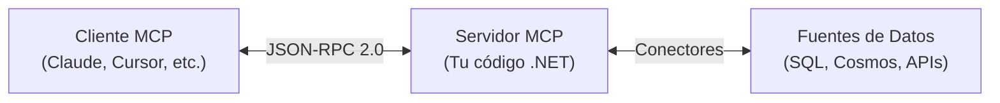

# Bloque 2: Fundamentos - Notas para el Instructor

**Duración objetivo**: 25 minutos  
**Estilo**: Didáctico, con ejemplos visuales, asegurando comprensión conceptual antes de código

---

## ⏱️ Cronometraje Detallado

| Sección                        | Tiempo | Acumulado | Checkpoint                  |
| ------------------------------ | ------ | --------- | --------------------------- |
| Definición y analogía MCP      | 5 min  | 5 min     | Analogía USB-C clara        |
| Arquitectura cliente-servidor  | 5 min  | 10 min    | Diagrama Mermaid proyectado |
| Flujo de comunicación JSON-RPC | 6 min  | 16 min    | Secuencia completa          |
| MCP vs Plugins tradicionales   | 5 min  | 21 min    | Tabla comparativa           |
| Casos de uso empresariales     | 3 min  | 24 min    | 2-3 ejemplos                |
| Q&A y cierre                   | 1 min  | 25 min    | Transición a Bloque 3       |

**⚠️ Alerta de tiempo**: Si llegas a minuto 20 sin haber mostrado casos de uso, abrevia la sección de comparación.

---

## 🎤 Script de Apertura (5 minutos)

### Definición Clara de MCP

> "Model Context Protocol. Tres palabras. Vamos a descomponerlas:
>
> -   **Model**: Los modelos de IA (LLMs) como ChatGPT, Claude, Copilot
> -   **Context**: El contexto que necesitan para ser útiles - TUS datos, TUS herramientas
> -   **Protocol**: Un estándar abierto que define CÓMO se conectan
>
> En una frase: MCP es la forma estandarizada en que la IA accede a lo que necesita para ayudarte."

**Objetivo**: Que cualquier asistente, sin importar su nivel técnico, entienda la esencia.

### Analogía USB-C (Imprescindible)

**Setup narrativo**:

> "¿Recuerdan la época de los cargadores? iPhone tenía su puerto, Android otro, laptops otro diferente. Era un caos. Luego llegó USB-C y... [PAUSA, espera respuesta de audiencia]... exacto, un solo cable para todo."

**Transición a MCP**:

> "Pues MCP hace lo mismo pero con IA. Antes, si querías que ChatGPT accediera a tu base de datos SQL, escribías un plugin para ChatGPT. Si querías que Claude hiciera lo mismo, OTRO plugin diferente. Copilot, OTRO más. Mismo trabajo, tres veces.
>
> Con MCP, escribes UN servidor - en C# como haremos hoy - y funciona con ChatGPT, Claude, Copilot, y cualquier otra herramienta que soporte MCP. Un código, múltiples clientes."

**Validación de comprensión**:
Pregunta al salón: "¿Ven la ventaja?" [Espera asentimientos/comentarios]

---

## 🏗️ Arquitectura Cliente-Servidor (5 minutos)

### Estrategia Visual

**IMPORTANTE**: No avances sin proyectar el diagrama Mermaid de arquitectura.



**Narrativa recomendada**:

1. **Cliente** (apuntar al cuadro izquierdo):

    > "El cliente es la aplicación de IA. Claude Desktop, Cursor, o un chatbot que tú crees. Este NO es tu código, es el software que usa el usuario final."

2. **Servidor** (apuntar al cuadro central):

    > "El servidor es TU código. Lo que vamos a crear hoy en C#. Su trabajo es simple: escuchar solicitudes del cliente y responder con datos o resultados de herramientas."

3. **Fuentes de Datos** (apuntar al cuadro derecho):

    > "Y aquí están tus datos reales. SQL Server, Cosmos DB, archivos JSON, APIs externas. El servidor MCP hace de puente entre la IA y estos datos."

4. **JSON-RPC 2.0** (apuntar a la flecha):
    > "Y se comunican con JSON-RPC 2.0, un protocolo estándar desde 2010. No es nuevo, es probado y confiable."

### Pregunta de Validación

"Si yo quiero que mi LLM acceda a datos de SAP, ¿dónde va el código que conecta a SAP? [PAUSA] Exacto, en el SERVIDOR MCP. El cliente (ChatGPT, Claude) no sabe nada de SAP."

---

## 🔄 Flujo de Comunicación (6 minutos)

### Secuencia Paso a Paso

**Proyectar el diagrama de secuencia** y narrar como si fuera una historia:

#### Fase 1: Inicialización (Handshake)

> "Todo empieza con un saludo. El cliente dice: 'Hola, soy Claude, hablo MCP versión 2024-11-05, puedo recibir notificaciones'. Y el servidor responde: 'Hola Claude, soy servidor de datos de clientes, también hablo MCP 2024-11-05, tengo recursos y herramientas disponibles'."

**Código proyectado** (opcional, si hay tiempo):

```json
// Cliente envía
{"jsonrpc": "2.0", "method": "initialize", "params": {...}}

// Servidor responde
{"jsonrpc": "2.0", "result": {"serverInfo": {...}, "capabilities": {...}}}
```

#### Fase 2: Descubrimiento

> "Luego el cliente pregunta: '¿Qué recursos tienes?'. El servidor lista: 'Tengo clientes, productos, pedidos'. Cliente: '¿Qué herramientas ofreces?'. Servidor: 'Puedo buscar, puedo generar reportes, puedo enviar emails'."

**Analogía**: Como entrar a un restaurante y pedir el menú antes de ordenar.

#### Fase 3: Ejecución

> "Finalmente, el cliente pide algo específico: 'Dame los datos del recurso clientes'. Y el servidor va a SQL Server, ejecuta `SELECT * FROM Customers`, y devuelve JSON. O: 'Ejecuta la herramienta de búsqueda con query=Madrid'. Servidor ejecuta, devuelve resultados."

**Enfatizar**: Cada solicitud es independiente (stateless). No hay "sesión" por defecto.

### Ejemplo en Vivo (2 minutos)

Muestra en tu terminal el contenido de un archivo JSON de solicitud y respuesta:

```bash
# En terminal PowerShell
Get-Content .\specs\001-mcp-workshop-course\contracts\exercise-1-static-resource.json
```

Resalta los campos `jsonrpc`, `method`, `params`, `result`.

---

## 🆚 MCP vs Plugins (5 minutos)

### Estrategia de Comparación

**Proyecta la tabla comparativa** y enfoca en 3 puntos clave:

#### 1. Estándar Universal

**Plugins tradicionales**:

> "Cada plataforma inventa su API. OpenAI tiene su estándar, Anthropic (Claude) otro, Microsoft otro. Aprendes tres APIs diferentes."

**MCP**:

> "Un solo estándar. Aprendes JSON-RPC 2.0 y funciona en TODAS las plataformas MCP."

#### 2. Instalación y Actualización

**Plugins tradicionales**:

> "Instalas un binario compilado. Si hay un bug, republicas. El usuario debe descargar e instalar de nuevo EN CADA aplicación."

**MCP**:

> "Tu servidor corre en HTTP o stdio. Actualizas una vez, todos los clientes ven la nueva versión inmediatamente."

#### 3. Seguridad y Aislamiento

**Plugins tradicionales**:

> "El plugin ejecuta DENTRO del proceso de la aplicación host. Si falla, puede tirar la app. Si es malicioso, acceso total."

**MCP**:

> "El servidor es un proceso separado. Falla independiente. Autenticación JWT propia. Rate limiting. Control total."

### Mostrar Diagrama de Arquitecturas

Proyecta el diagrama "Tradicional vs MCP" y enfatiza:

-   **Izquierda (Tradicional)**: Trabajo duplicado × N clientes
-   **Derecha (MCP)**: Un servidor, N clientes gratis

---

## 💼 Casos de Uso (3 minutos)

### Seleccionar 2-3 Según la Audiencia

**Para audiencia técnica**:

-   DevOps y monitoreo (logs, métricas, alertas)
-   Análisis de datos ejecutivo

**Para audiencia de negocio**:

-   Asistente de atención al cliente
-   Cumplimiento y auditoría

**Narrativa ejemplo (Soporte al Cliente)**:

> "Imaginen un agente de soporte. Antes: abre 5 pestañas - CRM, sistema de tickets, base de datos de productos, docs internas, email. Hace malabarismos.
>
> Con MCP: tiene Claude Desktop conectado a UN servidor MCP que agrega todo. Escribe en lenguaje natural: 'Muéstrame el historial del cliente 1234 y si tiene pedidos pendientes'. La IA consulta TODO desde un solo lugar, responde en segundos."

**Validación**: ¿Alguien tiene un caso de uso similar en su empresa? [Invita participación]

---

## 🔐 Seguridad (1 minuto - Introducción Rápida)

> "Una duda común: ¿Y la seguridad? MCP lo tiene cubierto. Los servidores pueden pedir autenticación JWT, aplicar rate limiting, auditar cada operación. Esto lo veremos en detalle en el Ejercicio 3 y Bloque 7. Por ahora, sepan que es seguro por diseño."

**No profundices aquí** - hay bloques dedicados.

---

## 📖 Especificación MCP (1 minuto)

> "Todo lo que hemos visto está documentado en la especificación oficial: https://spec.modelcontextprotocol.io/
>
> Versión actual: 2024-11-05. Es un documento abierto, pueden leerlo. Define cada método, cada código de error, cada formato. No hay magia, solo estándar claro."

---

## ⚠️ Contingencias y Plan B

### Si te Quedas Sin Tiempo (llegar a minuto 28+)

**Cortar**:

-   ❌ Detalles de transportes (HTTP vs stdio vs WebSocket)
-   ❌ Lista exhaustiva de clientes MCP
-   ❌ Comparación con REST (ya queda clara la diferencia)

**Mantener**:

-   ✅ Arquitectura cliente-servidor
-   ✅ Flujo de 3 fases (initialize, discover, execute)
-   ✅ Ventaja "un servidor, múltiples clientes"

### Si Preguntas Técnicas Profundas

**Ejemplo**: "¿MCP soporta streaming de respuestas?"

**Respuesta**:

> "Excelente pregunta. La especificación actual no incluye streaming nativo, pero se puede lograr con Server-Sent Events en el transporte HTTP. Es un tema avanzado que podemos explorar después del taller si hay interés."

**Estrategia**: Valida la pregunta, da respuesta corta, ofrece seguimiento offline.

### Si Alguien Pregunta por Costos

> "El protocolo MCP es 100% open source y gratis. Las librerías oficiales (.NET, Python, TypeScript) también son gratis (licencias Apache 2.0/MIT). Los costos vienen de:
>
> -   Tu infraestructura (si despliegas en Azure, AWS, etc.)
> -   Los LLMs que uses (GPT-4, Claude tienen costos por token)
>
> Pero el taller usa todo local y datos de muestra, costo cero."

---

## 🔄 Transición al Bloque 3

### Frase de Cierre

> "Perfecto. Ahora entendemos QUÉ es MCP y POR QUÉ es útil. Es hora de ensuciarnos las manos. En los próximos 20 minutos voy a crear un servidor MCP completo desde cero, en vivo, sin trucos. Vamos a ver el código real, el JSON real, y lo vamos a probar. Preparen Visual Studio Code."

**Acción física**: Cambiar a Visual Studio Code de forma visible, abrir terminal.

---

## 📝 Preguntas Frecuentes Anticipadas

### "¿MCP funciona solo con C#?"

**Respuesta**:

> "No, hay SDKs oficiales en TypeScript, Python y C#. También implementaciones comunitarias en Go, Rust, Java. Hoy usamos C# porque es ideal para Azure y muchas empresas lo usan."

### "¿Necesito conocer JSON-RPC antes?"

**Respuesta**:

> "No. Las librerías MCP abstraen JSON-RPC. Tú trabajas con objetos C# normales, la librería maneja el JSON-RPC por debajo. Lo veremos en el live coding."

### "¿Claude Desktop es gratis?"

**Respuesta**:

> "Claude Desktop tiene plan gratuito y planes de pago. Para este taller no necesitan Claude Desktop - probaremos con HTTP requests directas."

---

## 📊 Señales de Éxito del Bloque 2

Al finalizar, deberías observar:

✅ **Comprensión conceptual**:

-   Asistentes pueden explicar MCP en una frase
-   Entienden "un servidor, múltiples clientes"

✅ **Engagement**:

-   Al menos 3-5 preguntas o comentarios
-   Algunos asistentes tomando notas

✅ **Preparación técnica**:

-   Visual Studio Code abierto en la mayoría
-   Expectación por ver código real

❌ **Señales de alarma**:

-   Confusión entre cliente y servidor (repetir analogía)
-   Preguntas sobre implementación (viene en Bloque 3)

---

**Preparado por**: Instructor del taller MCP  
**Última revisión**: Noviembre 2025
