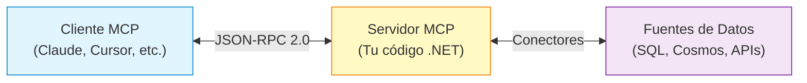
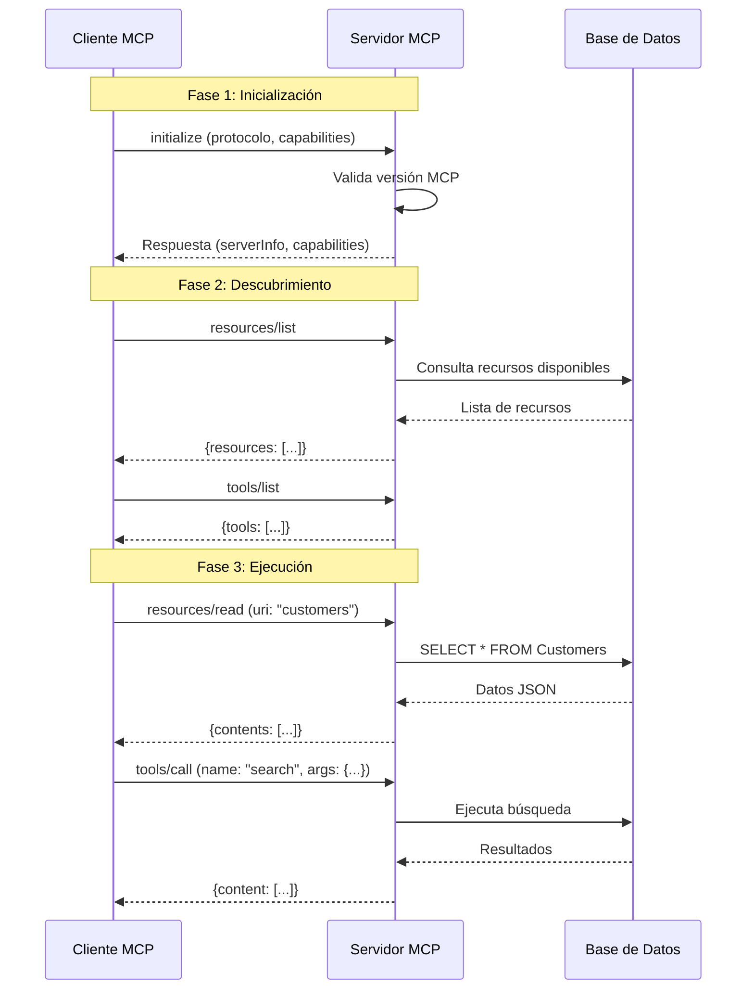
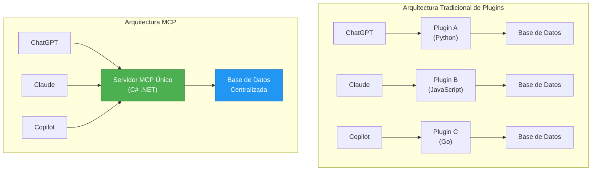
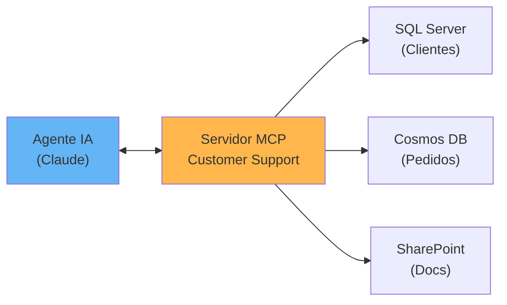

# Bloque 2: Fundamentos de MCP (25 minutos)

**Duración**: 25 minutos  
**Objetivo**: Comprender qué es MCP, su arquitectura, y por qué es diferente de los sistemas tradicionales de plugins

---

## 🎯 Objetivos del Bloque

1. Definir Model Context Protocol de forma clara y concisa
2. Entender la arquitectura cliente-servidor de MCP
3. Comparar MCP vs plugins tradicionales
4. Identificar casos de uso empresariales reales
5. Conocer el flujo de comunicación JSON-RPC 2.0

---

## 📚 ¿Qué es Model Context Protocol?

### Definición Oficial

> **Model Context Protocol (MCP)** es un protocolo abierto que estandariza cómo las aplicaciones de IA se conectan a fuentes de datos y herramientas externas.

### Analogía: El "USB-C" de la IA

Piensa en MCP como el estándar USB-C pero para aplicaciones de IA:

| Antes de USB-C                              | Antes de MCP                              |
| ------------------------------------------- | ----------------------------------------- |
| Cada dispositivo necesitaba su propio cable | Cada LLM necesitaba su propia integración |
| Incompatibilidad entre marcas               | APIs personalizadas por cliente           |
| Cables específicos por modelo               | Trabajo duplicado en cada proyecto        |

| Con USB-C                          | Con MCP                               |
| ---------------------------------- | ------------------------------------- |
| Un solo estándar universal         | Un solo protocolo para todos          |
| Funciona con cualquier dispositivo | Funciona con cualquier LLM compatible |
| Conexión bidireccional             | Comunicación estandarizada            |

---

## 🏗️ Arquitectura de MCP

### Modelo Cliente-Servidor

MCP sigue una arquitectura cliente-servidor donde:



### Componentes Principales

#### 1. **Cliente MCP** (Host)

- **Qué es**: La aplicación de IA que necesita datos
- **Ejemplos**: Claude Desktop, Cursor IDE, agentes personalizados
- **Responsabilidad**: Enviar solicitudes y procesar respuestas

#### 2. **Servidor MCP** (Provider)

- **Qué es**: Tu código que expone datos y herramientas
- **Ejemplos**: Servidor .NET con acceso a SQL Server, API REST
- **Responsabilidad**: Responder solicitudes, ejecutar herramientas

#### 3. **Transporte**

- **Protocolo**: JSON-RPC 2.0
- **Canales**: HTTP, stdio (pipes), WebSocket
- **Formato**: JSON estructurado

---

## 🔄 Flujo de Comunicación

### Secuencia de Inicialización



### Ejemplo de Mensajes JSON-RPC

**Solicitud del Cliente**:

```json
{
    "jsonrpc": "2.0",
    "id": "req_12345",
    "method": "resources/list",
    "params": {}
}
```

**Respuesta del Servidor**:

```json
{
    "jsonrpc": "2.0",
    "id": "req_12345",
    "result": {
        "resources": [
            {
                "uri": "mcp://customers",
                "name": "Customers Database",
                "mimeType": "application/json"
            }
        ]
    }
}
```

---

## 🆚 MCP vs Plugins Tradicionales

### Comparación Técnica

| Característica    | Plugins Tradicionales              | Model Context Protocol              |
| ----------------- | ---------------------------------- | ----------------------------------- |
| **Estándar**      | Cada plataforma define su API      | Protocolo abierto universal         |
| **Instalación**   | Binarios compilados por plataforma | Servidor independiente (HTTP/stdio) |
| **Lenguaje**      | Debe compilarse para el host       | Cualquier lenguaje (C#, Python, JS) |
| **Actualización** | Reinstalar en cada cliente         | Actualizar servidor una vez         |
| **Seguridad**     | Ejecuta en proceso del host        | Aislado, con autenticación propia   |
| **Escalabilidad** | Limitado por proceso host          | Puede escalar horizontalmente       |
| **Multi-cliente** | Un plugin por plataforma           | Un servidor para todos              |

### Diagrama Comparativo



**Ventajas MCP**:

- ✅ Escribes el código una vez
- ✅ Funciona con cualquier cliente compatible
- ✅ Actualización centralizada
- ✅ Seguridad y autenticación independiente
- ✅ Escalabilidad empresarial

---

## 💼 Casos de Uso Empresariales

### 1. Asistente de Atención al Cliente

**Problema**: Los agentes de soporte necesitan acceso a:

- Base de datos de clientes (SQL)
- Historial de pedidos (Cosmos DB)
- Documentación interna (SharePoint)

**Solución MCP**:



**Herramientas expuestas**:

- `get_customer_info(customer_id)`
- `list_orders(customer_id, status)`
- `search_documentation(query)`

### 2. Análisis de Datos para Ejecutivos

**Problema**: CEO necesita dashboard con datos de múltiples sistemas:

- Ventas (SQL Server)
- Marketing (Google Analytics API)
- Finanzas (SAP API)

**Solución MCP**:

- Un servidor MCP que agrega todas las fuentes
- Dashboard con LLM que consulta en lenguaje natural
- "¿Cuánto vendimos este trimestre vs el anterior?"

### 3. DevOps y Monitoreo

**Problema**: Equipo de operaciones necesita consultar:

- Logs de Azure Log Analytics
- Métricas de Application Insights
- Estado de infraestructura

**Solución MCP**:

- Servidor MCP con acceso a APIs de Azure
- Chatbot en Teams/Slack que responde:
  - "¿Hay errores críticos en producción?"
  - "¿Cuál es el uso de CPU del servicio X?"

### 4. Cumplimiento y Auditoría

**Problema**: Auditor necesita verificar:

- Logs de acceso (Azure AD)
- Cambios en configuraciones (Git history)
- Políticas aplicadas (Azure Policy)

**Solución MCP**:

- Recursos de solo lectura con logs estructurados
- Herramientas para búsqueda temporal
- `audit_trail(user, from_date, to_date)`

---

## 🔐 Conceptos de Seguridad (Introducción)

### Autenticación

MCP permite implementar autenticación a nivel de servidor:

- **JWT tokens**: Verificación de identidad del cliente
- **API Keys**: Para aplicaciones de confianza
- **OAuth 2.0**: Delegación de permisos

### Autorización

Control granular sobre qué puede hacer cada cliente:

- **Scopes**: `read:customers`, `write:orders`
- **Rate Limiting**: Límites por cliente/token
- **Auditoría**: Logs de todas las operaciones

_Nota: Veremos implementación detallada en Ejercicio 3 y Bloque 7._

---

## 📊 Capabilities (Capacidades)

### Qué Puede Exponer un Servidor MCP

| Capability    | Descripción                         | Ejemplo                                   |
| ------------- | ----------------------------------- | ----------------------------------------- |
| **Resources** | Datos estáticos o dinámicos         | Lista de clientes, catálogo de productos  |
| **Tools**     | Funciones invocables con parámetros | `search(query)`, `send_email(to, body)`   |
| **Prompts**   | Plantillas predefinidas             | "Analiza el cliente X y sugiere acciones" |
| **Sampling**  | Generación de texto por el servidor | Resúmenes automáticos de datos            |

### Capabilities en la Respuesta de Initialize

```json
{
    "capabilities": {
        "resources": {
            "subscribe": true,
            "listChanged": true
        },
        "tools": {
            "listChanged": false
        },
        "logging": {}
    }
}
```

**Interpretación**:

- `resources.subscribe`: El servidor puede notificar cambios en recursos
- `tools.listChanged`: Las herramientas NO cambian dinámicamente
- `logging`: El servidor acepta logs del cliente

---

## 🛠️ Tecnologías Subyacentes

### JSON-RPC 2.0

**¿Por qué JSON-RPC?**

- ✅ Protocolo ligero y estándar (2010)
- ✅ Request/Response estructurado
- ✅ Soporte para notificaciones y batch requests
- ✅ Manejo de errores estandarizado

**Estructura Básica**:

```json
{
    "jsonrpc": "2.0", // Versión del protocolo
    "method": "resources/read", // Método a invocar
    "params": { "uri": "..." }, // Parámetros
    "id": "req_12345" // ID para correlación
}
```

### Transportes Soportados

#### 1. **HTTP/HTTPS** (Recomendado para producción)

```
POST /mcp HTTP/1.1
Content-Type: application/json
Authorization: Bearer <token>

{ "jsonrpc": "2.0", ... }
```

#### 2. **stdio (Standard Input/Output)**

- Ideal para herramientas de línea de comandos
- Usado por Claude Desktop, Cursor
- El servidor se ejecuta como proceso hijo

#### 3. **WebSocket** (Experimental)

- Comunicación bidireccional
- Notificaciones en tiempo real

---

## 🌐 Ecosistema MCP

### Clientes MCP Populares

| Cliente                     | Tipo                 | Uso Principal                         |
| --------------------------- | -------------------- | ------------------------------------- |
| **Visual Studio Code**      | Editor de código     | Conexión usando GitHub Copilot        |
| **Visual Studio 2022/2026** | Editor de código     | Conexión usando GitHub Copilot        |
| **Claude Desktop**          | App nativa           | Asistente personal con datos locales  |
| **Cursor IDE**              | Editor de código     | Copilot con contexto del proyecto     |
| **Continue.dev**            | VS Code Extension    | Autocomplete con contexto empresarial |
| **Zed Editor**              | Editor de texto      | Desarrollo con IA integrada           |
| **Custom Agents**           | Aplicaciones propias | Chatbots, automatizaciones            |

### Servidores MCP Oficiales (Ejemplos)

- **Filesystem Server**: Acceso seguro a archivos locales
- **GitHub Server**: Consulta repos, issues, PRs
- **Database Server**: Conexión a PostgreSQL, MySQL
- **Web Search Server**: Integración con Brave Search

### Implementaciones por Lenguaje

| Lenguaje       | Librería                       | Estado       |
| -------------- | ------------------------------ | ------------ |
| **C# / .NET**  | `ModelContextProtocol` (NuGet) | ✅ Oficial   |
| **TypeScript** | `@modelcontextprotocol/sdk`    | ✅ Oficial   |
| **Python**     | `mcp` (PyPI)                   | ✅ Oficial   |
| **Go**         | `go-mcp`                       | 🟡 Comunidad |
| **Rust**       | `mcp-rs`                       | 🟡 Comunidad |

---

## 📖 Especificación MCP

### Versión Actual: 2025-06-18

La especificación oficial define un protocolo abierto que permite la integración perfecta entre aplicaciones LLM y fuentes de datos externas y herramientas.

**URL oficial**: <https://modelcontextprotocol.io/specification/2025-06-18>

### Componentes del Protocolo

#### Protocolo Base

- **Formato de mensajes**: JSON-RPC 2.0
- **Conexiones**: Stateful (con estado)
- **Negociación**: Capabilities entre servidor y cliente
- **Ciclo de vida**: Inicialización → Descubrimiento → Ejecución → Cierre

#### Características del Servidor

Los servidores pueden ofrecer las siguientes características a los clientes:

1. **Resources**: Contexto y datos para uso del usuario o el modelo de IA
2. **Prompts**: Mensajes y flujos de trabajo con plantillas para usuarios
3. **Tools**: Funciones para que el modelo de IA ejecute

#### Características del Cliente

Los clientes pueden ofrecer las siguientes características a los servidores:

1. **Sampling**: Comportamientos agénticos iniciados por el servidor e interacciones recursivas con LLM
2. **Roots**: Consultas iniciadas por el servidor sobre límites de URI o sistema de archivos
3. **Elicitation**: Solicitudes iniciadas por el servidor para información adicional de usuarios

#### Utilidades Adicionales

- **Configuration**: Gestión de configuración
- **Progress tracking**: Seguimiento de progreso de operaciones
- **Cancellation**: Cancelación de operaciones en curso
- **Error reporting**: Reporte estructurado de errores
- **Logging**: Sistema de logging integrado

### Principios de Seguridad

La especificación 2025-06-18 establece principios clave de seguridad:

1. **Consentimiento y Control del Usuario**

    - Los usuarios deben consentir explícitamente todo acceso a datos
    - Los usuarios retienen control sobre qué datos se comparten
    - Interfaces claras para revisar y autorizar actividades

2. **Privacidad de Datos**

    - Consentimiento explícito antes de exponer datos de usuario
    - No transmitir datos de recursos sin consentimiento
    - Protección de datos con controles de acceso apropiados

3. **Seguridad de Herramientas**

    - Las herramientas representan ejecución de código arbitrario
    - Consentimiento explícito antes de invocar herramientas
    - Los usuarios deben entender qué hace cada herramienta

4. **Controles de Sampling LLM**
    - Aprobación explícita de solicitudes de sampling
    - Control del usuario sobre prompts y resultados
    - Visibilidad limitada del servidor en prompts

### Extensiones Propietarias

Aunque MCP es un estándar abierto, puedes agregar:

- Métodos personalizados (deben empezar con `x-` o `vendor-`)
- Capabilities adicionales
- Metadata propietario

_Importante: Mantén compatibilidad con clientes estándares._

---

## 🎯 Principios de Diseño de MCP

### 1. **Simplicidad**

> "Si un cliente necesita datos, pregunta. Si necesita ejecutar algo, llama."

### 2. **Descubrimiento Dinámico**

> Los clientes NO necesitan saber de antemano qué ofrece el servidor.

### 3. **Seguridad por Diseño**

> Autenticación y autorización son de primera clase, no afterthoughts.

### 4. **Stateless**

> Cada request es independiente (pero puede haber sesiones si se necesita).

### 5. **Extensible**

> Puedes agregar capabilities sin romper compatibilidad.

---

## 🚀 Ventajas para Desarrolladores

### Antes de MCP (Problema)

```csharp
// Código para ChatGPT
app.MapPost("/chatgpt/customers", async (ChatGPTRequest req) => {
    // Lógica específica de ChatGPT
});

// Código para Claude
app.MapPost("/claude/customers", async (ClaudeRequest req) => {
    // Lógica específica de Claude (¡duplicada!)
});

// Código para Copilot
app.MapPost("/copilot/customers", async (CopilotRequest req) => {
    // Lógica específica de Copilot (¡triplicada!)
});
```

### Con MCP (Solución)

```csharp
// Un solo endpoint para TODOS los clientes
app.MapPost("/mcp", async (JsonRpcRequest req) => {
    return req.Method switch {
        "resources/list" => ListResources(),
        "resources/read" => ReadResource(req.Params),
        "tools/call" => CallTool(req.Params),
        _ => Error("Method not found")
    };
});
```

**Resultado**:

- ✅ Menos código
- ✅ Menos bugs
- ✅ Más mantenible
- ✅ Funciona con CUALQUIER cliente MCP

---

## 💡 Casos de Uso que NO Son para MCP

### Cuándo NO Usar MCP

❌ **API pública para consumo humano directo**

- Mejor: REST tradicional con OpenAPI/Swagger

❌ **Comunicación entre microservicios internos**

- Mejor: gRPC o mensajería asíncrona

❌ **Streaming de datos en tiempo real**

- Mejor: WebSocket puro o Server-Sent Events

❌ **Sistema legacy sin soporte JSON-RPC**

- Mejor: Adaptador/proxy, no fuerces MCP

### Cuándo SÍ Usar MCP

✅ Conectar LLMs a datos empresariales  
✅ Exponer herramientas a asistentes de IA  
✅ Crear contexto para Copilots personalizados  
✅ Integración con múltiples clientes de IA  
✅ Necesitas estandarización en IA generativa

---

## 🔍 Preguntas Frecuentes

### 1. ¿MCP reemplaza REST APIs?

**No.** MCP es complementario:

- Usa REST para APIs públicas y humanos
- Usa MCP para conectar IA a tus datos

### 2. ¿MCP funciona sin internet?

**Sí.** Puede usar transporte stdio local (Claude Desktop lo hace).

### 3. ¿Qué pasa si mi cliente no soporta MCP?

Creas un adaptador simple que traduce tu API a MCP.

### 4. ¿MCP es gratis?

**Sí**, el protocolo es open source. Las implementaciones también (Apache 2.0/MIT).

### 5. ¿Necesito Azure para usar MCP?

**No**, puedes ejecutar servidores MCP en cualquier infraestructura:

- Local (localhost)
- On-premise (tu datacenter)
- Cualquier cloud (AWS, GCP, Azure, etc.)

---

## 📋 Resumen del Bloque 2

### Puntos Clave

1. **MCP es un protocolo abierto** que estandariza la conexión entre IA y datos
2. **Arquitectura cliente-servidor** con transporte JSON-RPC 2.0
3. **Ventaja principal**: Escribe una vez, funciona en múltiples clientes
4. **Casos de uso**: Soporte al cliente, análisis ejecutivo, DevOps, auditoría
5. **Seguridad**: Autenticación, autorización y rate limiting integrados

### Lo que Viene

En el **Bloque 3** (20 min de live coding), veremos:

- Cómo crear un servidor MCP desde cero en C#
- Implementar métodos `initialize`, `resources/list`, `resources/read`
- Probar el servidor con un cliente de prueba
- Ver el flujo JSON-RPC 2.0 en acción

---

**Preparado por**: Instructor del taller MCP  
**Versión**: 1.0.0  
**Última actualización**: Febrero 2026
