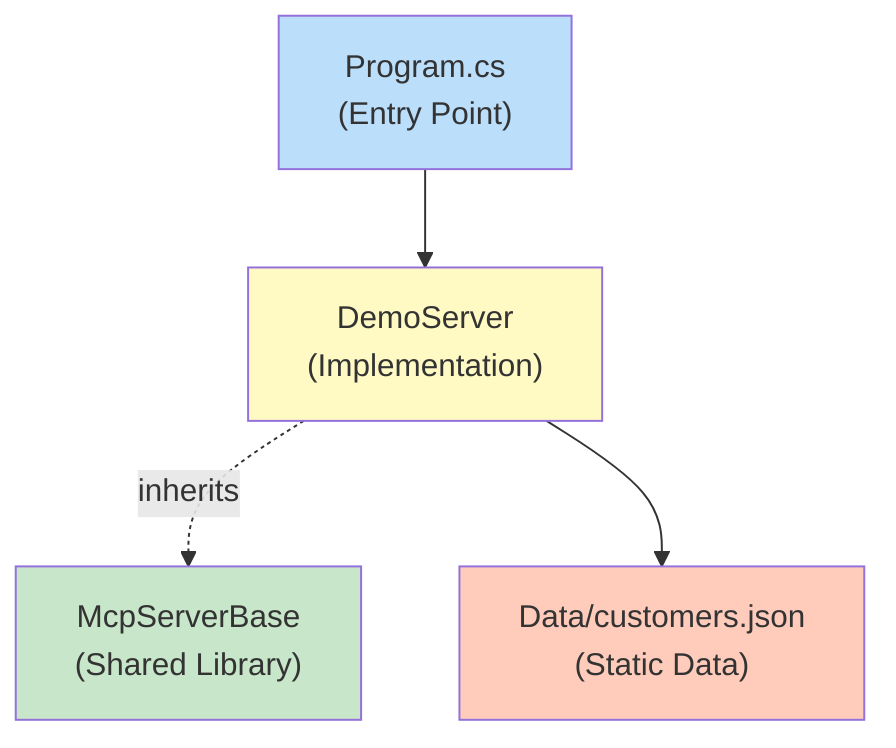
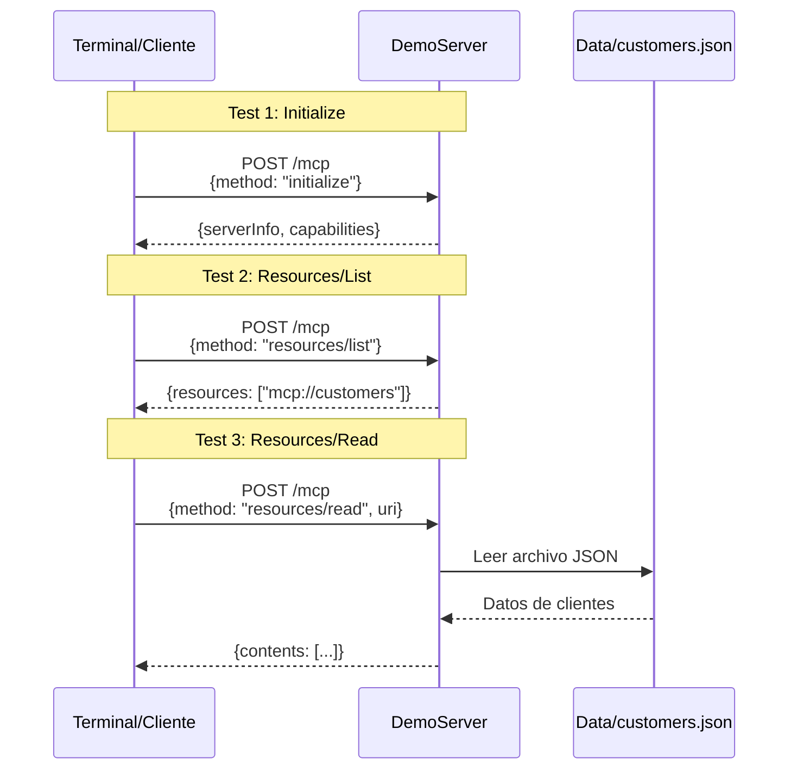

# Bloque 3: Anatomía de un Proveedor MCP - Live Coding (20 minutos)

**Duración**: 20 minutos  
**Tipo**: Demostración en vivo (live coding)  
**Objetivo**: Crear un servidor MCP funcional desde cero y ejecutarlo

---

## 🎯 Objetivos del Bloque

1. Crear un proyecto de servidor MCP básico en C# / .NET 10.0
2. Implementar el método `initialize` para handshake
3. Exponer recursos estáticos (`resources/list` y `resources/read`)
4. Probar el servidor con solicitudes HTTP directas
5. Mostrar el flujo JSON-RPC 2.0 en acción

---

## 🛠️ Estructura del Servidor

### Diagrama de Componentes



### Archivos a Crear

```
src/McpWorkshop.Servers/
└── DemoServer/
    ├── Program.cs              # ASP.NET Core minimal API
    ├── DemoServer.csproj       # Proyecto .NET
    └── Models/
        └── Customer.cs         # Modelo de datos
```

---

## 📝 Código Paso a Paso

### Paso 1: Crear el Proyecto (2 minutos)

```powershell
# Crear proyecto web API
cd src/McpWorkshop.Servers
dotnet new web -n DemoServer -f net10.0

# Agregar referencia a la librería compartida
cd DemoServer
dotnet add reference ../../McpWorkshop.Shared/McpWorkshop.Shared.csproj

# Agregar a la solución
cd ../../..
dotnet sln add src/McpWorkshop.Servers/DemoServer/DemoServer.csproj
```

**Explicación al salón**:

> "Usamos `dotnet new web` porque es la plantilla más ligera de ASP.NET Core. No necesitamos MVC, solo un endpoint HTTP simple."

---

### Paso 2: Modelo de Datos (3 minutos)

**Archivo**: `src/McpWorkshop.Servers/DemoServer/Models/Customer.cs`

```csharp
namespace DemoServer.Models;

/// <summary>
/// Representa un cliente en el sistema de demostración
/// </summary>
public class Customer
{
    public int Id { get; set; }
    public string Name { get; set; } = string.Empty;
    public string Email { get; set; } = string.Empty;
    public string Country { get; set; } = string.Empty;
    public DateTime Created { get; set; }
}
```

**Explicación**:

> "Este es un modelo simple de cliente. En un sistema real vendría de SQL Server o Cosmos DB. Hoy usamos JSON estático para simplificar."

---

### Paso 3: Implementación del Servidor (10 minutos)

**Archivo**: `src/McpWorkshop.Servers/DemoServer/Program.cs`

```csharp
using System.Text.Json;
using DemoServer.Models;
using McpWorkshop.Shared.Logging;
using McpWorkshop.Shared.Mcp;
using Microsoft.Extensions.Options;

var builder = WebApplication.CreateBuilder(args);

// Configurar servicios
builder.Services.AddSingleton<IStructuredLogger, StructuredLogger>();
builder.Services.Configure<McpWorkshop.Shared.Configuration.WorkshopSettings>(options =>
{
    options.Server.Name = "DemoServer";
    options.Server.Version = "1.0.0";
    options.Server.ProtocolVersion = "2024-11-05";
});

var app = builder.Build();

// Cargar datos de muestra
var customers = LoadCustomers();

// Endpoint principal MCP
app.MapPost("/mcp", async (
    JsonRpcRequest request,
    IStructuredLogger logger,
    IOptions<McpWorkshop.Shared.Configuration.WorkshopSettings> settings) =>
{
    var requestId = request.Id?.ToString() ?? "unknown";

    IDictionary<string, object>? paramsDict = null;
    if (request.Params != null)
    {
        paramsDict = JsonSerializer.Deserialize<IDictionary<string, object>>(JsonSerializer.Serialize(request.Params));
    }

    logger.LogRequest(request.Method, requestId, paramsDict);

    try
    {
        var response = request.Method switch
        {
            "initialize" => HandleInitialize(settings),
            "resources/list" => HandleResourcesList(),
            "resources/read" => HandleResourcesRead(paramsDict, customers),
            _ => CreateErrorResponse(-32601, "Method not found", null, request.Id)
        };

        logger.LogResponse(request.Method, requestId, 200, 0);
        return Results.Ok(response);
    }
    catch (Exception ex)
    {
        logger.LogError(request.Method, requestId, ex);
        return Results.Ok(CreateErrorResponse(-32603, "Internal error", ex.Message, request.Id));
    }
});

await app.RunAsync("http://localhost:5000");

// Métodos helper
static JsonRpcResponse HandleInitialize(IOptions<McpWorkshop.Shared.Configuration.WorkshopSettings> settings)
{
    return new JsonRpcResponse
    {
        JsonRpc = "2.0",
        Result = new
        {
            protocolVersion = settings.Value.Server.ProtocolVersion,
            capabilities = new
            {
                resources = new { },
                tools = new { }
            },
            serverInfo = new
            {
                name = settings.Value.Server.Name,
                version = settings.Value.Server.Version
            }
        },
        Id = "init"
    };
}

static JsonRpcResponse HandleResourcesList()
{
    return new JsonRpcResponse
    {
        JsonRpc = "2.0",
        Result = new
        {
            resources = new[]
            {
                new
                {
                    uri = "mcp://customers",
                    name = "Customers Database",
                    description = "Lista de clientes del sistema",
                    mimeType = "application/json"
                }
            }
        },
        Id = "list"
    };
}

static JsonRpcResponse HandleResourcesRead(IDictionary<string, object>? parameters, List<Customer> customers)
{
    // Parsear el URI del recurso
    var uri = parameters?["uri"] as string;

    if (uri == "mcp://customers")
    {
        return new JsonRpcResponse
        {
            JsonRpc = "2.0",
            Result = new
            {
                contents = new[]
                {
                    new
                    {
                        uri = "mcp://customers",
                        mimeType = "application/json",
                        text = JsonSerializer.Serialize(customers, new JsonSerializerOptions { WriteIndented = true })
                    }
                }
            },
            Id = "read"
        };
    }

    throw new ArgumentException($"Unknown resource URI: {uri}");
}
static JsonRpcResponse CreateErrorResponse(int code, string message, object? data, object? id)
{
    return new JsonRpcResponse
    {
        JsonRpc = "2.0",
        Error = new JsonRpcError
        {
            Code = code,
            Message = message,
            Data = data
        },
        Id = id
    };
}

static List<Customer> LoadCustomers()
{
    var json = File.ReadAllText("../../../Data/customers.json");
    return JsonSerializer.Deserialize<List<Customer>>(json)
           ?? new List<Customer>();
}
```

**Explicación progresiva durante el live coding**:

#### Parte 1: Configuración (líneas 1-15)

> "Primero configuramos los servicios. Inyectamos el logger estructurado y la configuración del servidor. Esto viene de nuestra librería compartida que creamos antes."

#### Parte 2: Carga de Datos (línea 19)

> "Cargamos los clientes desde el JSON que generamos con el script `create-sample-data.ps1`. En producción, esto sería una consulta a base de datos."

#### Parte 3: Endpoint MCP (líneas 22-44)

> "Este es el corazón. Un solo endpoint `/mcp` que recibe todas las solicitudes JSON-RPC. Usamos pattern matching con `switch` para rutear a los handlers correctos."

#### Parte 4: Handler de Initialize (líneas 47-66)

> "El cliente siempre empieza llamando `initialize`. Respondemos con nuestra versión de protocolo, nuestras capabilities (recursos y herramientas), y la info del servidor."

#### Parte 5: Handler de Resources/List (líneas 68-86)

> "Aquí listamos los recursos disponibles. Solo tenemos uno: `mcp://customers`. El cliente usa esto para descubrir qué puede pedir."

#### Parte 6: Handler de Resources/Read (líneas 88-117)

> "Cuando el cliente pide leer un recurso específico, verificamos el URI y devolvemos el JSON. Simple pero poderoso."

---

### Paso 4: Ejecutar el Servidor (2 minutos)

```powershell
# Ejecutar el servidor
cd src/McpWorkshop.Servers/DemoServer
dotnet run

# Deberías ver:
# info: Microsoft.Hosting.Lifetime[14]
#       Now listening on: http://localhost:5000
# info: Microsoft.Hosting.Lifetime[0]
#       Application started. Press Ctrl+C to shut down.
```

**Explicación**:

> "El servidor está corriendo en puerto 5000. Ahora vamos a probarlo con solicitudes HTTP directas."

---

## 🧪 Pruebas en Vivo

### Test 1: Initialize

```powershell
# En otra terminal
$body = @{
    jsonrpc = "2.0"
    method = "initialize"
    params = @{
        protocolVersion = "2024-11-05"
        capabilities = @{}
        clientInfo = @{
            name = "TestClient"
            version = "1.0.0"
        }
    }
    id = "init-001"
} | ConvertTo-Json -Depth 10

Invoke-RestMethod -Uri "http://localhost:5000/mcp" `
    -Method POST `
    -Body $body `
    -ContentType "application/json"
```

**Resultado esperado**:

```json
{
    "jsonrpc": "2.0",
    "result": {
        "protocolVersion": "2024-11-05",
        "capabilities": {
            "resources": {},
            "tools": {}
        },
        "serverInfo": {
            "name": "DemoServer",
            "version": "1.0.0"
        }
    },
    "id": "init-001"
}
```

**Explicación**:

> "¡Funciona! El servidor nos respondió con su información. Ahora sabemos que habla MCP 2024-11-05 y tiene capacidad de recursos."

---

### Test 2: Resources/List

```powershell
$body = @{
    jsonrpc = "2.0"
    method = "resources/list"
    params = @{}
    id = "list-001"
} | ConvertTo-Json

Invoke-RestMethod -Uri "http://localhost:5000/mcp" `
    -Method POST `
    -Body $body `
    -ContentType "application/json"
```

**Resultado esperado**:

```json
{
    "jsonrpc": "2.0",
    "result": {
        "resources": [
            {
                "uri": "mcp://customers",
                "name": "Customers Database",
                "description": "Lista de clientes del sistema",
                "mimeType": "application/json"
            }
        ]
    },
    "id": "list-001"
}
```

**Explicación**:

> "Perfecto. El servidor nos dice que tiene un recurso: `mcp://customers`. Ahora vamos a leerlo."

---

### Test 3: Resources/Read

```powershell
$body = @{
    jsonrpc = "2.0"
    method = "resources/read"
    params = @{
        uri = "mcp://customers"
    }
    id = "read-001"
} | ConvertTo-Json

Invoke-RestMethod -Uri "http://localhost:5000/mcp" `
    -Method POST `
    -Body $body `
    -ContentType "application/json"
```

**Resultado esperado**:

```json
{
    "jsonrpc": "2.0",
    "result": {
        "contents": [
            {
                "uri": "mcp://customers",
                "mimeType": "application/json",
                "text": "[\n  {\n    \"id\": 1,\n    \"name\": \"Ana García\",\n    \"email\": \"ana.garcia@example.com\",\n    \"country\": \"España\",\n    \"created\": \"2024-01-15T10:30:00Z\"\n  },\n  ...\n]"
            }
        ]
    },
    "id": "read-001"
}
```

**Explicación**:

> "¡Excelente! Recibimos los datos de clientes. Este es el flujo completo: initialize → list → read. Así funciona MCP."

---

## 📊 Diagrama de Secuencia de lo que Acabamos de Hacer



---

## 🎓 Conceptos Clave Demostrados

### 1. **JSON-RPC 2.0 en Acción**

Cada mensaje tiene:

-   ✅ `jsonrpc: "2.0"` - Identificador de protocolo
-   ✅ `method` - Qué operación ejecutar
-   ✅ `params` - Parámetros de entrada
-   ✅ `id` - Para correlacionar request/response

### 2. **Patrón Request/Response**

```
Cliente envía:          Servidor responde:
{                       {
  "method": "...",        "result": {...},
  "params": {...},        "id": "..."
  "id": "..."           }
}
```

### 3. **Capabilities Negotiation**

El cliente y servidor acuerdan qué funcionalidades soportan:

-   Cliente dice: "Puedo recibir notificaciones"
-   Servidor dice: "Tengo recursos y herramientas"

### 4. **Recursos como URIs**

```
mcp://customers
mcp://products
mcp://orders
```

Esquema de URI personalizado para identificar recursos de forma única.

---

## 🔧 Mejoras Posibles (Extensiones)

### Agregar Herramientas (Tools)

```csharp
case "tools/list":
    return new JsonRpcResponse
    {
        JsonRpc = "2.0",
        Result = new
        {
            tools = new[]
            {
                new
                {
                    name = "search_customers",
                    description = "Busca clientes por país",
                    inputSchema = new
                    {
                        type = "object",
                        properties = new
                        {
                            country = new { type = "string" }
                        }
                    }
                }
            }
        }
    };

case "tools/call":
    // Ejecutar búsqueda...
    break;
```

### Agregar Logging Estructurado

Ya está integrado con `IStructuredLogger` - se puede ver en logs del servidor.

### Agregar Validación de Entrada

```csharp
if (string.IsNullOrEmpty(uri) || !uri.StartsWith("mcp://"))
{
    return CreateErrorResponse(-32602, "Invalid params", "URI must start with mcp://", id);
}
```

---

## ⚠️ Errores Comunes y Soluciones

### Error: "Port 5000 already in use"

**Solución**:

```powershell
# Ver qué proceso usa el puerto
netstat -ano | findstr :5000

# Cambiar puerto en Program.cs
app.Run("http://localhost:5001");
```

### Error: "Cannot find customers.json"

**Solución**:

```powershell
# Verificar ruta del archivo
Get-Item ../../../Data/customers.json

# Ajustar ruta relativa según estructura
```

### Error: "JsonException: The JSON value could not be converted"

**Solución**: Verificar que el JSON del body esté bien formado con `ConvertTo-Json -Depth 10`

---

## 📋 Resumen del Bloque 3

### Lo que Construimos

1. ✅ Servidor MCP funcional en ~120 líneas de C#
2. ✅ Tres métodos MCP: `initialize`, `resources/list`, `resources/read`
3. ✅ Endpoint HTTP único (`/mcp`) para todas las operaciones
4. ✅ Integración con logging estructurado
5. ✅ Carga de datos desde JSON

### Lo que Aprendimos

-   Cómo se estructura un servidor MCP
-   El flujo JSON-RPC 2.0 request/response
-   Pattern matching para ruteo de métodos
-   Uso de la librería compartida (`McpServerBase`)

### Próximo Paso

**Bloque 4**: Los asistentes crearán su propio servidor MCP con recursos estáticos en el **Ejercicio 1** (15 minutos guiados).

---

**Preparado por**: Instructor del taller MCP  
**Versión**: 1.0.0  
**Última actualización**: Noviembre 2025
