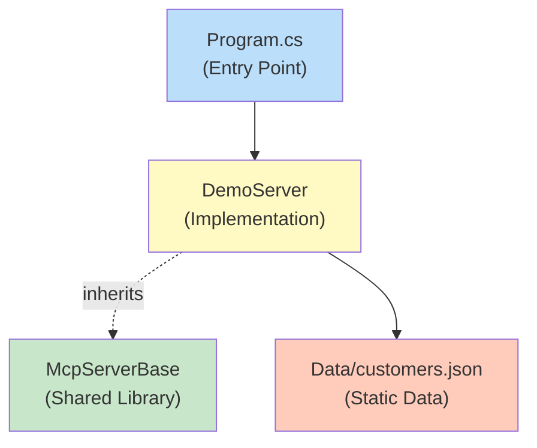
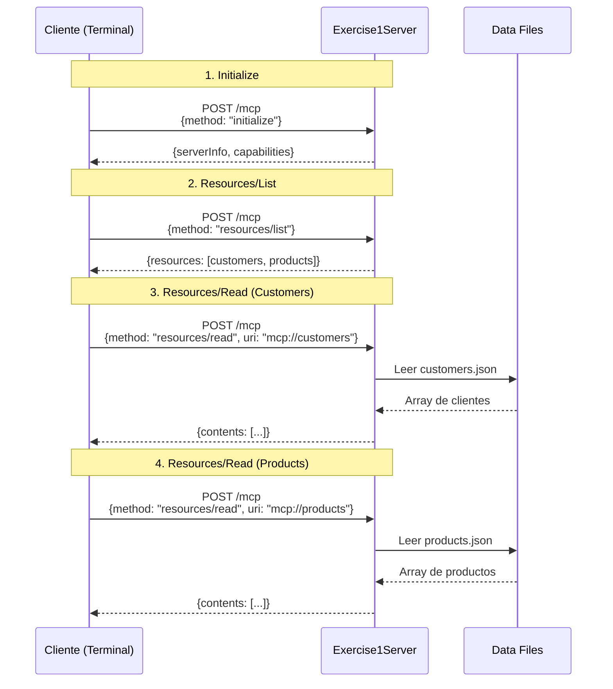

# Bloque 3: Anatomía de un Proveedor MCP - Ejercicio Guiado (30 minutos)

**Duración**: 30 minutos (15 min demostración + 15 min práctica)  
**Tipo**: Demostración en vivo seguida de ejercicio práctico hands-on  
**Objetivo**: Crear un servidor MCP funcional desde cero y ejecutarlo

---

## 🎯 Objetivos del Bloque

1. **[Demostración]** Crear un proyecto de servidor MCP básico en C# / .NET 10.0
2. **[Demostración]** Implementar el método `initialize` para handshake
3. **[Demostración]** Exponer recursos estáticos (`resources/list` y `resources/read`)
4. **[Todos]** Probar el servidor con solicitudes HTTP directas
5. **[Práctica]** Extender el servidor con un segundo recurso (productos)

---

## 🛠️ Estructura del Servidor

### Diagrama de Componentes



### Archivos a Crear

```
src/McpWorkshop.Servers/
└── DemoServer/
    ├── Program.cs              # ASP.NET Core minimal API
    ├── DemoServer.csproj       # Proyecto .NET
    └── Models/
        └── Customer.cs         # Modelo de datos
```

---

## 📝 Código Paso a Paso

### Paso 1: Crear el Proyecto (3 minutos) - **[DEMOSTRACIÓN]**

> **💬 Instructor**: "Usamos `dotnet new web` porque es la plantilla más ligera de ASP.NET Core. No necesitamos MVC, solo un endpoint HTTP simple."

```powershell
# Crear proyecto web API
cd src/McpWorkshop.Servers
dotnet new web -n Exercise1Server -f net10.0

# Agregar referencia a la librería compartida
cd Exercise1Server
dotnet add reference ../../McpWorkshop.Shared/McpWorkshop.Shared.csproj

# Agregar a solución y verificar compilación
cd ../../..
dotnet sln add src/McpWorkshop.Servers/Exercise1Server/Exercise1Server.csproj
dotnet build
```

**✅ Checkpoint**: Debe compilar sin errores.

---

### Paso 2: Modelos de Datos (3 minutos) - **[DEMOSTRACIÓN]**

> **💬 Instructor**: "Este es un modelo simple de cliente. En un sistema real vendría de SQL Server o Cosmos DB. Hoy usamos JSON estático para simplificar."

**Archivo**: `src/McpWorkshop.Servers/Exercise1Server/Models/Customer.cs`

```csharp
namespace Exercise1Server.Models;

public class Customer
{
    public int Id { get; set; }
    public string Name { get; set; } = string.Empty;
    public string Email { get; set; } = string.Empty;
    public string Country { get; set; } = string.Empty;
    public DateTime Created { get; set; }
}
```

**Archivo**: `src/McpWorkshop.Servers/Exercise1Server/Models/Product.cs`

```csharp
namespace Exercise1Server.Models;

public class Product
{
    public int Id { get; set; }
    public string Name { get; set; } = string.Empty;
    public decimal Price { get; set; }
    public string Category { get; set; } = string.Empty;
    public bool InStock { get; set; }
}
```

**✅ Checkpoint**: Dos modelos creados.

---

### Paso 3: Implementación del Servidor (10 minutos) - **[DEMOSTRACIÓN]**

**Archivo**: `src/McpWorkshop.Servers/Exercise1Server/Program.cs`

> **💬 Instructor - Parte 1**: "Configuramos los servicios con DI. Inyectamos el logger estructurado y la configuración del servidor desde nuestra librería compartida."

```csharp
using System.Text.Json;
using Exercise1Server.Models;
using McpWorkshop.Shared.Logging;
using McpWorkshop.Shared.Mcp;
using Microsoft.Extensions.Options;

var builder = WebApplication.CreateBuilder(args);

// Configurar servicios
builder.Services.AddSingleton<IStructuredLogger, StructuredLogger>();
builder.Services.Configure<McpWorkshop.Shared.Configuration.WorkshopSettings>(options =>
{
    options.Server.Name = "Exercise1Server";
    options.Server.Version = "1.0.0";
    options.Server.ProtocolVersion = "2024-11-05";
    options.Server.Port = 5001;
});

var app = builder.Build();

// Cargar datos de muestra
var customers = LoadData<Customer>("../../../Data/customers.json");
var products = LoadData<Product>("../../../Data/products.json");

// Health check endpoint
app.MapGet("/", () => Results.Ok(new
{
    status = "healthy",
    server = "Exercise1StaticResources",
    version = "1.0.0",
    timestamp = DateTime.UtcNow
}));

// Endpoint principal MCP
app.MapPost("/mcp", async (
    JsonRpcRequest request,
    IStructuredLogger logger,
    IOptions<McpWorkshop.Shared.Configuration.WorkshopSettings> settings) =>
{
    var requestId = request.Id?.ToString() ?? "unknown";

    IDictionary<string, object>? paramsDict = null;
    if (request.Params != null)
    {
        paramsDict = JsonSerializer.Deserialize<IDictionary<string, object>>(JsonSerializer.Serialize(request.Params));
    }

    try
    {
        var response = request.Method switch
        {
            "initialize" => HandleInitialize(request.Id, settings),
            "resources/list" => HandleResourcesList(request.Id),
            "resources/read" => HandleResourcesRead(request.Id, paramsDict, customers, products),
            _ => CreateErrorResponse(-32601, "Method not found", null, request.Id)
        };

        logger.LogResponse(request.Method, requestId, 200, 0);
        return Results.Ok(response);
    }
    catch (Exception ex)
    {
        logger.LogError(request.Method, requestId, ex);
        return Results.Ok(CreateErrorResponse(-32603, "Internal error", ex.Message, request.Id));
    }
});

app.Run("http://localhost:5001");

// Métodos Helper
static JsonRpcResponse HandleInitialize(object? requestId, IOptions<McpWorkshop.Shared.Configuration.WorkshopSettings> settings)
{
    return new JsonRpcResponse
    {
        JsonRpc = "2.0",
        Result = new
        {
            protocolVersion = "2024-11-05",
            capabilities = new
            {
                resources = new { },
                tools = new { }
            },
            serverInfo = new
            {
                name = settings.Value.Server.Name,
                version = settings.Value.Server.Version
            }
        },
        Id = requestId
    };
}

static JsonRpcResponse HandleResourcesList(object? requestId)
{
    return new JsonRpcResponse
    {
        JsonRpc = "2.0",
        Result = new
        {
            resources = new[]
            {
                new
                {
                    uri = "mcp://customers",
                    name = "Customers Database",
                    description = "Lista completa de clientes registrados",
                    mimeType = "application/json"
                },
                new
                {
                    uri = "mcp://products",
                    name = "Products Catalog",
                    description = "Catálogo de productos disponibles",
                    mimeType = "application/json"
                }
            }
        },
        Id = requestId
    };
}

static JsonRpcResponse HandleResourcesRead(
    object? requestId,
    IDictionary<string, object>? parameters,
    List<Customer> customers,
    List<Product> products)
{
    // Parsear el URI del recurso
    string? uri = null;
    if (parameters != null && parameters.TryGetValue("uri", out var uriValue))
    {
        if (uriValue is JsonElement jsonElement)
        {
            uri = jsonElement.GetString();
        }
        else if (uriValue is string strValue)
        {
            uri = strValue;
        }
    }

    var content = uri switch
    {
        "mcp://customers" => JsonSerializer.Serialize(customers, new JsonSerializerOptions { WriteIndented = true }),
        "mcp://products" => JsonSerializer.Serialize(products, new JsonSerializerOptions { WriteIndented = true }),
        _ => throw new ArgumentException($"Unknown resource URI: {uri}")
    };

    return new JsonRpcResponse
    {
        JsonRpc = "2.0",
        Result = new
        {
            contents = new[]
            {
                new
                {
                    uri,
                    mimeType = "application/json",
                    text = content
                }
            }
        },
        Id = requestId
    };
}

static JsonRpcResponse CreateErrorResponse(int code, string message, object? data, object? id)
{
    return new JsonRpcResponse
    {
        JsonRpc = "2.0",
        Error = new JsonRpcError
        {
            Code = code,
            Message = message,
            Data = data
        },
        Id = id
    };
}

static List<T> LoadData<T>(string path)
{
    var json = File.ReadAllText(path);
    var options = new JsonSerializerOptions
    {
        PropertyNameCaseInsensitive = true
    };
    return JsonSerializer.Deserialize<List<T>>(json, options) ?? new List<T>();
}
```

> **💬 Instructor - Resumen**:
>
> -   "Un endpoint `/mcp` recibe todas las solicitudes JSON-RPC"
> -   "Usamos pattern matching para rutear a los handlers"
> -   "Initialize negocia capabilities, list muestra recursos, read devuelve contenido"
> -   "Los datos vienen de JSON estático - en producción serían consultas a BD"

**✅ Checkpoint**: El código compila sin errores.

---

### Paso 4: Ejecutar y Probar el Servidor (10 minutos) - **[DEMOSTRACIÓN + PRÁCTICA]**

#### 4.1 Iniciar el servidor

> **💬 Instructor**: "El servidor correrá en puerto 5001. Ahora todos van a probarlo con solicitudes HTTP."

```powershell
cd src/McpWorkshop.Servers/Exercise1Server
dotnet run
```

**Salida esperada**:

```text
info: Microsoft.Hosting.Lifetime[14]
      Now listening on: http://localhost:5001
```

#### 4.2 Verificar Health Check (Opcional)

Antes de probar MCP, verifica que el servidor responde:

```powershell
Invoke-WebRequest -Uri "http://localhost:5001" -Method GET
```

**Salida esperada**:

```json
{
    "status": "healthy",
    "server": "Exercise1StaticResources",
    "version": "1.0.0",
    "timestamp": "2024-11-22T10:30:00Z"
}
```

---

#### 4.3 Test 1: Initialize (Todos lo ejecutan)

> **💬 Instructor**: "Abran una segunda terminal y ejecuten esto todos juntos"

```powershell
$body = @{
    jsonrpc = "2.0"
    method = "initialize"
    params = @{
        protocolVersion = "2024-11-05"
        capabilities = @{}
        clientInfo = @{ name = "WorkshopClient"; version = "1.0.0" }
    }
    id = "init-001"
} | ConvertTo-Json

Invoke-RestMethod -Uri "http://localhost:5001/mcp" `
    -Method POST `
    -Body $body `
    -ContentType "application/json"
```

**✅ Debe devolver**: `serverInfo` con nombre "Exercise1Server" y capabilities.

> **💬 Instructor**: "¡Perfecto! El servidor respondió con su información. Ahora sabemos que habla MCP 2024-11-05."

#### 4.4 Test 2: Resources/List

```powershell
$body = @{
    jsonrpc = "2.0"
    method = "resources/list"
    params = @{}
    id = "list-001"
} | ConvertTo-Json

Invoke-RestMethod -Uri "http://localhost:5001/mcp" `
    -Method POST `
    -Body $body `
    -ContentType "application/json"
```

**✅ Debe devolver**: Array con **2 recursos** (`mcp://customers` y `mcp://products`).

> **💬 Instructor**: "Perfecto. El servidor lista ambos recursos. Ahora vamos a leer cada uno."

#### 4.5 Test 3: Resources/Read (Customers)

```powershell
$body = @{
    jsonrpc = "2.0"
    method = "resources/read"
    params = @{ uri = "mcp://customers" }
    id = "read-001"
} | ConvertTo-Json

Invoke-RestMethod -Uri "http://localhost:5001/mcp" `
    -Method POST `
    -Body $body `
    -ContentType "application/json"
```

**✅ Debe devolver**: JSON con array de clientes.

#### 4.6 Test 4: Resources/Read (Products)

```powershell
$body = @{
    jsonrpc = "2.0"
    method = "resources/read"
    params = @{ uri = "mcp://products" }
    id = "read-002"
} | ConvertTo-Json

Invoke-RestMethod -Uri "http://localhost:5001/mcp" `
    -Method POST `
    -Body $body `
    -ContentType "application/json"
```

**✅ Debe devolver**: JSON con array de productos.

> **💬 Instructor**: "¡Excelente! Este es el flujo completo MCP: **initialize → list → read**. Así funciona el protocolo."

---

---

## 📊 Diagrama de Secuencia Completo



---

## 🎓 Conceptos Clave Demostrados

### 1. **JSON-RPC 2.0 en Acción**

Cada mensaje tiene:

-   ✅ `jsonrpc: "2.0"` - Identificador de protocolo
-   ✅ `method` - Qué operación ejecutar
-   ✅ `params` - Parámetros de entrada
-   ✅ `id` - Para correlacionar request/response

### 2. **Patrón Request/Response**

```text
Cliente envía:          Servidor responde:
{                       {
  "method": "...",        "result": {...},
  "params": {...},        "id": "..."
  "id": "..."           }
}
```

### 3. **Capabilities Negotiation**

El cliente y servidor acuerdan qué funcionalidades soportan:

-   Cliente dice: "Puedo recibir notificaciones"
-   Servidor dice: "Tengo recursos y herramientas"

### 4. **Recursos como URIs**

```text
mcp://customers
mcp://products
mcp://orders
```

Esquema de URI personalizado para identificar recursos de forma única.

---

---

## ✅ Criterios de Éxito

Has completado el ejercicio exitosamente si:

-   [x] El servidor compila sin errores
-   [x] El servidor se ejecuta en `http://localhost:5001`
-   [x] `initialize` devuelve serverInfo correcto
-   [x] `resources/list` muestra 2 recursos (customers y products)
-   [x] `resources/read` devuelve datos de customers
-   [x] `resources/read` devuelve datos de products

**¡Si todos los checkboxes están marcados, lo lograste!** 🎉

---

---

## 🐛 Solución de Problemas

### Error: "Port 5001 already in use"

```powershell
# Ver qué proceso usa el puerto
netstat -ano | findstr :5001

# Cambiar puerto en Program.cs a 5002
app.Run("http://localhost:5002");
# Y actualizar URLs de prueba
```

### Error: "Cannot find customers.json"

```powershell
# Verificar que ejecutaste el script de datos
.\scripts\create-sample-data.ps1
Get-Item Data/customers.json  # Debe existir

# Ajustar ruta en LoadData si es necesario
var customers = LoadData<Customer>("../../../../Data/customers.json");
```

### Error: "JsonException: The JSON value could not be converted"

```powershell
# Usar -Depth 10 en ConvertTo-Json
$body | ConvertTo-Json -Depth 10
```

### Error: Compilación falla con "Type or namespace 'McpWorkshop' could not be found"

```powershell
# Verificar referencia
dotnet list reference  # Debe mostrar McpWorkshop.Shared

# Si no está, agrégala
dotnet add reference ../../McpWorkshop.Shared/McpWorkshop.Shared.csproj
```

---

---

## 📚 Conceptos Aprendidos

### 1. Inicialización del Servidor MCP

-   Configuración de servicios con DI (Dependency Injection)
-   Registro de logger y settings
-   ASP.NET Core Minimal API

### 2. Manejo de Solicitudes JSON-RPC

-   Pattern matching con `switch` expressions
-   Deserialización de parámetros dinámicos
-   Generación de respuestas estructuradas

### 3. Recursos Estáticos

-   URIs como identificadores (`mcp://resource-name`)
-   Listado dinámico de recursos disponibles
-   Lectura de contenido desde fuentes locales (JSON)

### 4. Manejo de Errores

-   Códigos de error estándar JSON-RPC (-32601, -32603)
-   Try-catch para excepciones
-   Logging estructurado

---

## 🚀 Extensiones Opcionales (Tiempo Extra)

Si terminaste antes de los 30 minutos, prueba estas extensiones:

### Extensión 1: Agregar Recurso de Pedidos

1. Crea `Models/Order.cs`
2. Carga los datos: `var orders = LoadData<Order>("../../../Data/orders.json");`
3. Agrega el recurso en `HandleResourcesList`
4. Agrega el caso en `HandleResourcesRead`

### Extensión 2: Filtrar por País

Modifica `HandleResourcesRead` para aceptar parámetros opcionales:

```csharp
var country = paramsDict?["country"]?.ToString();

if (uri == "mcp://customers" && !string.IsNullOrEmpty(country))
{
    var filtered = customers.Where(c => c.Country == country).ToList();
    content = JsonSerializer.Serialize(filtered, new JsonSerializerOptions { WriteIndented = true });
}
```

### Extensión 3: Agregar Metadata

```csharp
Result = new
{
    contents = new[] { ... },
    metadata = new
    {
        timestamp = DateTime.UtcNow,
        count = customers.Count
    }
}
```

---

## 📋 Resumen del Bloque 3

### Lo que Construimos

1. ✅ Servidor MCP funcional en ~150 líneas de C#
2. ✅ Tres métodos MCP: `initialize`, `resources/list`, `resources/read`
3. ✅ Dos recursos estáticos: clientes y productos
4. ✅ Endpoint HTTP único (`/mcp`) para todas las operaciones
5. ✅ Integración con logging estructurado

### Próximo Paso

**Bloque 4 (Ejercicio 2)**: Consultas Paramétricas con Herramientas (20 min)

Aprenderás a:

-   Implementar herramientas invocables (`tools/call`)
-   Validar parámetros de entrada con JSON Schema
-   Ejecutar búsquedas y filtros dinámicos
-   Combinar múltiples fuentes de datos

---

## 📖 Recursos Adicionales

-   **Contrato de referencia**: `specs/001-mcp-workshop-course/contracts/exercise-1-static-resource.json`
-   **Documentación MCP**: <https://modelcontextprotocol.io/specification/2025-06-18>

---

**Preparado por**: Instructor del taller MCP  
**Versión**: 2.0.0 (Fusión de bloques 3 y 4)  
**Última actualización**: Noviembre 2025
