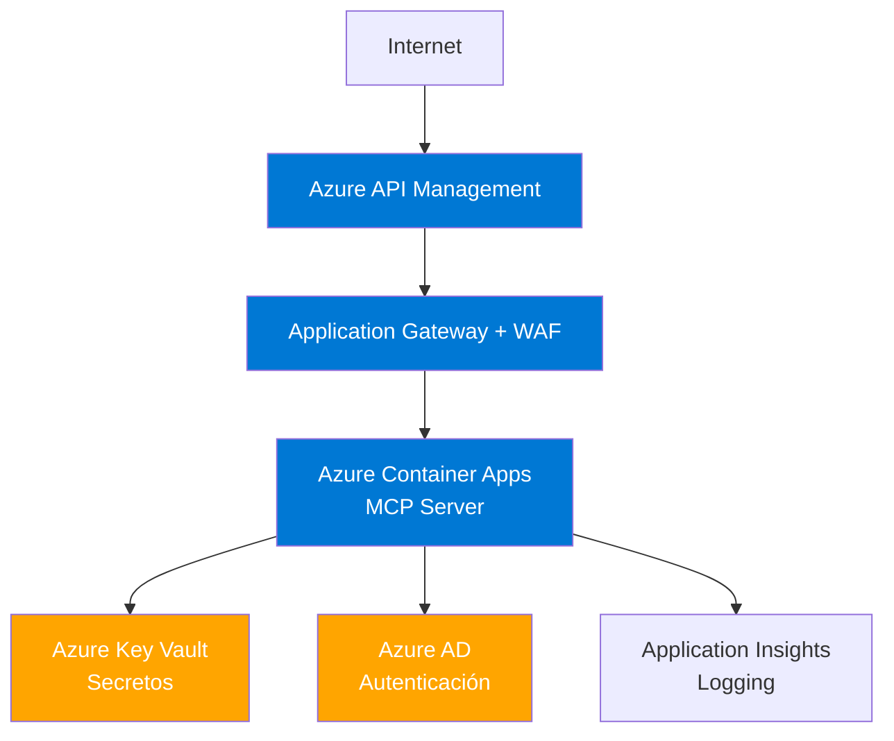

# Bloque 6: Seguridad y Gobernanza (15 minutos)

**Tipo**: Sesión teórica con ejemplos prácticos  
**Duración**: 15 minutos  
**Nivel**: Intermedio  
**Objetivo**: Profundizar en mejores prácticas de seguridad para despliegues MCP en producción

---

## 🎯 Objetivos del Bloque

Al completar este bloque, comprenderás:

1. ✅ Mejores prácticas de autenticación y autorización para producción
2. ✅ Gestión segura de secretos y certificados
3. ✅ Estrategias de auditoría y compliance
4. ✅ Patrones de despliegue seguro en Azure

---

## 🔐 1. Autenticación en Producción

### ❌ Lo que NO debes hacer

```csharp
// ❌ NUNCA: Secreto hardcodeado
private const string SecretKey = "my-secret-key-123";

// ❌ NUNCA: Validación deshabilitada
var validationParameters = new TokenValidationParameters
{
    ValidateIssuerSigningKey = false,  // ❌ MAL
    ValidateLifetime = false            // ❌ MAL
};

// ❌ NUNCA: Usuarios sin contraseña
if (username == "admin") return GenerateToken(username);
```

**Consecuencias**:

- Secretos expuestos en repositorios Git
- Tokens que nunca expiran
- Acceso sin credenciales

---

### ✅ Mejores Prácticas

#### 1.1 Usar Azure AD / Entra ID

**Recomendación**: Delegar autenticación a Azure Active Directory.

```csharp
builder.Services.AddAuthentication(JwtBearerDefaults.AuthenticationScheme)
    .AddJwtBearer(options =>
    {
        options.Authority = "https://login.microsoftonline.com/{tenant-id}";
        options.Audience = "api://mcp-workshop-server";
        options.TokenValidationParameters = new TokenValidationParameters
        {
            ValidateIssuer = true,
            ValidateAudience = true,
            ValidateLifetime = true,
            ClockSkew = TimeSpan.Zero
        };
    });
```

**Ventajas**:

- ✅ Multi-factor authentication (MFA) integrado
- ✅ Gestión centralizada de usuarios
- ✅ Integración con políticas de seguridad empresariales
- ✅ Auditoría automática de inicios de sesión

---

#### 1.2 Gestión de Secretos con Azure Key Vault

**❌ Antes (inseguro)**:

```json
// appsettings.json
{
    "JwtSettings": {
        "SecretKey": "my-super-secret-key-12345" // ❌ Expuesto
    }
}
```

**✅ Después (seguro)**:

```csharp
// Program.cs
var keyVaultUrl = new Uri($"https://{builder.Configuration["KeyVaultName"]}.vault.azure.net/");
builder.Configuration.AddAzureKeyVault(keyVaultUrl, new DefaultAzureCredential());

// Ahora el secreto se carga desde Key Vault
var secretKey = builder.Configuration["JwtSecretKey"];
```

**Configuración de Key Vault**:

```bash
# Crear Key Vault
az keyvault create --name mcp-workshop-kv --resource-group mcp-rg --location westeurope

# Guardar secreto
az keyvault secret set --vault-name mcp-workshop-kv --name JwtSecretKey --value "tu-secreto-real"

# Dar acceso a tu aplicación
az keyvault set-policy --name mcp-workshop-kv --object-id {app-identity-id} --secret-permissions get list
```

---

#### 1.3 Tokens con Expiración Corta + Refresh Tokens

**Patrón recomendado**:

| Token             | Duración   | Propósito             |
| ----------------- | ---------- | --------------------- |
| **Access Token**  | 15 minutos | Acceso a recursos MCP |
| **Refresh Token** | 7 días     | Renovar access token  |

```csharp
public class TokenResponse
{
    public string AccessToken { get; set; }     // JWT, 15 min
    public string RefreshToken { get; set; }    // GUID, 7 días
    public DateTime ExpiresAt { get; set; }
}

public async Task<TokenResponse> RefreshAccessToken(string refreshToken)
{
    var storedToken = await _tokenStore.GetRefreshToken(refreshToken);

    if (storedToken == null || storedToken.ExpiresAt < DateTime.UtcNow)
    {
        throw new SecurityTokenException("Invalid or expired refresh token");
    }

    // Generar nuevo access token
    var newAccessToken = GenerateAccessToken(storedToken.UserId, 15);

    return new TokenResponse
    {
        AccessToken = newAccessToken,
        RefreshToken = refreshToken,  // Mantener el mismo refresh token
        ExpiresAt = DateTime.UtcNow.AddMinutes(15)
    };
}
```

---

## 🛡️ 2. Autorización Avanzada

### 2.1 Scopes Jerárquicos

**Implementación**:

```csharp
public class ScopeHierarchy
{
    private static readonly Dictionary<string, List<string>> Hierarchy = new()
    {
        { "admin", new List<string> { "admin", "write", "read" } },
        { "write", new List<string> { "write", "read" } },
        { "read", new List<string> { "read" } }
    };

    public static bool HasEffectiveScope(List<string> userScopes, string requiredScope)
    {
        foreach (var userScope in userScopes)
        {
            if (Hierarchy.TryGetValue(userScope, out var effectiveScopes))
            {
                if (effectiveScopes.Contains(requiredScope))
                {
                    return true;
                }
            }
        }
        return false;
    }
}
```

**Uso**:

```csharp
// Usuario con scope "admin" automáticamente tiene "write" y "read"
var user = new AuthenticatedUser { Scopes = new List<string> { "admin" } };
var canRead = ScopeHierarchy.HasEffectiveScope(user.Scopes, "read");  // true
var canWrite = ScopeHierarchy.HasEffectiveScope(user.Scopes, "write"); // true
```

---

### 2.2 Autorización Basada en Recursos

**Escenario**: Un usuario puede leer solo sus propios datos.

```csharp
public class ResourceAuthorizationService
{
    public bool CanAccessResource(AuthenticatedUser user, string resourceId, string resourceType)
    {
        // Verificar scope básico
        if (!user.Scopes.Contains("read"))
        {
            return false;
        }

        // Verificar propiedad del recurso
        if (resourceType == "customer")
        {
            var customer = _customerRepository.GetById(resourceId);
            return customer.OwnerId == user.UserId || user.Scopes.Contains("admin");
        }

        return false;
    }
}
```

**Uso en endpoint**:

```csharp
app.MapPost("/mcp", async (JsonRpcRequest request, AuthenticatedUser user, ResourceAuthorizationService authz) =>
{
    if (request.Method == "resources/read")
    {
        var resourceId = ExtractResourceId(request.Params);

        if (!authz.CanAccessResource(user, resourceId, "customer"))
        {
            return CreateErrorResponse(-32004, "Access denied to this resource");
        }

        // Continuar con la lectura...
    }
});
```

---

## 📊 3. Auditoría y Compliance

### 3.1 Logging Estructurado de Eventos de Seguridad

**Eventos críticos a registrar**:

| Evento                | Severidad | Información requerida                            |
| --------------------- | --------- | ------------------------------------------------ |
| Autenticación exitosa | Info      | UserId, IP, timestamp                            |
| Autenticación fallida | Warning   | Username, IP, reason, timestamp                  |
| Acceso denegado       | Warning   | UserId, resource, requiredScope, timestamp       |
| Token expirado        | Info      | UserId, tokenId, timestamp                       |
| Rate limit excedido   | Warning   | UserId, IP, limit, timestamp                     |
| Cambio de permisos    | Audit     | AdminId, UserId, oldScopes, newScopes, timestamp |

**Implementación**:

```csharp
public class SecurityAuditLogger
{
    private readonly ILogger<SecurityAuditLogger> _logger;

    public void LogAuthenticationSuccess(string userId, string ipAddress)
    {
        _logger.LogInformation("Authentication successful for user {UserId} from {IpAddress}", userId, ipAddress);
    }

    public void LogAuthenticationFailure(string username, string ipAddress, string reason)
    {
        _logger.LogWarning("Authentication failed for user {Username} from {IpAddress}: {Reason}", username, ipAddress, reason);
    }

    public void LogAccessDenied(string userId, string resource, string requiredScope)
    {
        _logger.LogWarning("Access denied for user {UserId} to resource {Resource}. Required scope: {RequiredScope}", userId, resource, requiredScope);
    }

    public void LogRateLimitExceeded(string userId, string ipAddress, int limit)
    {
        _logger.LogWarning("Rate limit exceeded for user {UserId} from {IpAddress}. Limit: {Limit} req/min", userId, ipAddress, limit);
    }
}
```

---

### 3.2 Integración con Azure Monitor

**Configuración**:

```csharp
// Program.cs
builder.Logging.AddApplicationInsights(
    configureTelemetryConfiguration: (config) =>
        config.ConnectionString = builder.Configuration["ApplicationInsights:ConnectionString"],
    configureApplicationInsightsLoggerOptions: (options) => { }
);

builder.Logging.AddFilter<ApplicationInsightsLoggerProvider>("Exercise3Server.Security", LogLevel.Information);
```

**Query en Log Analytics**:

```kusto
// Buscar intentos de autenticación fallidos en las últimas 24 horas
traces
| where timestamp > ago(24h)
| where message contains "Authentication failed"
| extend Username = tostring(customDimensions.Username)
| extend IpAddress = tostring(customDimensions.IpAddress)
| summarize FailureCount = count() by Username, IpAddress
| where FailureCount > 5
| order by FailureCount desc
```

---

### 3.3 Cumplimiento GDPR / LOPD

**Consideraciones clave**:

1. **Consentimiento**: Registrar consentimiento del usuario para procesar datos.

```csharp
public class UserConsent
{
    public string UserId { get; set; }
    public bool ConsentGiven { get; set; }
    public DateTime ConsentDate { get; set; }
    public string ConsentVersion { get; set; }  // "v1.0"
}
```

1. **Derecho al olvido**: Implementar endpoint para eliminar datos del usuario.

```csharp
app.MapDelete("/api/users/{userId}/data", async (string userId, IUserDataService dataService) =>
{
    await dataService.DeleteAllUserData(userId);
    await _auditLogger.LogDataDeletion(userId, "User requested data deletion");
    return Results.Ok(new { message = "All user data deleted" });
});
```

1. **Portabilidad de datos**: Exportar datos del usuario en formato legible.

```csharp
app.MapGet("/api/users/{userId}/export", async (string userId) =>
{
    var userData = await _userDataService.GetAllUserData(userId);
    var json = JsonSerializer.Serialize(userData, new JsonSerializerOptions { WriteIndented = true });
    return Results.File(Encoding.UTF8.GetBytes(json), "application/json", $"user-{userId}-data.json");
});
```

---

## 🚀 4. Despliegue Seguro en Azure

### 4.1 Arquitectura Recomendada



**Componentes clave**:

1. **Azure API Management**: Rate limiting global, políticas de seguridad, transformación de requests.
2. **Application Gateway + WAF**: Protección contra ataques (SQL injection, XSS, DDoS).
3. **Azure Container Apps**: Hosting del servidor MCP con escalado automático.
4. **Azure Key Vault**: Gestión de secretos y certificados.
5. **Azure AD**: Autenticación centralizada.
6. **Application Insights**: Monitoreo y logging.

---

### 4.2 Configuración de HTTPS

**Certificado gestionado por Azure**:

```bash
# Crear Container App con HTTPS automático
az containerapp create \
  --name mcp-exercise3-server \
  --resource-group mcp-rg \
  --environment mcp-env \
  --image mcr.microsoft.com/azuredocs/containerapps-helloworld:latest \
  --target-port 5003 \
  --ingress external \
  --transport auto

# Azure asigna automáticamente un certificado SSL para *.azurecontainerapps.io
```

**Certificado personalizado**:

```bash
# Subir certificado a Key Vault
az keyvault certificate import \
  --vault-name mcp-workshop-kv \
  --name mcp-ssl-cert \
  --file mycert.pfx \
  --password {cert-password}

# Vincular certificado a Container App
az containerapp hostname bind \
  --name mcp-exercise3-server \
  --resource-group mcp-rg \
  --hostname mcp.tudominio.com \
  --certificate {cert-id}
```

---

### 4.3 Network Isolation

**Configuración de VNET**:

```bash
# Crear VNET
az network vnet create \
  --name mcp-vnet \
  --resource-group mcp-rg \
  --address-prefix 10.0.0.0/16 \
  --subnet-name mcp-subnet \
  --subnet-prefix 10.0.1.0/24

# Desplegar Container Apps Environment en VNET
az containerapp env create \
  --name mcp-env-secure \
  --resource-group mcp-rg \
  --location westeurope \
  --infrastructure-subnet-resource-id {subnet-id} \
  --internal-only true  # Solo accesible desde VNET
```

---

## 🔍 5. Monitoreo de Seguridad

### 5.1 Alertas Automatizadas

**Configurar alertas en Azure Monitor**:

```kusto
// Alerta: Más de 10 intentos fallidos de autenticación en 5 minutos
traces
| where timestamp > ago(5m)
| where message contains "Authentication failed"
| extend Username = tostring(customDimensions.Username)
| summarize FailureCount = count() by Username
| where FailureCount > 10
```

**Acción de alerta**:

- Enviar email al equipo de seguridad
- Crear ticket en Azure DevOps
- Bloquear temporalmente la IP del atacante

---

### 5.2 Métricas de Seguridad

| Métrica                              | Objetivo | Acción si se excede                 |
| ------------------------------------ | -------- | ----------------------------------- |
| Tasa de autenticación fallida        | < 5%     | Investigar intentos de brute force  |
| Tiempo de respuesta de autenticación | < 200ms  | Optimizar validación de tokens      |
| Tokens expirados rechazados          | < 2%     | Revisar configuración de expiración |
| Accesos denegados por scope          | < 10%    | Revisar asignación de permisos      |

---

## 📋 Checklist de Seguridad para Producción

### Autenticación

- [ ] Usar Azure AD / Entra ID para autenticación
- [ ] Tokens JWT con expiración ≤ 30 minutos
- [ ] Implementar refresh tokens para renovación
- [ ] MFA habilitado para usuarios administrativos
- [ ] Secretos en Azure Key Vault (no en código/config)

### Autorización

- [ ] Scopes definidos según principio de mínimo privilegio
- [ ] Autorización basada en recursos implementada
- [ ] Validación de permisos en cada endpoint MCP
- [ ] Logs de accesos denegados

### Comunicación

- [ ] HTTPS obligatorio (TLS 1.2+)
- [ ] Certificados válidos y renovados automáticamente
- [ ] CORS configurado con dominios específicos (no `*`)
- [ ] Rate limiting por usuario e IP

### Auditoría

- [ ] Logs estructurados enviados a Application Insights
- [ ] Eventos de seguridad registrados (login, access denied, rate limit)
- [ ] Retención de logs ≥ 90 días
- [ ] Alertas configuradas para patrones anómalos

### Infraestructura

- [ ] WAF habilitado en Application Gateway
- [ ] Network isolation con VNET
- [ ] Container Apps con replicas mínimas 2
- [ ] Backups automáticos de secretos y configuraciones

### Compliance

- [ ] Consentimiento de usuario registrado
- [ ] Endpoint de eliminación de datos (GDPR)
- [ ] Endpoint de exportación de datos
- [ ] Documentación de procesamiento de datos personales

---

## 🎓 Resumen

**Principios clave de seguridad MCP**:

1. **Defensa en Profundidad**: Múltiples capas de seguridad (WAF, autenticación, autorización, rate limiting).
2. **Principio de Mínimo Privilegio**: Usuarios tienen solo los permisos necesarios.
3. **Zero Trust**: No confiar en nada, verificar todo.
4. **Auditoría Continua**: Registrar y monitorear todos los eventos de seguridad.

**Próximos pasos**:

En el Ejercicio 4 aplicarás estos conceptos en un escenario de orquestación multi-fuente, integrando 3 servidores MCP con seguridad centralizada.

---

## ✅ Enterprise Deployment Checklist

### Pre-Production Validation

#### Security

- [ ] JWT tokens almacenados en Azure Key Vault (no hardcoded)
- [ ] Certificados SSL/TLS con renovación automática
- [ ] Secrets rotados cada 90 días máximo
- [ ] Validación de tokens con issuer y audience correctos
- [ ] Rate limiting configurado por scope (read < write < admin)
- [ ] Logs sin datos sensibles (password/token/secret redactados)
- [ ] Azure AD / Entra ID configurado para autenticación
- [ ] Managed Identity habilitado para servicios Azure

#### Compliance

- [ ] Logs con retención mínima según regulación (GDPR: 6 meses)
- [ ] Encriptación en tránsito (TLS 1.3) y en reposo (AES-256)
- [ ] Auditoría de accesos a datos sensibles
- [ ] Data residency configurada según jurisdicción
- [ ] Política de backup y recuperación documentada
- [ ] Incident response plan definido

#### Monitoring

- [ ] Application Insights configurado
- [ ] Alertas para errores 401/403/429
- [ ] Alertas para latencia >2s (p95)
- [ ] Alertas para disponibilidad <99.9%
- [ ] Dashboard con métricas clave (requests/s, errors, latency)
- [ ] Health checks en /health endpoint

#### Performance

- [ ] Caching habilitado (5 min TTL para queries frecuentes)
- [ ] Connection pooling configurado
- [ ] Timeout de HTTP <5s
- [ ] Throttling para prevenir abuse
- [ ] CDN para recursos estáticos

### Production vs Development Configuration

| Aspecto              | Development                  | Production                                           |
| -------------------- | ---------------------------- | ---------------------------------------------------- |
| **JWT Secret**       | Hardcoded `"dev-secret-123"` | Azure Key Vault `@Microsoft.KeyVault(SecretUri=...)` |
| **Token Expiration** | 24 horas                     | 1 hora + refresh token                               |
| **Rate Limiting**    | 1000 req/min                 | 100/50/10 por scope                                  |
| **Logging Level**    | Debug                        | Warning/Error                                        |
| **HTTPS**            | Opcional (localhost)         | Obligatorio (enforce)                                |
| **CORS**             | `*` (cualquier origen)       | Lista blanca específica                              |
| **Error Details**    | Stack trace completo         | Mensaje genérico                                     |
| **Database**         | SQLite local                 | Azure SQL con geo-replication                        |
| **Secrets**          | appsettings.Development.json | Azure Key Vault + Managed Identity                   |

#### Aspectos Adicionales de Configuración

##### Health Checks y Monitoring

| Funcionalidad           | Development             | Staging                                    | Production                                                                      |
| ----------------------- | ----------------------- | ------------------------------------------ | ------------------------------------------------------------------------------- |
| **Health Endpoints**    | `/health` básico (ping) | Health checks con dependencies (DB, Redis) | Health checks + readiness/liveness probes                                       |
| **Distributed Tracing** | No configurado          | Application Insights con sampling 10%      | Application Insights con sampling adaptivo + correlación cross-service          |
| **Alerting**            | No configurado          | Alertas para errores 5xx                   | Alertas multi-nivel: Errores, latencia, rate limit exceeded, certificate expiry |
| **Metrics**             | Console output          | Azure Monitor métricas básicas             | Azure Monitor + custom metrics (business KPIs)                                  |

##### Resiliencia y Circuit Breakers

| Patrón              | Development    | Staging                                   | Production                                              |
| ------------------- | -------------- | ----------------------------------------- | ------------------------------------------------------- |
| **Retry Policy**    | No configurado | Retry 3 veces con backoff lineal          | Retry con exponential backoff + jitter (Polly library)  |
| **Circuit Breaker** | No configurado | Circuit breaker básico (10 fallos → open) | Circuit breaker avanzado con half-open state + métricas |
| **Timeout**         | Sin límite     | 30 segundos por llamada                   | Timeout agresivo: 5s API calls, 30s DB queries          |
| **Bulkhead**        | No configurado | No configurado                            | Thread pool isolation para proteger recursos críticos   |

##### Seguridad de Red y Failover

| Aspecto               | Development     | Staging                         | Production                                                        |
| --------------------- | --------------- | ------------------------------- | ----------------------------------------------------------------- |
| **Network**           | Public internet | VNet con NSG básico             | VNet con Private Endpoints + Azure Firewall                       |
| **DDoS Protection**   | No configurado  | Azure DDoS Network Protection   | Azure DDoS Network + IP Protection                                |
| **Certificate**       | Self-signed     | Let's Encrypt wildcard          | DigiCert EV con auto-rotation                                     |
| **Backup Strategy**   | No backups      | Daily backup retención 7 días   | Hourly incremental + daily full, retención 30 días, geo-redundant |
| **Disaster Recovery** | No configurado  | Active-passive (RTO 4h, RPO 1h) | Active-active multi-region (RTO 5min, RPO 5min)                   |

##### Decisión Tree: ¿Cuándo Usar Cada Configuración?

```text
┌─────────────────────────────────────┐
│ ¿Es una demostración/prototipo?     │
└──┬──────────────────────────────────┘
   │
   ├─ Sí → Development Config
   │        • SQLite local
   │        • Secrets en appsettings
   │        • Sin rate limiting
   │        • CORS permisivo
   │
   └─ No → ¿Tiene usuarios reales?
           │
           ├─ No → Staging Config
           │        • Azure SQL single region
           │        • Key Vault basic tier
           │        • Rate limiting moderado
           │        • Health checks básicos
           │
           └─ Sí → ¿Datos regulados (GDPR/HIPAA)?
                   │
                   ├─ No → Production Config Standard
                   │        • Azure SQL geo-replication
                   │        • Key Vault standard tier
                   │        • Rate limiting estricto
                   │        • Monitoring + alertas
                   │
                   └─ Sí → Production Config Premium
                            • Azure SQL Hyperscale multi-region
                            • Key Vault premium HSM
                            • WAF + DDoS protection
                            • Compliance logging (SIEM)
                            • Multi-region disaster recovery
```

##### Migración Progresiva: Checklist de Upgrade

**De Development a Staging**:

- [x] Migrar SQLite → Azure SQL
- [x] Secrets → Azure Key Vault
- [x] Habilitar Application Insights
- [x] Configurar health checks con dependencies
- [x] Implementar rate limiting por scope
- [x] Configurar CORS con whitelist
- [x] Habilitar HTTPS con certificate real
- [ ] Configurar backup diario
- [ ] Implementar circuit breaker para llamadas externas

**De Staging a Production**:

- [x] Geo-replication para Azure SQL
- [x] Managed Identity para Key Vault (eliminar connection strings)
- [x] Distributed tracing con correlación IDs
- [x] Multi-level alerting (email + SMS + PagerDuty)
- [x] Custom metrics para business KPIs
- [x] Timeout agresivo + retry con exponential backoff
- [x] Private Endpoints (eliminar public access)
- [x] DDoS Network + IP Protection
- [x] DigiCert EV certificate con auto-rotation
- [x] Hourly backup geo-redundant
- [x] Multi-region active-active disaster recovery
- [ ] Penetration testing por terceros
- [ ] Compliance audit (SOC2, ISO 27001)

**Ejemplo configuración producción**:

```json
{
    "Authentication": {
        "JwtSecretKeyVault": "https://mykv.vault.azure.net/secrets/jwt-secret",
        "Issuer": "https://login.microsoftonline.com/{tenant-id}",
        "Audience": "api://mcp-workshop-prod",
        "TokenExpiration": "01:00:00"
    },
    "RateLimiting": {
        "ReadScope": { "Limit": 100, "Window": "00:01:00" },
        "WriteScope": { "Limit": 50, "Window": "00:01:00" },
        "AdminScope": { "Limit": 10, "Window": "00:01:00" }
    },
    "Logging": {
        "LogLevel": {
            "Default": "Warning",
            "Microsoft": "Error"
        },
        "ApplicationInsights": {
            "InstrumentationKey": "@Microsoft.KeyVault(SecretUri=...)"
        }
    },
    "AllowedOrigins": ["https://portal.contoso.com", "https://app.contoso.com"]
}
```

---

## 📖 Recursos Adicionales

- **Azure AD Documentation**: <https://learn.microsoft.com/en-us/azure/active-directory/>
- **Azure Key Vault Best Practices**: <https://learn.microsoft.com/en-us/azure/key-vault/general/best-practices>
- **OWASP API Security Top 10**: <https://owasp.org/www-project-api-security/>
- **GDPR Compliance Guide**: <https://gdpr.eu/>

---

**Preparado por**: Instructor del taller MCP  
**Versión**: 1.0.0  
**Última actualización**: Febrero 2026
