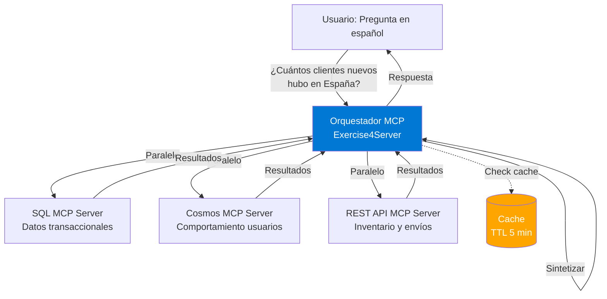

# Bloque 7: Ejercicio 4 - Analista Virtual Multi-Fuente (25 minutos)

**Tipo**: Ejercicio en grupo (3-5 personas)  
**Duración**: 25 minutos  
**Nivel**: Avanzado - Integración de conceptos  
**Objetivo**: Crear un orquestador MCP que coordina múltiples servidores para responder preguntas de negocio en español

---

## 🎯 Objetivos del Ejercicio

Al completar este ejercicio, habrás:

1. ✅ Integrado 3 servidores MCP independientes (SQL, Cosmos DB, REST API)
2. ✅ Implementado patrones de orquestación (paralelo, secuencial, fan-out)
3. ✅ Creado un parser de lenguaje natural para consultas en español
4. ✅ Optimizado con estrategias de caching
5. ✅ Gestionado errores y fallbacks cuando servidores no están disponibles

---

## 🏗️ Arquitectura del Sistema



---

## 📋 Escenario de Negocio

**Contexto**: Eres el CTO de una empresa de e-commerce. El CEO te pide:

> "Necesito respuestas rápidas a preguntas de negocio sin abrir 5 dashboards. Quiero preguntarle a la IA en español y que consulte SQL, Cosmos DB, y nuestras APIs automáticamente."

**Ejemplos de preguntas** (del contrato):

1. **"¿Cuántos clientes nuevos registrados en España este mes?"**

    - Servidor: SQL MCP
    - Método: `tools/call` → `query_customers_by_country`
    - Parámetros: `{ country: "España" }`

2. **"¿Qué usuarios abandonaron carritos en las últimas 24 horas?"**

    - Servidor: Cosmos MCP
    - Método: `tools/call` → `get_abandoned_carts`
    - Parámetros: `{ hours: 24 }`

3. **"¿Cuál es el estado del pedido #1234 y su inventario asociado?"**

    - Servidores: SQL MCP (pedido) + REST API MCP (inventario, envío)
    - Patrón: Secuencial → primero pedido, luego inventario/envío con IDs

4. **"Dame un resumen de ventas de la semana más productos más vendidos"**
    - Servidores: SQL MCP (ventas) + REST API MCP (top productos)
    - Patrón: Paralelo → ambas consultas simultáneas, luego fusionar

---

## 🚀 Paso a Paso

### Paso 1: Estructura del Proyecto (2 minutos)

```powershell

cd src/McpWorkshop.Servers
dotnet new web -n Exercise4Server -f net10.0
cd Exercise4Server

# Referencias
dotnet add reference ../../McpWorkshop.Shared/McpWorkshop.Shared.csproj

# Crear estructura
mkdir Orchestration
mkdir Models
mkdir Parsers

# Agregar a solución
cd ../../..
dotnet sln add src/McpWorkshop.Servers/Exercise4Server/Exercise4Server.csproj
```

**✅ Checkpoint**: Proyecto creado.

---

### Paso 2: Servidores MCP Simulados (5 minutos)

**Nota**: En este ejercicio, usarás servidores MCP simulados (mocks) para enfocarte en la orquestación. En producción, estos serían servidores reales.

Crea `Models/McpServerClient.cs`:

```csharp
using System.Text.Json;

namespace Exercise4Server.Models;

public class McpServerClient
{
    private readonly string _serverUrl;
    private readonly HttpClient _httpClient;

    public McpServerClient(string serverUrl)
    {
        _serverUrl = serverUrl;
        _httpClient = new HttpClient { Timeout = TimeSpan.FromSeconds(5) };
    }

    public async Task<T?> CallToolAsync<T>(string toolName, object arguments)
    {
        var request = new
        {
            jsonrpc = "2.0",
            method = "tools/call",
            @params = new { name = toolName, arguments },
            id = Guid.NewGuid().ToString()
        };

        var json = JsonSerializer.Serialize(request);
        var content = new StringContent(json, System.Text.Encoding.UTF8, "application/json");

        try
        {
            var response = await _httpClient.PostAsync($"{_serverUrl}/mcp", content);
            response.EnsureSuccessStatusCode();

            var responseJson = await response.Content.ReadAsStringAsync();
            var result = JsonSerializer.Deserialize<JsonElement>(responseJson);

            // Verificar si la respuesta tiene la propiedad "result"
            if (result.TryGetProperty("result", out var resultProperty))
            {
                return JsonSerializer.Deserialize<T>(resultProperty.GetRawText());
            }

            // Si tiene "error", lanzar excepción con el mensaje de error
            if (result.TryGetProperty("error", out var errorProperty))
            {
                var errorMessage = errorProperty.TryGetProperty("message", out var msgProp)
                    ? msgProp.GetString()
                    : "Unknown error";
                throw new InvalidOperationException($"MCP Server error: {errorMessage}");
            }

            // Si no tiene ni result ni error, devolver la respuesta completa
            return JsonSerializer.Deserialize<T>(responseJson);
        }
        catch (HttpRequestException ex)
        {
            throw new InvalidOperationException($"Failed to connect to MCP server at {_serverUrl}: {ex.Message}", ex);
        }
        catch (TaskCanceledException ex)
        {
            throw new InvalidOperationException($"Request to MCP server at {_serverUrl} timed out", ex);
        }
    }
}
```

Crea `Models/QueryRequest.cs`:

```csharp
namespace Exercise4Server.Models;

public record QueryRequest(string Query);
```

---

### Paso 3: Query Parser (7 minutos)

**Estrategia MVP**: Parser basado en keywords (no LLM). Extensible para futuro.

Crea `Parsers/SpanishQueryParser.cs`:

```csharp
namespace Exercise4Server.Parsers;

public record ParsedQuery(
    string Intent,
    Dictionary<string, string> Parameters,
    List<string> RequiredServers
);

public class SpanishQueryParser
{
    public ParsedQuery Parse(string query)
    {
        query = query.ToLowerInvariant();

        // Intent: Nuevos clientes
        if (query.Contains("clientes nuevos") || query.Contains("nuevos clientes"))
        {
            var country = ExtractCountry(query);
            var city = ExtractCity(query);
            var since = ExtractDateRange(query) ?? DateTime.UtcNow.AddMonths(-1).ToString("yyyy-MM-dd");

            return new ParsedQuery(
                Intent: "new_customers",
                Parameters: new Dictionary<string, string>
                {
                    { "country", country ?? "España" },
                    { "city", city ?? "all" },
                    { "since", since }
                },
                RequiredServers: new List<string> { "sql" }
            );
        }

        // Intent: Carritos abandonados
        if (query.Contains("carrito") && (query.Contains("abandonado") || query.Contains("abandonaron")))
        {
            var hours = ExtractHours(query);
            var timeRange = hours > 0 ? $"{hours}h" : "24h";

            return new ParsedQuery(
                Intent: "abandoned_carts",
                Parameters: new Dictionary<string, string>
                {
                    { "timeRange", timeRange }
                },
                RequiredServers: new List<string> { "cosmos" }
            );
        }

        // Intent: Estado de pedido
        if (query.Contains("estado") && query.Contains("pedido"))
        {
            var orderId = ExtractOrderId(query);

            return new ParsedQuery(
                Intent: "order_status",
                Parameters: new Dictionary<string, string>
                {
                    { "orderId", orderId ?? "0" }
                },
                RequiredServers: new List<string> { "sql", "rest" }
            );
        }

        // Intent: Resumen de ventas
        if (query.Contains("resumen") || query.Contains("ventas"))
        {
            return new ParsedQuery(
                Intent: "sales_summary",
                Parameters: new Dictionary<string, string>(),
                RequiredServers: new List<string> { "sql", "rest" }
            );
        }

        // Default: Unknown intent
        return new ParsedQuery(
            Intent: "unknown",
            Parameters: new Dictionary<string, string>(),
            RequiredServers: new List<string>()
        );
    }

    private string? ExtractCountry(string query)
    {
        var countries = new Dictionary<string, string>
        {
            { "españa", "España" },
            { "spain", "España" },
            { "méxico", "México" },
            { "mexico", "México" },
            { "argentina", "Argentina" },
            { "chile", "Chile" },
            { "colombia", "Colombia" },
            { "perú", "Perú" },
            { "peru", "Perú" }
        };

        foreach (var (key, value) in countries)
        {
            if (query.Contains(key))
            {
                return value;
            }
        }
        return null;
    }

    private string? ExtractCity(string query)
    {
        var cities = new[] { "madrid", "barcelona", "valencia", "sevilla", "bilbao" };
        foreach (var city in cities)
        {
            if (query.Contains(city))
            {
                return char.ToUpper(city[0]) + city.Substring(1);
            }
        }
        return null;
    }

    private int ExtractHours(string query)
    {
        // Buscar patrones como "últimas 24 horas", "últimas 72 horas", etc.
        var match = System.Text.RegularExpressions.Regex.Match(query, @"últimas?\s+(\d+)\s+horas?");
        if (match.Success && int.TryParse(match.Groups[1].Value, out var hours))
        {
            return hours;
        }

        // Buscar patrones como "24h", "72h"
        match = System.Text.RegularExpressions.Regex.Match(query, @"(\d+)h");
        if (match.Success && int.TryParse(match.Groups[1].Value, out hours))
        {
            return hours;
        }

        return 0; // No se encontró
    }

    private string? ExtractOrderId(string query)
    {
        var match = System.Text.RegularExpressions.Regex.Match(query, @"#?(\d+)");
        return match.Success ? match.Groups[1].Value : null;
    }

    private string? ExtractDateRange(string query)
    {
        if (query.Contains("este mes"))
        {
            return new DateTime(DateTime.UtcNow.Year, DateTime.UtcNow.Month, 1).ToString("yyyy-MM-dd");
        }
        if (query.Contains("esta semana"))
        {
            var startOfWeek = DateTime.UtcNow.AddDays(-(int)DateTime.UtcNow.DayOfWeek);
            return startOfWeek.ToString("yyyy-MM-dd");
        }
        return null;
    }
}
```

---

### Paso 4: Orquestador (8 minutos)

Crea `Orchestration/OrchestratorService.cs`:

```csharp
using System.Collections.Concurrent;
using System.Text.Json;

using Exercise4Server.Models;
using Exercise4Server.Parsers;

namespace Exercise4Server.Orchestration;

public class OrchestratorService
{
    private readonly Dictionary<string, McpServerClient> _servers;
    private readonly SpanishQueryParser _parser;
    private readonly ConcurrentDictionary<string, (object Result, DateTime CachedAt)> _cache;
    private readonly TimeSpan _cacheTtl = TimeSpan.FromMinutes(5);

    public OrchestratorService()
    {
        _servers = new Dictionary<string, McpServerClient>
        {
            { "sql", new McpServerClient("http://localhost:5010") },
            { "cosmos", new McpServerClient("http://localhost:5011") },
            { "rest", new McpServerClient("http://localhost:5012") }
        };
        _parser = new SpanishQueryParser();
        _cache = new ConcurrentDictionary<string, (object, DateTime)>();
    }

    public async Task<string> ProcessQueryAsync(string userQuery)
    {
        // 1. Parse query
        var parsedQuery = _parser.Parse(userQuery);

        if (parsedQuery.Intent == "unknown")
        {
            return "Lo siento, no entendí la pregunta. ¿Puedes reformularla?";
        }

        // 2. Check cache
        var cacheKey = $"{parsedQuery.Intent}:{string.Join(",", parsedQuery.Parameters.Select(p => $"{p.Key}={p.Value}"))}";
        if (_cache.TryGetValue(cacheKey, out var cached))
        {
            if (DateTime.UtcNow - cached.CachedAt < _cacheTtl)
            {
                return $"[CACHE] {FormatResult(parsedQuery.Intent, cached.Result)}";
            }
            _cache.TryRemove(cacheKey, out _);
        }

        // 3. Execute based on intent
        try
        {
            object result = parsedQuery.Intent switch
            {
                "new_customers" => await ExecuteNewCustomersAsync(parsedQuery.Parameters),
                "abandoned_carts" => await ExecuteAbandonedCartsAsync(parsedQuery.Parameters),
                "order_status" => await ExecuteOrderStatusAsync(parsedQuery.Parameters),
                "sales_summary" => await ExecuteSalesSummaryAsync(),
                _ => "Intent no implementado"
            };

            // 4. Cache result
            _cache[cacheKey] = (result, DateTime.UtcNow);

            // 5. Format and return
            return FormatResult(parsedQuery.Intent, result);
        }
        catch (InvalidOperationException ex)
        {
            return $"❌ Error al ejecutar la consulta: {ex.Message}. Verifica que los servidores MCP estén corriendo.";
        }
        catch (Exception ex)
        {
            return $"❌ Error inesperado: {ex.Message}";
        }
    }

    private async Task<object> ExecuteNewCustomersAsync(Dictionary<string, string> parameters)
    {
        // Single server: SQL - usa query_customers_by_country
        var sqlClient = _servers["sql"];
        var country = parameters.GetValueOrDefault("country", "España");
        var city = parameters.GetValueOrDefault("city", "all");

        var result = await sqlClient.CallToolAsync<dynamic>("query_customers_by_country", new
        {
            country = country,
            city = city != "all" ? city : null
        });
        return result ?? "No data";
    }

    private async Task<object> ExecuteAbandonedCartsAsync(Dictionary<string, string> parameters)
    {
        // Single server: Cosmos - usa get_abandoned_carts
        var cosmosClient = _servers["cosmos"];

        // Extraer horas del parámetro timeRange (formato: "24h", "72h", etc.)
        var timeRange = parameters.GetValueOrDefault("timeRange", "24h");
        var hours = 24; // Default

        if (timeRange.EndsWith("h") && int.TryParse(timeRange.TrimEnd('h'), out var parsedHours))
        {
            hours = parsedHours;
        }

        var result = await cosmosClient.CallToolAsync<dynamic>("get_abandoned_carts", new
        {
            hours = hours
        });
        return result ?? "No data";
    }

    private async Task<object> ExecuteOrderStatusAsync(Dictionary<string, string> parameters)
    {
        // Sequential: SQL first, then REST with results
        var sqlClient = _servers["sql"];
        var restClient = _servers["rest"];

        var orderResponse = await sqlClient.CallToolAsync<JsonElement>("get_order_details", new
        {
            orderId = int.Parse(parameters["orderId"])
        });

        // Check if order was found
        if (!orderResponse.TryGetProperty("found", out var foundProp) || !foundProp.GetBoolean())
        {
            return "Pedido no encontrado";
        }

        var order = orderResponse.GetProperty("order");

        // Use order info to query REST
        var inventory = await restClient.CallToolAsync<dynamic>("check_inventory", new
        {
            productId = order.GetProperty("productId").GetInt32()
        });

        var shipping = await restClient.CallToolAsync<dynamic>("get_shipping_status", new
        {
            orderId = int.Parse(parameters["orderId"])
        });

        return new
        {
            order = JsonSerializer.Deserialize<object>(order.GetRawText()),
            inventory,
            shipping
        };
    }

    private async Task<object> ExecuteSalesSummaryAsync()
    {
        // Parallel: SQL + REST simultaneously
        var sqlClient = _servers["sql"];
        var restClient = _servers["rest"];

        var salesTask = sqlClient.CallToolAsync<dynamic>("get_sales_summary", new
        {
            // Opcional: startDate, endDate, status
        });

        var topProductsTask = restClient.CallToolAsync<dynamic>("get_top_products", new
        {
            limit = 5
        });

        await Task.WhenAll(salesTask, topProductsTask);

        return new
        {
            sales = salesTask.Result,
            topProducts = topProductsTask.Result
        };
    }

    private string FormatResult(string intent, object result)
    {
        return intent switch
        {
            "new_customers" => $"Clientes nuevos: {result}",
            "abandoned_carts" => $"Carritos abandonados: {result}",
            "order_status" => $"Estado del pedido: {result}",
            "sales_summary" => $"Resumen de ventas: {result}",
            _ => result.ToString() ?? "Sin resultado"
        };
    }
}
```

---

### Paso 5: Program.cs (3 minutos)

```csharp
using Exercise4Server.Models;
using Exercise4Server.Orchestration;

var builder = WebApplication.CreateBuilder(args);
builder.Services.AddSingleton<OrchestratorService>();

var app = builder.Build();

app.MapPost("/query", async (QueryRequest request, OrchestratorService orchestrator) =>
{
    var result = await orchestrator.ProcessQueryAsync(request.Query);
    return Results.Ok(new { answer = result });
});

Console.WriteLine("✅ VirtualAnalyst Orchestrator running on http://localhost:5004/query");
Console.WriteLine("📋 Intenciones soportadas:");
Console.WriteLine("  - new_customers: '¿Cuántos clientes nuevos hay en España?'");
Console.WriteLine("  - abandoned_carts: '¿Usuarios con carrito abandonado últimas 24 horas?'");
Console.WriteLine("  - order_status: '¿Estado del pedido 1001?'");
Console.WriteLine("  - sales_summary: 'Resumen de ventas de esta semana'");
Console.WriteLine("  - top_products: 'Top 10 productos más vendidos'");
Console.WriteLine("\n🔧 Servidores MCP requeridos:");
Console.WriteLine("  - SqlMcpServer (http://localhost:5010)");
Console.WriteLine("  - CosmosMcpServer (http://localhost:5011)");
Console.WriteLine("  - RestApiMcpServer (http://localhost:5012) \n");

await app.RunAsync("http://localhost:5004");

```

---

## 🧪 Pruebas (En Grupo)

### Prerequisito: Levantar Servidores MCP

**⚠️ IMPORTANTE**: Antes de ejecutar las pruebas, debes tener corriendo los 3 servidores MCP que el orquestador necesita consultar:

**📝 Nota sobre Tools MCP**: Los servidores `Exercise4SqlMcpServer`, `Exercise4CosmosMcpServer` y `Exercise4RestApiMcpServer` ya están implementados con todos los tools necesarios:

-   **SQL Server**: `query_customers_by_country`, `get_sales_summary` y `get_order_details`
-   **Cosmos Server**: `get_abandoned_carts` y `analyze_user_behavior`
-   **REST API Server**: `check_inventory`, `get_shipping_status` y `get_top_products`


```powershell
# Terminal 1: SQL Server
cd src/McpWorkshop.Servers/Exercise4SqlMcpServer
dotnet run

# Terminal 2: Cosmos DB Server
cd src/McpWorkshop.Servers/Exercise4CosmosMcpServer
dotnet run

# Terminal 3: REST API Server
cd src/McpWorkshop.Servers/Exercise4RestApiMcpServer
dotnet run

# Terminal 4: Orchestrator (este proyecto)
cd src/McpWorkshop.Servers/Exercise4Server
dotnet run
```

**Verifica que los 4 servidores estén escuchando**:

-   SqlMcpServer: `http://localhost:5010`
-   CosmosMcpServer: `http://localhost:5011`
-   RestApiMcpServer: `http://localhost:5012`
-   Orchestrator (este ejercicio): `http://localhost:5004`

---

### Prueba 1: Clientes nuevos en España

```powershell
$body = @{ query = "¿Cuántos clientes nuevos registrados en España este mes?" } | ConvertTo-Json
Invoke-RestMethod -Uri "http://localhost:5004/query" -Method POST -Body $body -ContentType "application/json"
```

**Resultado esperado**: Query parseado como `new_customers`, servidor SQL invocado.

### Prueba 2: Carritos abandonados

```powershell
$body = @{ query = "¿Qué usuarios abandonaron carritos en las últimas 24 horas?" } | ConvertTo-Json
Invoke-RestMethod -Uri "http://localhost:5004/query" -Method POST -Body $body -ContentType "application/json"
```

**Resultado esperado**: Query parseado como `abandoned_carts`, servidor Cosmos invocado con `hours=24`.

### Prueba 3: Resumen de ventas (Patrón paralelo)

```powershell
$body = @{ query = "Dame un resumen de ventas de esta semana más productos más vendidos" } | ConvertTo-Json
Invoke-RestMethod -Uri "http://localhost:5004/query" -Method POST -Body $body -ContentType "application/json"
```

**Resultado esperado**: Query parseado como `sales_summary`, servidores SQL y REST API invocados en paralelo.

### Prueba 4: Estado de pedido (Patrón secuencial)

```powershell
$body = @{ query = "¿Cuál es el estado del pedido #1001?" } | ConvertTo-Json
Invoke-RestMethod -Uri "http://localhost:5004/query" -Method POST -Body $body -ContentType "application/json"
```

**Resultado esperado**: Query parseado como `order_status`, patrón secuencial:

1. Primero consulta SQL MCP para obtener detalles del pedido
2. Luego usa esos datos para consultar REST API MCP (inventario y envío)

### Prueba 5: Caching

Ejecuta la misma query dos veces rápidamente:

```powershell
# Primera vez: consulta real
$body = @{ query = "¿Cuántos clientes nuevos en España?" } | ConvertTo-Json
Invoke-RestMethod -Uri "http://localhost:5004/query" -Method POST -Body $body -ContentType "application/json"

# Segunda vez: desde cache (debe responder con [CACHE])
Invoke-RestMethod -Uri "http://localhost:5004/query" -Method POST -Body $body -ContentType "application/json"
```

---

## ✅ Criterios de Éxito

-   [ ] Parser reconoce las 4 intents (new_customers, abandoned_carts, order_status, sales_summary)
-   [ ] Orquestador llama a servidores correctos según intent
-   [ ] Patrón paralelo funciona (sales_summary)
-   [ ] Patrón secuencial funciona (order_status)
-   [ ] Caching reduce latencia en queries repetidas
-   [ ] Respuestas en español legibles

---

## 📊 Rúbrica de Evaluación (Grupos)

| Criterio          | Peso | Evaluación                                               |
| ----------------- | ---- | -------------------------------------------------------- |
| **Funcionalidad** | 40%  | ¿Parser reconoce intents? ¿Orquestador llama servidores? |
| **Arquitectura**  | 30%  | ¿Código modular? ¿Separación de responsabilidades?       |
| **Performance**   | 20%  | ¿Usa paralelo/secuencial apropiadamente? ¿Caching?       |
| **Documentación** | 10%  | ¿Código comentado? ¿README con instrucciones?            |

---

## 🎓 Conceptos Aprendidos

1. **Orquestación Multi-Fuente**: Coordinar múltiples servidores MCP independientes
2. **Query Parsing**: Convertir lenguaje natural a parámetros estructurados
3. **Patrones de Ejecución**: Paralelo vs Secuencial según dependencias
4. **Caching Estratégico**: TTL para reducir latencia en queries frecuentes
5. **Manejo de Errores**: Fallbacks cuando servidores no responden

---

## 📐 Comparación Visual: Paralelo vs Secuencial

### Patrón Paralelo (ExecuteSalesSummaryAsync)

```text
Timeline:
0ms ────────> Task.WhenAll inicia
              ├── SQL: get_sales_summary (500ms)
              └── REST: get_top_products (300ms)
500ms ──────> ✅ Ambos completan (toma el máximo)

Total: ~500ms
```

**Código**:

```csharp
var salesTask = sqlClient.CallToolAsync<dynamic>("get_sales_summary", new { });
var topProductsTask = restClient.CallToolAsync<dynamic>("get_top_products", new { limit = 5 });

await Task.WhenAll(salesTask, topProductsTask); // Espera a que AMBOS completen

return new
{
    sales = salesTask.Result,        // Ya completado
    topProducts = topProductsTask.Result  // Ya completado
};
```

**¿Cuándo usar?**: Consultas **independientes** que no dependen entre sí.

---

### Patrón Secuencial (ExecuteOrderStatusAsync)

```text
Timeline:
0ms ────────> SQL: get_order_details (200ms)
200ms ──────> ✅ Order recibido, extraer productId
              REST: check_inventory con productId (300ms)
500ms ──────> ✅ Inventory recibido
              REST: get_shipping_status con orderId (200ms)
700ms ──────> ✅ Shipping recibido

Total: ~700ms (suma de todas las llamadas)
```

**Código**:

```csharp
// 1️⃣ Primero: Obtener detalles del pedido
var order = await sqlClient.CallToolAsync<dynamic>("get_order_details", new
{
    orderId = int.Parse(parameters["orderId"])
});

// 2️⃣ Segundo: Usar productId del pedido para consultar inventario
var inventory = await restClient.CallToolAsync<dynamic>("check_inventory", new
{
    productId = order.ProductId  // ⬅️ DEPENDE del resultado anterior
});

// 3️⃣ Tercero: Consultar estado de envío
var shipping = await restClient.CallToolAsync<dynamic>("get_shipping_status", new
{
    orderId = parameters["orderId"]
});

return new { order, inventory, shipping };
```

**¿Cuándo usar?**: Consultas **dependientes** donde una necesita datos de la anterior.

---

### Comparación de Tiempos

| Patrón         | Tiempo Total    | Uso de Red               | Caso de Uso                       |
| -------------- | --------------- | ------------------------ | --------------------------------- |
| **Paralelo**   | ~500ms (máximo) | 2 conexiones simultáneas | Resumen de ventas + top productos |
| **Secuencial** | ~700ms (suma)   | 1 conexión a la vez      | Pedido → Inventario → Envío       |

**Regla de oro**:

-   Si los datos **NO dependen entre sí** → **Paralelo** (Task.WhenAll)
-   Si una consulta **necesita resultados de otra** → **Secuencial** (await en cadena)

---

## 🔧 Troubleshooting

### ⚠️ Problemas Comunes y Soluciones

#### Error: "Unknown tool: get_order_details"

**Síntoma**: Al ejecutar la Prueba 4 (estado de pedido), recibes:

```json
{
    "answer": "❌ Error al ejecutar la consulta: MCP Server error: Internal error: Unknown tool: get_order_details"
}
```

**Causa**: El servidor SQL MCP no tiene registrado el tool `get_order_details`.

**Solución**: El tool `GetOrderDetailsTool` ya está implementado en `Exercise4SqlMcpServer`. Verifica que:

1. El archivo `Exercise4SqlMcpServer/Tools/GetOrderDetailsTool.cs` existe
2. El servidor se compiló correctamente: `dotnet build` en la carpeta del servidor SQL
3. Reiniciaste el servidor SQL después de agregar el tool

**Verificación**: Al iniciar el servidor SQL, debes ver en la consola:

```text
🔧 Tools: query_customers_by_country, get_sales_summary, get_order_details
```

Si solo ves 2 tools en lugar de 3, significa que el código no se recompiló o no se reinició el servidor.

---

#### Error: KeyNotFoundException en orderResponse

**Síntoma**: El orquestador falla al intentar acceder a propiedades del pedido.

**Causa**: El código intenta acceder directamente a `order.ProductId` cuando la respuesta del tool está envuelta en una estructura con `found` y `order`.

**Solución**: Asegúrate de que el código en `OrchestratorService.cs` use el patrón correcto:

```csharp
// ❌ INCORRECTO - Acceso directo
var order = await sqlClient.CallToolAsync<dynamic>("get_order_details", ...);
var inventory = await restClient.CallToolAsync<dynamic>("check_inventory", new { productId = order.ProductId });

// ✅ CORRECTO - Verificar found y extraer order
var orderResponse = await sqlClient.CallToolAsync<JsonElement>("get_order_details", ...);
if (!orderResponse.TryGetProperty("found", out var foundProp) || !foundProp.GetBoolean())
{
    return "Pedido no encontrado";
}
var order = orderResponse.GetProperty("order");
var inventory = await restClient.CallToolAsync<dynamic>("check_inventory", new
{
    productId = order.GetProperty("productId").GetInt32()
});
```

---

#### Error: "requires an element of type 'Number', but the target element has type 'String'"

**Síntoma**: Al ejecutar la Prueba 4 (estado de pedido), recibes un error sobre tipos incompatibles:

```json
{
    "answer": "❌ Error al ejecutar la consulta: MCP Server error: Internal error: The requested operation requires an element of type 'Number', but the target element has type 'String'."
}
```

**Causa**: El parámetro `orderId` se está enviando como `string` al tool `get_shipping_status`, pero este espera un `number` (int).

**Solución**: Asegúrate de convertir el `orderId` a `int` antes de pasarlo:

```csharp
// ❌ INCORRECTO - Envía string
var shipping = await restClient.CallToolAsync<dynamic>("get_shipping_status", new
{
    orderId = parameters["orderId"]  // ⬅️ Esto es un string
});

// ✅ CORRECTO - Convierte a int
var shipping = await restClient.CallToolAsync<dynamic>("get_shipping_status", new
{
    orderId = int.Parse(parameters["orderId"])  // ⬅️ Convierte a int
});
```

**Regla general**: Siempre revisa el schema del tool en el servidor para conocer el tipo esperado:

-   `"type": "number"` → usa `int.Parse()` o `.GetInt32()`
-   `"type": "string"` → usa el valor directo
-   `"type": "boolean"` → usa `bool.Parse()` o `.GetBoolean()`

---

#### Servidor no responde o timeout

**Síntoma**: Todas las consultas fallan con "Failed to connect to MCP server" o "Request timed out".

**Solución**: Verifica que los 4 servidores estén corriendo:

```powershell
# Verifica cada endpoint
Invoke-RestMethod -Uri "http://localhost:5010/" -Method GET  # SQL
Invoke-RestMethod -Uri "http://localhost:5011/" -Method GET  # Cosmos
Invoke-RestMethod -Uri "http://localhost:5012/" -Method GET  # REST
Invoke-RestMethod -Uri "http://localhost:5004/" -Method GET  # Orchestrator (puede fallar si no tiene endpoint /)
```

Cada uno debe responder con un objeto JSON con `status: "healthy"`.

---

**Preparado por**: Instructor del taller MCP  
**Versión**: 1.0.0  
**Última actualización**: Noviembre 2025
