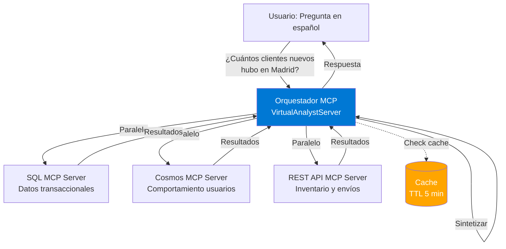

# Ejercicio 4: Analista Virtual - Orquestación Multi-Fuente (25 minutos)

**Tipo**: Ejercicio en grupo (3-5 personas)  
**Duración**: 25 minutos  
**Nivel**: Avanzado - Integración de conceptos  
**Objetivo**: Crear un orquestador MCP que coordina múltiples servidores para responder preguntas de negocio en español

---

## 🎯 Objetivos del Ejercicio

Al completar este ejercicio, habrás:

1. ✅ Integrado 3 servidores MCP independientes (SQL, Cosmos DB, REST API)
2. ✅ Implementado patrones de orquestación (paralelo, secuencial, fan-out)
3. ✅ Creado un parser de lenguaje natural para consultas en español
4. ✅ Optimizado con estrategias de caching
5. ✅ Gestionado errores y fallbacks cuando servidores no están disponibles

---

## 🏗️ Arquitectura del Sistema



---

## 📋 Escenario de Negocio

**Contexto**: Eres el CTO de una empresa de e-commerce. El CEO te pide:

> "Necesito respuestas rápidas a preguntas de negocio sin abrir 5 dashboards. Quiero preguntarle a la IA en español y que consulte SQL, Cosmos DB, y nuestras APIs automáticamente."

**Ejemplos de preguntas** (del contrato):

1. **"¿Cuántos clientes nuevos registrados en Madrid este mes?"**

    - Servidor: SQL MCP
    - Método: `tools/call` → `query_customers`
    - Parámetros: `{ city: "Madrid", since: "2025-11-01" }`

2. **"¿Qué usuarios abandonaron carritos en las últimas 24 horas?"**

    - Servidor: Cosmos MCP
    - Método: `tools/call` → `analyze_user_behavior`
    - Parámetros: `{ behaviorType: "cart_abandonment", timeRange: "24h" }`

3. **"¿Cuál es el estado del pedido #1234 y su inventario asociado?"**

    - Servidores: SQL MCP (pedido) + REST API MCP (inventario, envío)
    - Patrón: Secuencial → primero pedido, luego inventario/envío con IDs

4. **"Dame un resumen de ventas de la semana más productos más vendidos"**
    - Servidores: SQL MCP (ventas) + REST API MCP (top productos)
    - Patrón: Paralelo → ambas consultas simultáneas, luego fusionar

---

## 🚀 Paso a Paso

### Paso 1: Estructura del Proyecto (2 minutos)

```powershell
cd src/McpWorkshop.Servers
dotnet new web -n Exercise4VirtualAnalyst -f net10.0
cd Exercise4VirtualAnalyst

# Referencias
dotnet add reference ../../McpWorkshop.Shared/McpWorkshop.Shared.csproj

# Crear estructura
mkdir Orchestration
mkdir Models
mkdir Parsers

# Agregar a solución
cd ../../..
dotnet sln add src/McpWorkshop.Servers/Exercise4VirtualAnalyst/Exercise4VirtualAnalyst.csproj
```

**✅ Checkpoint**: Proyecto creado.

---

### Paso 2: Servidores MCP Simulados (5 minutos)

**Nota**: En este ejercicio, usarás servidores MCP simulados (mocks) para enfocarte en la orquestación. En producción, estos serían servidores reales.

Crea `Models/McpServerClient.cs`:

```csharp
using System.Text.Json;

namespace Exercise4VirtualAnalyst.Models;

public class McpServerClient
{
    private readonly string _serverUrl;
    private readonly HttpClient _httpClient;

    public McpServerClient(string serverUrl)
    {
        _serverUrl = serverUrl;
        _httpClient = new HttpClient { Timeout = TimeSpan.FromSeconds(5) };
    }

    public async Task<T?> CallToolAsync<T>(string toolName, object arguments)
    {
        var request = new
        {
            jsonrpc = "2.0",
            method = "tools/call",
            @params = new { name = toolName, arguments },
            id = Guid.NewGuid().ToString()
        };

        var json = JsonSerializer.Serialize(request);
        var content = new StringContent(json, System.Text.Encoding.UTF8, "application/json");

        var response = await _httpClient.PostAsync($"{_serverUrl}/mcp", content);
        response.EnsureSuccessStatusCode();

        var responseJson = await response.Content.ReadAsStringAsync();
        var result = JsonSerializer.Deserialize<JsonElement>(responseJson);

        var resultProperty = result.GetProperty("result");
        return JsonSerializer.Deserialize<T>(resultProperty.GetRawText());
    }
}
```

---

### Paso 3: Query Parser (7 minutos)

**Estrategia MVP**: Parser basado en keywords (no LLM). Extensible para futuro.

Crea `Parsers/SpanishQueryParser.cs`:

```csharp
namespace Exercise4VirtualAnalyst.Parsers;

public record ParsedQuery(
    string Intent,
    Dictionary<string, string> Parameters,
    List<string> RequiredServers
);

public class SpanishQueryParser
{
    public ParsedQuery Parse(string query)
    {
        query = query.ToLowerInvariant();

        // Intent: Nuevos clientes
        if (query.Contains("clientes nuevos") || query.Contains("nuevos clientes"))
        {
            var city = ExtractCity(query);
            var since = ExtractDateRange(query) ?? DateTime.UtcNow.AddMonths(-1).ToString("yyyy-MM-dd");

            return new ParsedQuery(
                Intent: "new_customers",
                Parameters: new Dictionary<string, string>
                {
                    { "city", city ?? "all" },
                    { "since", since }
                },
                RequiredServers: new List<string> { "sql" }
            );
        }

        // Intent: Carritos abandonados
        if (query.Contains("carrito") && (query.Contains("abandonado") || query.Contains("abandonaron")))
        {
            var timeRange = query.Contains("24 horas") || query.Contains("24h") ? "24h" : "7d";

            return new ParsedQuery(
                Intent: "abandoned_carts",
                Parameters: new Dictionary<string, string>
                {
                    { "behaviorType", "cart_abandonment" },
                    { "timeRange", timeRange }
                },
                RequiredServers: new List<string> { "cosmos" }
            );
        }

        // Intent: Estado de pedido
        if (query.Contains("estado") && query.Contains("pedido"))
        {
            var orderId = ExtractOrderId(query);

            return new ParsedQuery(
                Intent: "order_status",
                Parameters: new Dictionary<string, string>
                {
                    { "orderId", orderId ?? "0" }
                },
                RequiredServers: new List<string> { "sql", "rest" }
            );
        }

        // Intent: Resumen de ventas
        if (query.Contains("resumen") || query.Contains("ventas"))
        {
            return new ParsedQuery(
                Intent: "sales_summary",
                Parameters: new Dictionary<string, string>(),
                RequiredServers: new List<string> { "sql", "rest" }
            );
        }

        // Default: Unknown intent
        return new ParsedQuery(
            Intent: "unknown",
            Parameters: new Dictionary<string, string>(),
            RequiredServers: new List<string>()
        );
    }

    private string? ExtractCity(string query)
    {
        var cities = new[] { "madrid", "barcelona", "valencia", "sevilla", "bilbao" };
        foreach (var city in cities)
        {
            if (query.Contains(city))
            {
                return char.ToUpper(city[0]) + city.Substring(1);
            }
        }
        return null;
    }

    private string? ExtractOrderId(string query)
    {
        var match = System.Text.RegularExpressions.Regex.Match(query, @"#?(\d+)");
        return match.Success ? match.Groups[1].Value : null;
    }

    private string? ExtractDateRange(string query)
    {
        if (query.Contains("este mes"))
        {
            return new DateTime(DateTime.UtcNow.Year, DateTime.UtcNow.Month, 1).ToString("yyyy-MM-dd");
        }
        if (query.Contains("esta semana"))
        {
            var startOfWeek = DateTime.UtcNow.AddDays(-(int)DateTime.UtcNow.DayOfWeek);
            return startOfWeek.ToString("yyyy-MM-dd");
        }
        return null;
    }
}
```

---

### Paso 4: Orquestador (8 minutos)

Crea `Orchestration/OrchestratorService.cs`:

```csharp
using Exercise4VirtualAnalyst.Models;
using Exercise4VirtualAnalyst.Parsers;
using System.Collections.Concurrent;

namespace Exercise4VirtualAnalyst.Orchestration;

public class OrchestratorService
{
    private readonly Dictionary<string, McpServerClient> _servers;
    private readonly SpanishQueryParser _parser;
    private readonly ConcurrentDictionary<string, (object Result, DateTime CachedAt)> _cache;
    private readonly TimeSpan _cacheTtl = TimeSpan.FromMinutes(5);

    public OrchestratorService()
    {
        _servers = new Dictionary<string, McpServerClient>
        {
            { "sql", new McpServerClient("http://localhost:5010") },
            { "cosmos", new McpServerClient("http://localhost:5011") },
            { "rest", new McpServerClient("http://localhost:5012") }
        };
        _parser = new SpanishQueryParser();
        _cache = new ConcurrentDictionary<string, (object, DateTime)>();
    }

    public async Task<string> ProcessQueryAsync(string userQuery)
    {
        // 1. Parse query
        var parsedQuery = _parser.Parse(userQuery);

        if (parsedQuery.Intent == "unknown")
        {
            return "Lo siento, no entendí la pregunta. ¿Puedes reformularla?";
        }

        // 2. Check cache
        var cacheKey = $"{parsedQuery.Intent}:{string.Join(",", parsedQuery.Parameters.Select(p => $"{p.Key}={p.Value}"))}";
        if (_cache.TryGetValue(cacheKey, out var cached))
        {
            if (DateTime.UtcNow - cached.CachedAt < _cacheTtl)
            {
                return $"[CACHE] {FormatResult(parsedQuery.Intent, cached.Result)}";
            }
            _cache.TryRemove(cacheKey, out _);
        }

        // 3. Execute based on intent
        object result = parsedQuery.Intent switch
        {
            "new_customers" => await ExecuteNewCustomersAsync(parsedQuery.Parameters),
            "abandoned_carts" => await ExecuteAbandonedCartsAsync(parsedQuery.Parameters),
            "order_status" => await ExecuteOrderStatusAsync(parsedQuery.Parameters),
            "sales_summary" => await ExecuteSalesSummaryAsync(),
            _ => "Intent no implementado"
        };

        // 4. Cache result
        _cache[cacheKey] = (result, DateTime.UtcNow);

        // 5. Format and return
        return FormatResult(parsedQuery.Intent, result);
    }

    private async Task<object> ExecuteNewCustomersAsync(Dictionary<string, string> parameters)
    {
        // Single server: SQL
        var sqlClient = _servers["sql"];
        var result = await sqlClient.CallToolAsync<dynamic>("query_customers", new
        {
            city = parameters["city"],
            since = parameters["since"]
        });
        return result ?? "No data";
    }

    private async Task<object> ExecuteAbandonedCartsAsync(Dictionary<string, string> parameters)
    {
        // Single server: Cosmos
        var cosmosClient = _servers["cosmos"];
        var result = await cosmosClient.CallToolAsync<dynamic>("analyze_user_behavior", new
        {
            behaviorType = parameters["behaviorType"],
            timeRange = parameters["timeRange"]
        });
        return result ?? "No data";
    }

    private async Task<object> ExecuteOrderStatusAsync(Dictionary<string, string> parameters)
    {
        // Sequential: SQL first, then REST with results
        var sqlClient = _servers["sql"];
        var restClient = _servers["rest"];

        var order = await sqlClient.CallToolAsync<dynamic>("get_order_details", new
        {
            orderId = int.Parse(parameters["orderId"])
        });

        if (order == null)
        {
            return "Pedido no encontrado";
        }

        // Use order info to query REST
        var inventory = await restClient.CallToolAsync<dynamic>("check_inventory", new
        {
            productId = order.ProductId
        });

        var shipping = await restClient.CallToolAsync<dynamic>("get_shipping_status", new
        {
            orderId = parameters["orderId"]
        });

        return new { order, inventory, shipping };
    }

    private async Task<object> ExecuteSalesSummaryAsync()
    {
        // Parallel: SQL + REST simultaneously
        var sqlClient = _servers["sql"];
        var restClient = _servers["rest"];

        var salesTask = sqlClient.CallToolAsync<dynamic>("calculate_metrics", new
        {
            metricType = "sales"
        });

        var topProductsTask = restClient.CallToolAsync<dynamic>("get_top_products", new
        {
            limit = 5
        });

        await Task.WhenAll(salesTask, topProductsTask);

        return new
        {
            sales = salesTask.Result,
            topProducts = topProductsTask.Result
        };
    }

    private string FormatResult(string intent, object result)
    {
        return intent switch
        {
            "new_customers" => $"Clientes nuevos: {result}",
            "abandoned_carts" => $"Carritos abandonados: {result}",
            "order_status" => $"Estado del pedido: {result}",
            "sales_summary" => $"Resumen de ventas: {result}",
            _ => result.ToString() ?? "Sin resultado"
        };
    }
}
```

---

### Paso 5: Program.cs (3 minutos)

```csharp
using Exercise4VirtualAnalyst.Orchestration;

var builder = WebApplication.CreateBuilder(args);
builder.Services.AddSingleton<OrchestratorService>();

var app = builder.Build();

app.MapPost("/query", async (QueryRequest request, OrchestratorService orchestrator) =>
{
    var result = await orchestrator.ProcessQueryAsync(request.Query);
    return Results.Ok(new { answer = result });
});

app.Run("http://localhost:5004");

record QueryRequest(string Query);
```

---

## 🧪 Pruebas (En Grupo)

### Prueba 1: Clientes nuevos en Madrid

```powershell
$body = @{ query = "¿Cuántos clientes nuevos registrados en Madrid este mes?" } | ConvertTo-Json
Invoke-RestMethod -Uri "http://localhost:5004/query" -Method POST -Body $body -ContentType "application/json"
```

**Resultado esperado**: Query parseado como `new_customers`, servidor SQL invocado.

### Prueba 2: Carritos abandonados

```powershell
$body = @{ query = "¿Qué usuarios abandonaron carritos en las últimas 24 horas?" } | ConvertTo-Json
Invoke-RestMethod -Uri "http://localhost:5004/query" -Method POST -Body $body -ContentType "application/json"
```

### Prueba 3: Caching

Ejecuta la misma query dos veces rápidamente:

```powershell
# Primera vez: consulta real
$body = @{ query = "¿Cuántos clientes nuevos en Madrid?" } | ConvertTo-Json
Invoke-RestMethod -Uri "http://localhost:5004/query" -Method POST -Body $body -ContentType "application/json"

# Segunda vez: desde cache (debe responder con [CACHE])
Invoke-RestMethod -Uri "http://localhost:5004/query" -Method POST -Body $body -ContentType "application/json"
```

---

## ✅ Criterios de Éxito

-   [ ] Parser reconoce las 4 intents (new_customers, abandoned_carts, order_status, sales_summary)
-   [ ] Orquestador llama a servidores correctos según intent
-   [ ] Patrón paralelo funciona (sales_summary)
-   [ ] Patrón secuencial funciona (order_status)
-   [ ] Caching reduce latencia en queries repetidas
-   [ ] Respuestas en español legibles

---

## 📊 Rúbrica de Evaluación (Grupos)

| Criterio          | Peso | Evaluación                                               |
| ----------------- | ---- | -------------------------------------------------------- |
| **Funcionalidad** | 40%  | ¿Parser reconoce intents? ¿Orquestador llama servidores? |
| **Arquitectura**  | 30%  | ¿Código modular? ¿Separación de responsabilidades?       |
| **Performance**   | 20%  | ¿Usa paralelo/secuencial apropiadamente? ¿Caching?       |
| **Documentación** | 10%  | ¿Código comentado? ¿README con instrucciones?            |

---

## 🎓 Conceptos Aprendidos

1. **Orquestación Multi-Fuente**: Coordinar múltiples servidores MCP independientes
2. **Query Parsing**: Convertir lenguaje natural a parámetros estructurados
3. **Patrones de Ejecución**: Paralelo vs Secuencial según dependencias
4. **Caching Estratégico**: TTL para reducir latencia en queries frecuentes
5. **Manejo de Errores**: Fallbacks cuando servidores no responden

---

**Preparado por**: Instructor del taller MCP  
**Versión**: 1.0.0  
**Última actualización**: Noviembre 2025
