# Bloque 8: Orquestación Multi-Fuente (15 minutos)

**Tipo**: Sesión con demo  
**Duración**: 15 minutos  
**Nivel**: Avanzado  
**Objetivo**: Comprender patrones de integración para orquestar múltiples servidores MCP

---

## 🎯 Objetivos del Bloque

Al completar este bloque, comprenderás:

1. ✅ Patrones de orquestación (paralelo, secuencial, fan-out, caching)
2. ✅ Estrategias de fusión de resultados de múltiples fuentes
3. ✅ Optimización de latencia con ejecución paralela
4. ✅ Manejo de fallos parciales en arquitecturas distribuidas

---

## 🔄 Patrones de Orquestación

### 1. Patrón Paralelo

**Cuándo usar**: Consultas independientes que no dependen entre sí.


**Ejemplo de código**:

```csharp
var salesTask = sqlServer.CallToolAsync("calculate_metrics", new { metricType = "sales" });
var behaviorTask = cosmosServer.CallToolAsync("analyze_users", new { segment = "premium" });
var inventoryTask = restServer.CallToolAsync("check_stock", new { });

await Task.WhenAll(salesTask, behaviorTask, inventoryTask);

var result = new
{
    sales = salesTask.Result,
    behavior = behaviorTask.Result,
    inventory = inventoryTask.Result
};
```

**Ventaja**: Latencia = max(latencia_S1, latencia_S2, latencia_S3) en vez de suma.

**Caso de uso**: Dashboard ejecutivo que muestra métricas de múltiples fuentes.

---

### 2. Patrón Secuencial

**Cuándo usar**: Consultas con dependencias donde resultado N se usa en consulta N+1.


**Ejemplo de código**:

```csharp
// Paso 1: Obtener detalles del pedido
var order = await sqlServer.CallToolAsync<OrderDetails>("get_order_details", new { orderId });

// Paso 2: Con productId del pedido, consultar inventario
var inventory = await restServer.CallToolAsync<InventoryInfo>("check_inventory", new
{
    productId = order.ProductId
});

// Paso 3: Consultar estado de envío
var shipping = await restServer.CallToolAsync<ShippingInfo>("get_shipping_status", new
{
    orderId
});

return new { order, inventory, shipping };
```

**Desventaja**: Latencia = suma de todas las consultas.

**Optimización**: Convertir a paralelo cuando sea posible (paso 2 y 3 son independientes).

---

### 3. Patrón Fan-Out / Fan-In

**Cuándo usar**: Una consulta inicial genera N sub-consultas paralelas.

```mermaid
flowchart TB
    O[Orquestador]
    Q[Query: Top 10 clientes<br/>con más compras]

    SQL[SQL Server<br/>get_top_customers]

    C1[Cosmos: Análisis<br/>Cliente 1]
    C2[Cosmos: Análisis<br/>Cliente 2]
    C3[Cosmos: Análisis<br/>Cliente N]

    O --> Q
    Q --> SQL
    SQL -->|customerIds| O
    O -.Fan-Out.-> C1
    O -.Fan-Out.-> C2
    O -.Fan-Out.-> C3

    C1 -.Fan-In.-> O
    C2 -.Fan-In.-> O
    C3 -.Fan-In.-> O

    O --> Result[Resultado agregado]
```



**Ejemplo de código**:

```csharp
// Fan-Out: Obtener top 10 clientes
var topCustomers = await sqlServer.CallToolAsync<List<int>>("get_top_customers", new { limit = 10 });

// Fan-Out: Consultar análisis de comportamiento para cada cliente en paralelo
var behaviorTasks = topCustomers.Select(customerId =>
    cosmosServer.CallToolAsync<UserBehavior>("analyze_user_behavior", new { customerId })
).ToArray();

await Task.WhenAll(behaviorTasks);

// Fan-In: Fusionar resultados
var enrichedCustomers = topCustomers.Zip(behaviorTasks, (customerId, task) => new
{
    customerId,
    behavior = task.Result
});

return enrichedCustomers;
```

**Ventaja**: Procesa N elementos en paralelo, latencia ~constante.

---

### 4. Patrón Caching

**Cuándo usar**: Consultas frecuentes con datos que cambian poco.

**Estrategias de cache**:

| Estrategia      | TTL        | Caso de uso                              |
| --------------- | ---------- | ---------------------------------------- |
| **Cache corto** | 1-5 min    | Métricas en tiempo real (ventas del día) |
| **Cache medio** | 15-60 min  | Catálogos de productos, inventario       |
| **Cache largo** | 1-24 horas | Datos históricos, informes mensuales     |

**Implementación**:

```csharp
public class CacheManager
{
    private readonly ConcurrentDictionary<string, (object Data, DateTime CachedAt, TimeSpan Ttl)> _cache = new();

    public async Task<T> GetOrFetchAsync<T>(string key, Func<Task<T>> fetchFunc, TimeSpan ttl)
    {
        if (_cache.TryGetValue(key, out var cached))
        {
            if (DateTime.UtcNow - cached.CachedAt < cached.Ttl)
            {
                return (T)cached.Data;
            }
            _cache.TryRemove(key, out _);
        }

        var data = await fetchFunc();
        _cache[key] = (data!, DateTime.UtcNow, ttl);
        return data;
    }

    public void Invalidate(string key) => _cache.TryRemove(key, out _);
}
```

**Uso**:

```csharp
var sales = await _cacheManager.GetOrFetchAsync(
    key: "sales_summary_today",
    fetchFunc: async () => await sqlServer.CallToolAsync<SalesSummary>("calculate_metrics", new { metricType = "sales" }),
    ttl: TimeSpan.FromMinutes(5)
);
```

**Invalidación proactiva**: Cuando se crea un pedido nuevo, invalida cache de ventas:

```csharp
await CreateOrder(order);
_cacheManager.Invalidate("sales_summary_today");
```

---

## 🔀 Estrategias de Fusión de Resultados

### 1. Fusión Simple (Concatenación)

```csharp
var result = new
{
    sales = await sqlServer.GetSales(),
    inventory = await restServer.GetInventory()
};
```

**Uso**: Datos independientes, solo agregación.

---

### 2. Fusión con Enriquecimiento

```csharp
var orders = await sqlServer.GetOrders();

// Enriquecer cada pedido con datos de envío
var enrichedOrders = await Task.WhenAll(orders.Select(async order => new
{
    order,
    shipping = await restServer.GetShippingStatus(order.Id)
}));
```

**Uso**: Datos relacionados, necesitas combinar info de múltiples fuentes.

---

### 3. Fusión con Agregación

```csharp
var salesBySql = await sqlServer.GetSalesByRegion();
var salesByCosmos = await cosmosServer.GetOnlineSalesByRegion();

// Combinar y sumar ventas físicas + online
var totalSales = salesBySql
    .Join(salesByCosmos,
        sql => sql.Region,
        cosmos => cosmos.Region,
        (sql, cosmos) => new
        {
            Region = sql.Region,
            TotalSales = sql.Amount + cosmos.Amount
        });
```

**Uso**: Mismo dato en múltiples fuentes, necesitas consolidar.

---

## ⚡ Optimización de Latencia

### Benchmark de Patrones

Escenario: 3 consultas de 500ms cada una.

| Patrón               | Latencia Total | Mejora             |
| -------------------- | -------------- | ------------------ |
| **Secuencial**       | 1500ms         | Baseline           |
| **Paralelo**         | 500ms          | **3x más rápido**  |
| **Paralelo + Cache** | 50ms (2da vez) | **30x más rápido** |

**Código de benchmark**:

```csharp
// Secuencial
var sw = Stopwatch.StartNew();
var r1 = await Query1();
var r2 = await Query2();
var r3 = await Query3();
sw.Stop();
Console.WriteLine($"Secuencial: {sw.ElapsedMilliseconds}ms");

// Paralelo
sw.Restart();
await Task.WhenAll(Query1(), Query2(), Query3());
sw.Stop();
Console.WriteLine($"Paralelo: {sw.ElapsedMilliseconds}ms");
```

---

## 🛡️ Manejo de Fallos Parciales

### Circuit Breaker Pattern

**Problema**: Si un servidor falla, no queremos seguir intentando (cascading failure).

**Solución**: Circuit Breaker que abre tras N fallos consecutivos.

```csharp
public class CircuitBreaker
{
    private int _failureCount = 0;
    private DateTime? _openedAt = null;
    private readonly int _failureThreshold = 5;
    private readonly TimeSpan _timeout = TimeSpan.FromMinutes(1);

    public enum State { Closed, Open, HalfOpen }

    public State CurrentState
    {
        get
        {
            if (_openedAt == null) return State.Closed;
            if (DateTime.UtcNow - _openedAt < _timeout) return State.Open;
            return State.HalfOpen;
        }
    }

    public async Task<T> ExecuteAsync<T>(Func<Task<T>> action)
    {
        if (CurrentState == State.Open)
        {
            throw new Exception("Circuit breaker is OPEN");
        }

        try
        {
            var result = await action();
            _failureCount = 0;
            _openedAt = null;
            return result;
        }
        catch
        {
            _failureCount++;
            if (_failureCount >= _failureThreshold)
            {
                _openedAt = DateTime.UtcNow;
            }
            throw;
        }
    }
}
```

**Uso**:

```csharp
try
{
    var data = await _circuitBreaker.ExecuteAsync(async () =>
        await sqlServer.CallToolAsync("get_data", new { })
    );
}
catch (Exception ex)
{
    // Fallback: usar cache antiguo o respuesta parcial
    return GetCachedDataOrDefault();
}
```

---

### Timeout y Retry con Polly

```csharp
using Polly;

var policy = Policy
    .Handle<HttpRequestException>()
    .WaitAndRetryAsync(3, retryAttempt => TimeSpan.FromSeconds(Math.Pow(2, retryAttempt)));

var result = await policy.ExecuteAsync(async () =>
    await cosmosServer.CallToolAsync("query", new { })
);
```

---

## 🏢 Enterprise Integration Patterns

### 1. Circuit Breaker Pattern

**Propósito**: Proteger el sistema de fallos en cascada cuando un servicio downstream está caído.

**Estados del Circuit Breaker**:

- **Closed** (Normal): Las llamadas pasan al servicio downstream
- **Open** (Fallo): Las llamadas fallan rápidamente sin intentar conectar
- **Half-Open** (Recuperación): Permite algunas llamadas de prueba para verificar si el servicio se recuperó


**Implementación con Polly**:

```csharp
using Polly;
using Polly.CircuitBreaker;

public class ResilientMcpClient
{
    private readonly AsyncCircuitBreakerPolicy _circuitBreakerPolicy;
    private readonly ILogger<ResilientMcpClient> _logger;

    public ResilientMcpClient(ILogger<ResilientMcpClient> logger)
    {
        _logger = logger;

        // Circuit breaker: Abre tras 5 fallos consecutivos, espera 30s antes de half-open
        _circuitBreakerPolicy = Policy
            .Handle<HttpRequestException>()
            .Or<TaskCanceledException>()
            .CircuitBreakerAsync(
                exceptionsAllowedBeforeBreaking: 5,
                durationOfBreak: TimeSpan.FromSeconds(30),
                onBreak: (ex, duration) =>
                {
                    _logger.LogWarning("Circuit breaker OPEN: {Exception}. Will retry after {Duration}s",
                        ex.Message, duration.TotalSeconds);
                },
                onReset: () =>
                {
                    _logger.LogInformation("Circuit breaker CLOSED: Service recovered");
                },
                onHalfOpen: () =>
                {
                    _logger.LogInformation("Circuit breaker HALF-OPEN: Testing service");
                }
            );
    }

    public async Task<T> CallToolWithCircuitBreakerAsync<T>(
        IMcpClient client,
        string toolName,
        object arguments)
    {
        try
        {
            return await _circuitBreakerPolicy.ExecuteAsync(async () =>
                await client.CallToolAsync<T>(toolName, arguments)
            );
        }
        catch (BrokenCircuitException ex)
        {
            _logger.LogError("Circuit breaker is OPEN. Call rejected immediately to prevent cascading failures.");
            throw new ServiceUnavailableException($"Service {toolName} is currently unavailable", ex);
        }
    }
}
```

**Cuándo usar**:

- ✅ Servicios externos con SLA < 99.9% (pueden estar caídos frecuentemente)
- ✅ Llamadas a APIs de terceros (ej: LinkedIn, Salesforce)
- ✅ Bases de datos con latencia variable (ej: Cosmos DB en regiones remotas)
- ❌ Servicios internos críticos que DEBEN responder (usar fallback en su lugar)

---

### 2. Retry Policy con Exponential Backoff + Jitter

**Propósito**: Reintentar operaciones fallidas con espera exponencial para evitar "thundering herd".

**Problema sin Jitter**: Si 1000 clientes fallan simultáneamente y todos reintentan exactamente tras 2s, 4s, 8s → sobrecarga sincronizada.

**Solución con Jitter**: Agregar aleatoriedad a los intervalos de retry.

```csharp
public class RetryPolicyFactory
{
    private static readonly Random _jitterer = new Random();

    public static AsyncPolicy<T> CreateRetryPolicy<T>(ILogger logger)
    {
        return Policy<T>
            .Handle<HttpRequestException>()
            .Or<TimeoutException>()
            .WaitAndRetryAsync(
                retryCount: 5,
                sleepDurationProvider: retryAttempt =>
                {
                    // Exponential backoff: 2^retryAttempt segundos
                    var exponentialDelay = TimeSpan.FromSeconds(Math.Pow(2, retryAttempt));

                    // Jitter: +/- 20% aleatorio
                    var jitter = TimeSpan.FromMilliseconds(
                        exponentialDelay.TotalMilliseconds * 0.2 * (_jitterer.NextDouble() - 0.5) * 2
                    );

                    return exponentialDelay + jitter;
                },
                onRetry: (outcome, timespan, retryAttempt, context) =>
                {
                    logger.LogWarning(
                        "Retry {RetryAttempt}/5 after {Delay}ms. Reason: {Exception}",
                        retryAttempt, timespan.TotalMilliseconds, outcome.Exception?.Message);
                }
            );
    }
}

// Uso combinado con Circuit Breaker (Policy Wrap)
var retryPolicy = RetryPolicyFactory.CreateRetryPolicy<OrderDetails>(_logger);
var circuitBreakerPolicy = /* ... */;

var combinedPolicy = Policy.WrapAsync(retryPolicy, circuitBreakerPolicy);

var result = await combinedPolicy.ExecuteAsync(async () =>
    await sqlServer.CallToolAsync<OrderDetails>("get_order_details", new { orderId })
);
```

**Intervalos con Jitter** (ejemplo con 5 retries):

```text
Retry 1: 2s  ± 0.4s  → 1.6s - 2.4s
Retry 2: 4s  ± 0.8s  → 3.2s - 4.8s
Retry 3: 8s  ± 1.6s  → 6.4s - 9.6s
Retry 4: 16s ± 3.2s  → 12.8s - 19.2s
Retry 5: 32s ± 6.4s  → 25.6s - 38.4s
```

**Cuándo usar**:

- ✅ Errores transitorios (network glitches, database connection pool exhausted)
- ✅ HTTP 429 (Too Many Requests) - respetar Retry-After header
- ✅ HTTP 503 (Service Unavailable) temporal
- ❌ HTTP 400 (Bad Request) - error de lógica, no se arregla con retry
- ❌ HTTP 401/403 (Auth errors) - requieren nueva autenticación, no retry ciego

---

### 3. Distributed Tracing con Application Insights

**Propósito**: Correlacionar llamadas a través de múltiples servidores MCP para debugging de latencia.

```csharp
using Microsoft.ApplicationInsights;
using Microsoft.ApplicationInsights.DataContracts;

public class TracedMcpOrchestrator
{
    private readonly TelemetryClient _telemetry;

    public TracedMcpOrchestrator(TelemetryClient telemetry)
    {
        _telemetry = telemetry;
    }

    public async Task<CustomerInsights> GetCustomerInsightsAsync(string customerId)
    {
        // Iniciar trace para toda la operación
        using var operation = _telemetry.StartOperation<RequestTelemetry>("GetCustomerInsights");
        operation.Telemetry.Properties["customerId"] = customerId;

        try
        {
            // Trace individual para llamada SQL
            var sqlDependency = _telemetry.StartOperation<DependencyTelemetry>("SQL MCP Server");
            sqlDependency.Telemetry.Type = "MCP";
            sqlDependency.Telemetry.Target = "sql-server:5010";
            sqlDependency.Telemetry.Data = "get_customer_orders";

            var orders = await _sqlClient.CallToolAsync<List<Order>>("get_customer_orders", new { customerId });
            sqlDependency.Telemetry.Success = true;
            _telemetry.StopOperation(sqlDependency);

            // Trace para llamada Cosmos (en paralelo)
            var cosmosDependency = _telemetry.StartOperation<DependencyTelemetry>("Cosmos MCP Server");
            cosmosDependency.Telemetry.Type = "MCP";
            cosmosDependency.Telemetry.Target = "cosmos-server:5011";
            cosmosDependency.Telemetry.Data = "get_user_behavior";

            var behavior = await _cosmosClient.CallToolAsync<UserBehavior>("get_user_behavior", new { userId = customerId });
            cosmosDependency.Telemetry.Success = true;
            _telemetry.StopOperation(cosmosDependency);

            // Agregar métricas custom
            _telemetry.TrackMetric("OrderCount", orders.Count);
            _telemetry.TrackMetric("TotalSpent", orders.Sum(o => o.Total));

            operation.Telemetry.Success = true;
            return new CustomerInsights { Orders = orders, Behavior = behavior };
        }
        catch (Exception ex)
        {
            operation.Telemetry.Success = false;
            _telemetry.TrackException(ex);
            throw;
        }
    }
}
```

**Visualización en Application Insights**:

```text
End-to-end transaction:
├─ GetCustomerInsights (320ms)
│  ├─ SQL MCP Server (120ms)
│  │  └─ get_customer_orders tool
│  ├─ Cosmos MCP Server (180ms)  ⚠️ Slow!
│  │  └─ get_user_behavior tool
│  └─ REST API Server (80ms)
│     └─ check_inventory tool
```

**Correlation ID Propagation**: Application Insights automáticamente propaga `operation_Id` a través de llamadas HTTP. Para MCP servers, agregar header custom:

```csharp
var request = new HttpRequestMessage(HttpMethod.Post, mcpServerUrl);
request.Headers.Add("X-Correlation-ID", Activity.Current?.Id ?? Guid.NewGuid().ToString());
```

---

### 4. Timeout y Bulkhead Patterns

#### Timeout Pattern

**Propósito**: Evitar que una llamada lenta bloquee el hilo indefinidamente.

```csharp
public async Task<T> CallToolWithTimeoutAsync<T>(
    IMcpClient client,
    string toolName,
    object arguments,
    TimeSpan timeout)
{
    using var cts = new CancellationTokenSource(timeout);

    try
    {
        return await client.CallToolAsync<T>(toolName, arguments, cts.Token);
    }
    catch (OperationCanceledException)
    {
        _logger.LogWarning("Tool {ToolName} timed out after {Timeout}ms",
            toolName, timeout.TotalMilliseconds);
        throw new TimeoutException($"Tool {toolName} did not respond within {timeout}");
    }
}
```

**Timeouts recomendados por tipo de operación**:

- Lectura simple (ej: get_customer_details): 5 segundos
- Query complejo (ej: analytics con joins): 30 segundos
- Operación de escritura (ej: create_order): 10 segundos
- Operación batch (ej: export_data): 2 minutos

#### Bulkhead Pattern

**Propósito**: Aislar recursos críticos para que un servicio lento no consuma todos los threads.

```csharp
using Polly.Bulkhead;

public class BulkheadMcpOrchestrator
{
    private readonly AsyncBulkheadPolicy _sqlBulkhead;
    private readonly AsyncBulkheadPolicy _cosmosBulkhead;

    public BulkheadMcpOrchestrator()
    {
        // SQL Server: Máximo 20 llamadas concurrentes, 40 en cola
        _sqlBulkhead = Policy.BulkheadAsync(
            maxParallelization: 20,
            maxQueuingActions: 40,
            onBulkheadRejectedAsync: context =>
            {
                _logger.LogError("SQL bulkhead saturated! Call rejected.");
                return Task.CompletedTask;
            }
        );

        // Cosmos Server: Máximo 50 llamadas concurrentes (más RUs)
        _cosmosBulkhead = Policy.BulkheadAsync(
            maxParallelization: 50,
            maxQueuingActions: 100
        );
    }

    public async Task<OrderDetails> GetOrderDetailsAsync(string orderId)
    {
        // Llamada protegida por bulkhead SQL
        return await _sqlBulkhead.ExecuteAsync(async () =>
            await _sqlClient.CallToolAsync<OrderDetails>("get_order_details", new { orderId })
        );
    }
}
```

**Ventaja**: Si Cosmos Server está lento (latencia 10s por llamada), solo consume 50 threads max. El resto del sistema (SQL, REST) sigue operando normalmente.

---

### 5. Patrón de Fallback y Degradación Elegante

**Propósito**: Proporcionar respuesta parcial cuando un servicio falla, en vez de error total.

```csharp
public async Task<CustomerInsights> GetCustomerInsightsWithFallbackAsync(string customerId)
{
    var insights = new CustomerInsights { CustomerId = customerId };

    // Intentar obtener órdenes (crítico)
    try
    {
        insights.Orders = await _sqlClient.CallToolAsync<List<Order>>("get_customer_orders", new { customerId });
    }
    catch (Exception ex)
    {
        _logger.LogError(ex, "Failed to get orders for customer {CustomerId}", customerId);
        throw; // Órdenes son críticas, no podemos continuar
    }

    // Intentar obtener comportamiento (nice-to-have)
    try
    {
        insights.Behavior = await _cosmosClient.CallToolAsync<UserBehavior>("get_user_behavior", new { userId = customerId });
    }
    catch (Exception ex)
    {
        _logger.LogWarning(ex, "Failed to get behavior for customer {CustomerId}. Using defaults.", customerId);
        insights.Behavior = UserBehavior.Default; // Fallback a datos por defecto
    }

    // Intentar obtener inventario (nice-to-have)
    try
    {
        insights.Inventory = await _restClient.CallToolAsync<InventoryInfo>("check_inventory", new { });
    }
    catch (Exception ex)
    {
        _logger.LogWarning(ex, "Failed to get inventory. Skipping.");
        insights.Inventory = null; // Omitir sección de inventario
    }

    return insights; // Respuesta parcial: siempre con Orders, opcionalmente con Behavior/Inventory
}
```

**Estrategias de Fallback**:

1. **Default values**: Usar datos por defecto (ej: `UserBehavior.Default`)
2. **Cached data**: Retornar datos en cache aunque estén desactualizados (ej: cache de 1 hora, aceptar datos de ayer)
3. **Partial response**: Omitir secciones opcionales (ej: `inventory: null`)
4. **Alternative source**: Usar fuente secundaria (ej: si SQL falla, leer replica read-only)

---

### 6. Performance Optimization: Advanced Caching Strategies

#### Cache-Aside Pattern (Lazy Loading)

```csharp
public class CacheAsideMcpClient
{
    private readonly IDistributedCache _cache; // Redis
    private readonly IMcpClient _mcpClient;

    public async Task<T> GetWithCacheAsync<T>(string cacheKey, string toolName, object arguments, TimeSpan ttl)
    {
        // 1. Intentar leer de cache
        var cachedData = await _cache.GetStringAsync(cacheKey);
        if (cachedData != null)
        {
            _logger.LogInformation("Cache HIT for key {CacheKey}", cacheKey);
            return JsonSerializer.Deserialize<T>(cachedData);
        }

        // 2. Cache MISS → consultar MCP server
        _logger.LogInformation("Cache MISS for key {CacheKey}. Fetching from MCP server.", cacheKey);
        var data = await _mcpClient.CallToolAsync<T>(toolName, arguments);

        // 3. Escribir a cache con TTL
        var options = new DistributedCacheEntryOptions { AbsoluteExpirationRelativeToNow = ttl };
        await _cache.SetStringAsync(cacheKey, JsonSerializer.Serialize(data), options);

        return data;
    }
}
```

#### Write-Through Cache

**Propósito**: Mantener cache sincronizado con escrituras.

```csharp
public async Task CreateOrderAsync(Order order)
{
    // 1. Escribir a base de datos (source of truth)
    await _sqlClient.CallToolAsync("create_order", order);

    // 2. Escribir a cache inmediatamente
    var cacheKey = $"order:{order.OrderId}";
    await _cache.SetStringAsync(cacheKey, JsonSerializer.Serialize(order),
        new DistributedCacheEntryOptions { AbsoluteExpirationRelativeToNow = TimeSpan.FromHours(1) });

    // 3. Invalidar caches relacionados
    await _cache.RemoveAsync($"customer:{order.CustomerId}:orders"); // Lista de órdenes del cliente
}
```

#### Cache Invalidation Strategies

```csharp
public class CacheInvalidationService
{
    // Estrategia 1: TTL-based (Time To Live)
    public async Task SetWithTTL<T>(string key, T value, TimeSpan ttl)
    {
        await _cache.SetStringAsync(key, JsonSerializer.Serialize(value),
            new DistributedCacheEntryOptions { AbsoluteExpirationRelativeToNow = ttl });
    }

    // Estrategia 2: Event-based invalidation (pub/sub)
    public async Task InvalidateOnEvent(string eventType, string entityId)
    {
        if (eventType == "OrderCreated")
        {
            // Invalidar cache del cliente
            await _cache.RemoveAsync($"customer:{entityId}:orders");
            await _cache.RemoveAsync($"customer:{entityId}:insights");
        }
        else if (eventType == "ProductUpdated")
        {
            // Invalidar cache del producto
            await _cache.RemoveAsync($"product:{entityId}");
            await _cache.RemoveAsync("products:list"); // Invalidar lista completa
        }
    }

    // Estrategia 3: Manual invalidation (admin endpoint)
    [HttpPost("admin/cache/invalidate")]
    [Authorize(Policy = "AdminOnly")]
    public async Task<IActionResult> InvalidateCache([FromBody] InvalidateCacheRequest request)
    {
        if (request.Pattern != null)
        {
            // Invalidar keys que matchean patrón (requiere Redis SCAN)
            await InvalidateByPattern(request.Pattern);
        }
        else if (request.Key != null)
        {
            await _cache.RemoveAsync(request.Key);
        }

        return Ok(new { message = "Cache invalidated" });
    }
}
```

#### Refresh-Ahead Cache (Proactive Refresh)

**Propósito**: Refrescar cache antes de que expire para evitar latencia en requests subsecuentes.

```csharp
public class RefreshAheadCache
{
    private readonly IDistributedCache _cache;
    private readonly BackgroundTaskQueue _taskQueue;

    public async Task<T> GetWithRefreshAheadAsync<T>(string cacheKey, Func<Task<T>> fetchData, TimeSpan ttl)
    {
        var cachedData = await _cache.GetStringAsync(cacheKey);

        if (cachedData != null)
        {
            var cacheEntry = JsonSerializer.Deserialize<CacheEntry<T>>(cachedData);

            // Si el cache expira en < 20% del TTL → refrescar en background
            var timeUntilExpiry = cacheEntry.ExpiresAt - DateTime.UtcNow;
            if (timeUntilExpiry < ttl * 0.2)
            {
                _logger.LogInformation("Cache for {CacheKey} expiring soon. Refreshing in background.", cacheKey);

                // Encolar tarea de refresh (no bloquear request actual)
                _taskQueue.QueueBackgroundWorkItem(async cancellationToken =>
                {
                    var freshData = await fetchData();
                    await SetCacheAsync(cacheKey, freshData, ttl);
                });
            }

            return cacheEntry.Data;
        }

        // Cache miss → fetch sincrónico
        var data = await fetchData();
        await SetCacheAsync(cacheKey, data, ttl);
        return data;
    }

    private async Task SetCacheAsync<T>(string key, T data, TimeSpan ttl)
    {
        var entry = new CacheEntry<T>
        {
            Data = data,
            CachedAt = DateTime.UtcNow,
            ExpiresAt = DateTime.UtcNow + ttl
        };

        await _cache.SetStringAsync(key, JsonSerializer.Serialize(entry),
            new DistributedCacheEntryOptions { AbsoluteExpirationRelativeToNow = ttl });
    }
}
```

---

### 7. Decision Matrix: Cuándo Usar Cada Patrón

| Patrón                  | Cuándo Usar                                      | Cuándo NO Usar                     | Overhead | Ejemplo                              |
| ----------------------- | ------------------------------------------------ | ---------------------------------- | -------- | ------------------------------------ |
| **Circuit Breaker**     | Servicios externos con SLA < 99.9%               | Servicios internos críticos        | Bajo     | API LinkedIn, Salesforce             |
| **Retry + Backoff**     | Errores transitorios (429, 503)                  | Errores de lógica (400, 401)       | Medio    | Database connection timeouts         |
| **Distributed Tracing** | Debugging de latencia multi-servicio             | Sistemas simples (< 3 servicios)   | Bajo     | Dashboard con 5+ fuentes de datos    |
| **Timeout**             | Siempre (default: 30s)                           | Nunca (siempre debe haber timeout) | Muy bajo | Cualquier llamada MCP                |
| **Bulkhead**            | Proteger recursos críticos                       | Sistemas de baja concurrencia      | Medio    | SQL pool (20 conexiones)             |
| **Fallback**            | Datos opcionales (nice-to-have)                  | Datos críticos (must-have)         | Bajo     | User behavior analytics              |
| **Cache-Aside**         | Lecturas frecuentes, datos lentamente cambiantes | Datos en tiempo real               | Medio    | Product catalog, customer profiles   |
| **Write-Through**       | Lecturas MUY frecuentes, escrituras raras        | Escrituras frecuentes (overhead)   | Alto     | Configuration settings               |
| **Refresh-Ahead**       | Cache con alto costo de regeneración             | Datos baratos de obtener           | Alto     | Analytics dashboards, ML predictions |

---

## 🎓 Resumen de Patrones

### Patrones de Orquestación Básicos

| Patrón             | Latencia | Complejidad | Caso de uso                    |
| ------------------ | -------- | ----------- | ------------------------------ |
| **Secuencial**     | Alta     | Baja        | Dependencias obligatorias      |
| **Paralelo**       | Baja     | Media       | Consultas independientes       |
| **Fan-Out/Fan-In** | Media    | Alta        | Procesar N elementos similares |
| **Caching**        | Muy baja | Media       | Datos que cambian lentamente   |

### Patrones de Resiliencia Enterprise

| Patrón              | Complejidad | Beneficio Principal          | Requiere Biblioteca |
| ------------------- | ----------- | ---------------------------- | ------------------- |
| **Circuit Breaker** | Alta        | Prevenir fallos en cascada   | Polly               |
| **Retry + Backoff** | Media       | Superar errores transitorios | Polly               |
| **Timeout**         | Baja        | Evitar threads bloqueados    | CancellationToken   |
| **Bulkhead**        | Alta        | Aislar recursos críticos     | Polly               |
| **Fallback**        | Baja        | Respuestas parciales         | Manual              |

### Patrones de Caching Avanzados

| Patrón                       | Consistencia | Latencia          | Complejidad | Mejor Para              |
| ---------------------------- | ------------ | ----------------- | ----------- | ----------------------- |
| **Cache-Aside**              | Eventual     | Baja              | Baja        | Lecturas frecuentes     |
| **Write-Through**            | Fuerte       | Alta (escrituras) | Media       | Lecturas muy frecuentes |
| **Refresh-Ahead**            | Eventual     | Muy baja          | Alta        | Datos caros de generar  |
| **Event-Based Invalidation** | Eventual     | Media             | Alta        | Cache distribuido       |

**Regla de oro**: Maximiza paralelismo, minimiza secuencialidad. En producción, SIEMPRE usa Circuit Breaker + Retry + Timeout para llamadas externas.

---

## 📖 Recursos Adicionales

- **Patrón Circuit Breaker**: <https://learn.microsoft.com/en-us/azure/architecture/patterns/circuit-breaker>
- **Polly (Resilience Library)**: <https://github.com/App-vNext/Polly>
- **Distributed Tracing**: Application Insights para visualizar flujos

---

**Preparado por**: Instructor del taller MCP  
**Versión**: 1.0.0  
**Última actualización**: Febrero 2026
