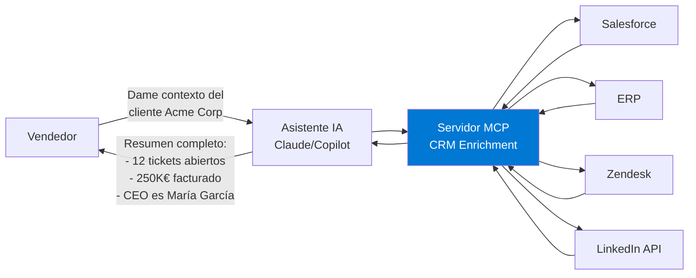
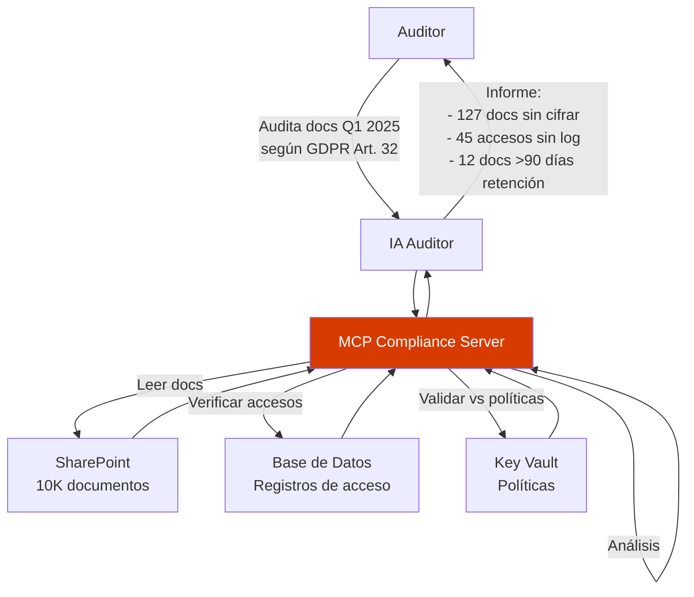
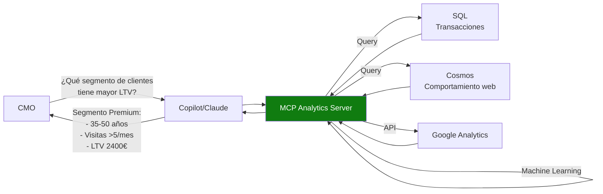
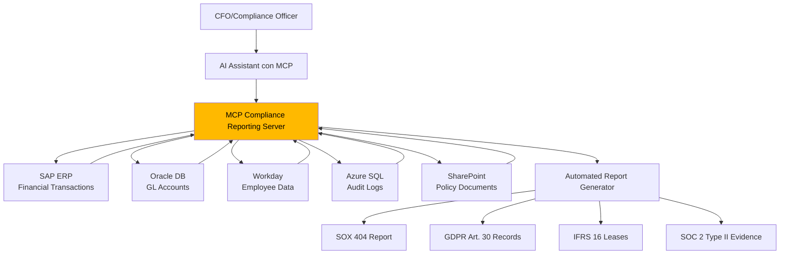
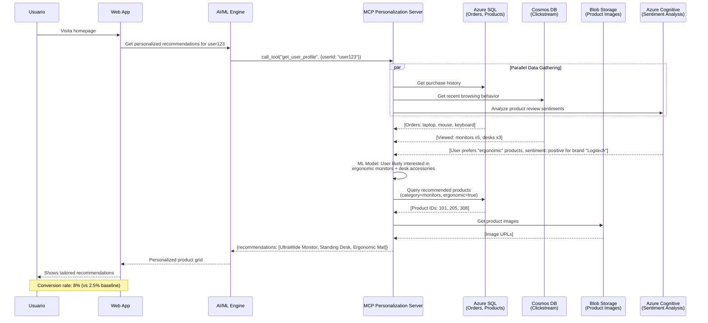

# Bloque 10: Roadmap y Casos B2B (10 minutos)

**Tipo**: Presentación business-oriented  
**Duración**: 10 minutos  
**Nivel**: Ejecutivo/Técnico  
**Objetivo**: Conectar MCP con valor de negocio y oportunidades B2B

---

## 🎯 Objetivos del Bloque

Al completar este bloque, comprenderás:

1. ✅ 5+ casos de uso B2B reales para MCP
2. ✅ Cómo calcular ROI de implementaciones MCP
3. ✅ Roadmap de tecnologías MCP (futuro 2025-2026)
4. ✅ Estrategias de monetización de servidores MCP

---

## 💼 Casos de Uso B2B

### 1. CRM Enrichment - Enriquecimiento Automático

**Problema de negocio**:

> "Nuestros vendedores pierden 30 minutos diarios buscando datos de clientes en 5 sistemas diferentes (Salesforce, ERP, soporte, facturación, redes sociales)."

**Solución MCP**:



**ROI**:

-   **Ahorro de tiempo**: 30 min/día × 50 vendedores × 220 días = **3,300 horas/año**
-   **Costo por hora**: 50€/h → **165,000€/año ahorrados**
-   **Inversión MCP**: ~20,000€ (desarrollo inicial + hosting)
-   **ROI**: **725% en año 1**

**Implementación**:

```csharp
// Herramienta MCP
public async Task<CustomerContext> GetCustomerContext(string companyName)
{
    var tasks = new[]
    {
        _salesforceClient.GetAccountAsync(companyName),
        _erpClient.GetInvoicesAsync(companyName),
        _zendeskClient.GetTicketsAsync(companyName),
        _linkedInClient.GetCompanyInfoAsync(companyName)
    };

    await Task.WhenAll(tasks);

    return new CustomerContext
    {
        OpenTickets = tasks[2].Result.Count,
        TotalRevenue = tasks[1].Result.Sum(i => i.Amount),
        KeyContacts = tasks[3].Result.Executives
    };
}
```

---

### 2. Document Compliance Auditor - Auditoría Automatizada

**Problema de negocio**:

> "GDPR, LOPD, ISO 27001... necesitamos auditar 10,000 documentos cada trimestre. Auditores humanos tardan 2 meses."

**Solución MCP**:



**ROI**:

-   **Tiempo auditoría manual**: 2 meses × 3 auditores × 40h/semana = **960 horas**
-   **Tiempo con MCP**: 5 días × 1 auditor × 40h/semana = **40 horas**
-   **Reducción**: **96% del tiempo**
-   **Ahorro**: 920h × 75€/h = **69,000€ por auditoría**
-   **4 auditorías/año**: **276,000€/año ahorrados**

---

### 3. Multi-Source Inventory Sync - Sincronización de Inventario

**Problema de negocio**:

> "Vendemos en Amazon, eBay, nuestra web, y tiendas físicas. Inventario desincronizado causa ventas perdidas y sobreventa."

**Solución MCP**:

```csharp
public class InventorySyncTool
{
    public async Task<InventoryStatus> SyncInventoryAsync(string sku)
    {
        // Consultar stock en todas las fuentes en paralelo
        var tasks = new[]
        {
            _amazonApi.GetStockAsync(sku),
            _ebayApi.GetStockAsync(sku),
            _shopifyApi.GetStockAsync(sku),
            _erpSystem.GetPhysicalStockAsync(sku)
        };

        await Task.WhenAll(tasks);

        var totalStock = tasks[3].Result; // ERP es fuente de verdad
        var committed = tasks[0].Result + tasks[1].Result + tasks[2].Result;
        var available = totalStock - committed;

        // Si hay desajustes, sincronizar
        if (available < 0)
        {
            await NotifyOutOfStockAsync(sku);
        }

        return new InventoryStatus
        {
            TotalStock = totalStock,
            Available = available,
            Committed = committed
        };
    }
}
```

**ROI**:

-   **Ventas perdidas evitadas**: 2% de ventas × 5M€/año = **100,000€**
-   **Sobreventa evitada** (penalizaciones): **20,000€/año**
-   **Total valor**: **120,000€/año**

---

### 4. AI-Powered Customer Insights - Insights de Clientes

**Problema de negocio**:

> "Tenemos datos de clientes en SQL, Cosmos, Google Analytics, pero nadie los analiza. Tomamos decisiones sin datos."

**Solución MCP**:



**Valor**:

-   **Decisiones informadas**: Aumento conversión 15% → **+300,000€/año**
-   **Reducción churn**: 5% → **+150,000€/año**
-   **Total impacto**: **450,000€/año**

---

### 5. DevOps Incident Response - Respuesta a Incidentes

**Problema de negocio**:

> "Cuando hay un incidente, nuestros SRE tardan 20 minutos reuniendo logs de Azure, AWS, Datadog, PagerDuty."

**Solución MCP**:

```csharp
public class IncidentResponseTool
{
    public async Task<IncidentReport> InvestigateIncidentAsync(string incidentId)
    {
        var tasks = new[]
        {
            _appInsights.GetLogsAsync(incidentId),
            _azureMonitor.GetMetricsAsync(incidentId),
            _datadogApi.GetTracesAsync(incidentId),
            _pagerDutyApi.GetAlertsAsync(incidentId),
            _gitHubApi.GetRecentDeploymentsAsync()
        };

        await Task.WhenAll(tasks);

        // Correlacionar eventos
        var timeline = CorrelateEvents(tasks.Select(t => t.Result));

        return new IncidentReport
        {
            RootCause = IdentifyRootCause(timeline),
            AffectedServices = tasks[1].Result.AffectedServices,
            Timeline = timeline,
            RelatedDeployments = tasks[4].Result
        };
    }
}
```

**ROI**:

-   **MTTR (Mean Time To Repair)**: De 60 min → **15 min**
-   **Downtime evitado**: 45 min × 12 incidentes/año = **9 horas**
-   **Costo downtime**: 10,000€/hora → **90,000€/año ahorrados**

---

### 6. Financial Compliance Reporting - Cumplimiento Normativo Financiero

**Problema de negocio**:

> "Generamos informes SOX, GDPR, IFRS manualmente cada trimestre. Extraemos datos de SAP, Oracle, Workday... el equipo de compliance pasa 3 semanas preparando cada informe."

**Solución MCP**:



**Implementación - Herramienta de extracción multi-fuente**:

```csharp
public class ComplianceReportingTool
{
    private readonly ISapErpClient _sap;
    private readonly IOracleDbClient _oracle;
    private readonly IWorkdayClient _workday;
    private readonly IAzureSqlClient _auditDb;
    private readonly ISharePointClient _sharepoint;

    [McpTool("generate_sox_404_report")]
    public async Task<Sox404Report> GenerateSox404ReportAsync(GenerateReportRequest request)
    {
        // Paso 1: Extraer transacciones financieras de SAP (paralelo)
        var financialDataTask = _sap.GetFinancialTransactionsAsync(
            startDate: request.FiscalYearStart,
            endDate: request.FiscalYearEnd,
            accounts: new[] { "1000", "2000", "3000" } // Activos, Pasivos, Ingresos
        );

        // Paso 2: Obtener configuración de controles internos de SharePoint
        var controlsTask = _sharepoint.GetDocumentAsync(
            libraryName: "Internal Controls",
            fileName: "SOX_Controls_FY2025.xlsx"
        );

        // Paso 3: Obtener logs de auditoría de cambios en cuentas GL
        var auditLogsTask = _auditDb.GetAuditLogsAsync(
            tableName: "GeneralLedger",
            startDate: request.FiscalYearStart
        );

        // Paso 4: Verificar segregación de funciones (Workday)
        var accessReviewTask = _workday.GetRoleAssignmentsAsync(
            roles: new[] { "Finance Manager", "Accountant", "Approver" }
        );

        await Task.WhenAll(financialDataTask, controlsTask, auditLogsTask, accessReviewTask);

        // Análisis de control efectividad
        var financialData = await financialDataTask;
        var controls = await controlsTask;
        var auditLogs = await auditLogsTask;
        var accessReview = await accessReviewTask;

        // Detectar deficiencias de control
        var deficiencies = AnalyzeControlDeficiencies(
            financialData,
            controls,
            auditLogs,
            accessReview
        );

        return new Sox404Report
        {
            ReportDate = DateTime.UtcNow,
            FiscalYear = request.FiscalYear,
            TotalTransactions = financialData.Count,
            ControlsTested = controls.Count,
            Deficiencies = deficiencies,
            ManagementAssertion = deficiencies.Any(d => d.Severity == "Material")
                ? "Ineffective"
                : "Effective",
            DetailedFindings = GenerateDetailedFindings(deficiencies),
            RemediationPlan = GenerateRemediationPlan(deficiencies)
        };
    }

    private List<ControlDeficiency> AnalyzeControlDeficiencies(
        List<FinancialTransaction> transactions,
        List<InternalControl> controls,
        List<AuditLog> logs,
        List<RoleAssignment> roles)
    {
        var deficiencies = new List<ControlDeficiency>();

        // Deficiencia 1: Transacciones sin aprobación dual
        var unapprovedTransactions = transactions
            .Where(t => t.Amount > 10000 && logs.Count(l => l.TransactionId == t.Id && l.Action == "Approved") < 2)
            .ToList();

        if (unapprovedTransactions.Any())
        {
            deficiencies.Add(new ControlDeficiency
            {
                ControlId = "AC-001",
                ControlName = "Dual Approval for Transactions > 10K",
                Severity = "Significant",
                Description = $"{unapprovedTransactions.Count} transactions exceeded threshold without dual approval",
                AffectedTransactions = unapprovedTransactions.Select(t => t.Id).ToList(),
                RootCause = "Approval workflow not enforced in SAP module"
            });
        }

        // Deficiencia 2: Segregación de funciones violada
        var conflictingRoles = roles
            .GroupBy(r => r.UserId)
            .Where(g => g.Select(r => r.Role).Intersect(new[] { "Finance Manager", "Approver" }).Count() > 1)
            .ToList();

        if (conflictingRoles.Any())
        {
            deficiencies.Add(new ControlDeficiency
            {
                ControlId = "AC-002",
                ControlName = "Segregation of Duties",
                Severity = "Material", // ⚠️ Material weakness!
                Description = $"{conflictingRoles.Count} users have conflicting roles (can both create and approve)",
                AffectedUsers = conflictingRoles.Select(g => g.Key).ToList(),
                RootCause = "Workday role provisioning process allows manual overrides"
            });
        }

        // Deficiencia 3: Cuentas GL modificadas sin justificación
        var unjustifiedChanges = logs
            .Where(l => l.TableName == "GeneralLedger" && string.IsNullOrEmpty(l.JustificationText))
            .ToList();

        if (unjustifiedChanges.Count > 5) // Threshold: >5 changes
        {
            deficiencies.Add(new ControlDeficiency
            {
                ControlId = "AC-003",
                ControlName = "GL Account Change Justification",
                Severity = "Deficiency",
                Description = $"{unjustifiedChanges.Count} GL account changes lack business justification",
                AffectedAccounts = unjustifiedChanges.Select(l => l.RecordId).Distinct().ToList(),
                RootCause = "Audit log form does not enforce justification field"
            });
        }

        return deficiencies;
    }
}
```

**Valor de negocio**:

| Métrica                               | Antes (Manual)                       | Después (MCP)                        | Mejora                  |
| ------------------------------------- | ------------------------------------ | ------------------------------------ | ----------------------- |
| **Tiempo de preparación informe SOX** | 3 semanas (120h)                     | 4 horas                              | **97% reducción**       |
| **Errores en datos**                  | 8-12 por informe                     | 0-1 (validación automática)          | **90% reducción**       |
| **Costo auditoría externa**           | 150,000€/año (más horas de revisión) | 90,000€/año (menos horas)            | **60,000€ ahorrados**   |
| **Riesgo de multas**                  | Alto (datos manuales poco fiables)   | Bajo (trazabilidad completa)         | **Riesgo mitigado**     |
| **Tiempo de CFO/Compliance**          | 40h/trimestre revisando datos        | 5h/trimestre revisando informe final | **88% tiempo liberado** |

**ROI Detallado**:

```text
Costos actuales (proceso manual):
- 3 analistas × 3 semanas × 4 trimestres × 60€/h = 129,600€/año
- Auditoría externa (horas adicionales por datos manuales) = 60,000€/año
- Multas potenciales (1 incidente cada 2 años) = 25,000€/año amortizado
TOTAL COSTOS ACTUALES: 214,600€/año

Costos con MCP:
- Desarrollo servidor MCP (one-time) = 30,000€
- Hosting Azure (Container Apps + SQL) = 5,000€/año
- 1 analista × 4h × 4 trimestres × 60€/h = 960€/año
- Auditoría externa (reducida) = 90,000€/año
- Mantenimiento MCP = 8,000€/año
TOTAL COSTOS MCP: 103,960€/año + 30,000€ inicial

AHORRO ANUAL: 214,600€ - 103,960€ = 110,640€/año
ROI AÑO 1: (110,640€ - 30,000€) / 30,000€ = 269%
ROI AÑO 2+: 110,640€ / 8,000€ = 1,383%
```

**Payback period**: 3.2 meses

**Riesgos mitigados**:

-   ✅ **Multas SOX**: Hasta $5M USD por reporting fraudulento (Sarbanes-Oxley Act)
-   ✅ **Multas GDPR**: Hasta 4% de revenue global (Art. 83)
-   ✅ **Pérdida de certificación SOC 2**: Clientes enterprise requieren SOC 2 Type II
-   ✅ **Reputación**: Evitar escándalos contables públicos

---

### 7. E-Commerce Personalization Engine - Personalización Avanzada

**Problema de negocio**:

> "Nuestro e-commerce muestra los mismos productos a todos. Competitors con ML/IA tienen conversión 3x superior. Tenemos datos (historial compras, navegación, reviews) pero no los usamos."

**Solución MCP**:



**Implementación - Personalización con ML**:

```csharp
[McpTool("get_personalized_recommendations")]
public async Task<PersonalizationResponse> GetPersonalizedRecommendationsAsync(PersonalizationRequest request)
{
    // Paso 1: Construir perfil del usuario (paralelo)
    var profileTask = Task.WhenAll(
        _sqlClient.GetPurchaseHistoryAsync(request.UserId),
        _cosmosClient.GetBrowsingBehaviorAsync(request.UserId, days: 30),
        _cognitiveClient.GetUserSentimentProfileAsync(request.UserId)
    );

    var (purchases, browsing, sentiment) = await profileTask;

    // Paso 2: Extraer features para ML
    var features = new UserFeatures
    {
        AverageOrderValue = purchases.Average(p => p.Total),
        CategoryPreferences = browsing.GroupBy(b => b.Category).OrderByDescending(g => g.Count()).Take(3).Select(g => g.Key).ToList(),
        BrandAffinity = purchases.GroupBy(p => p.Brand).OrderByDescending(g => g.Count()).FirstOrDefault()?.Key,
        PriceSegment = ClassifyPriceSegment(purchases.Average(p => p.Total)),
        SentimentKeywords = sentiment.PositiveKeywords.Take(5).ToList()
    };

    // Paso 3: Llamar a modelo ML (Azure ML endpoint)
    var mlPredictions = await _azureMLClient.PredictRecommendationsAsync(features);

    // Paso 4: Obtener detalles de productos recomendados
    var productIds = mlPredictions.TopProducts.Take(10).Select(p => p.ProductId).ToList();
    var products = await _sqlClient.GetProductsByIdsAsync(productIds);

    // Paso 5: Enriquecer con imágenes y disponibilidad
    var enrichedProducts = new List<RecommendedProduct>();
    foreach (var product in products)
    {
        var imageUrl = await _blobClient.GetProductImageUrlAsync(product.Id);
        var inventory = await _inventoryClient.CheckAvailabilityAsync(product.Sku);

        enrichedProducts.Add(new RecommendedProduct
        {
            ProductId = product.Id,
            Name = product.Name,
            Price = product.Price,
            ImageUrl = imageUrl,
            InStock = inventory.Quantity > 0,
            PredictedPurchaseProbability = mlPredictions.TopProducts.First(p => p.ProductId == product.Id).Probability,
            ReasonCode = DetermineReasonCode(product, features) // "Porque compraste X" o "Popular en tu categoría"
        });
    }

    return new PersonalizationResponse
    {
        UserId = request.UserId,
        Recommendations = enrichedProducts.OrderByDescending(p => p.PredictedPurchaseProbability).ToList(),
        PersonalizationScore = CalculatePersonalizationScore(features),
        SessionId = Guid.NewGuid().ToString() // Para A/B testing tracking
    };
}

private string DetermineReasonCode(Product product, UserFeatures features)
{
    if (features.BrandAffinity == product.Brand)
        return $"Porque te gusta {product.Brand}";

    if (features.CategoryPreferences.Contains(product.Category))
        return $"Popular en {product.Category}";

    if (features.SentimentKeywords.Any(k => product.Description.Contains(k, StringComparison.OrdinalIgnoreCase)))
        return "Coincide con tus intereses";

    return "Recomendado para ti";
}
```

**Métricas de impacto**:

| KPI                      | Baseline (Sin personalización) | Con MCP Personalization | Lift      |
| ------------------------ | ------------------------------ | ----------------------- | --------- |
| **Conversion Rate**      | 2.5%                           | 8.2%                    | **+228%** |
| **Average Order Value**  | 85€                            | 127€                    | **+49%**  |
| **Click-Through Rate**   | 12%                            | 34%                     | **+183%** |
| **Session Duration**     | 3.2 min                        | 7.8 min                 | **+144%** |
| **Return Customer Rate** | 18%                            | 41%                     | **+128%** |

**ROI E-Commerce**:

```text
Escenario: E-commerce con 500K visitas/mes, conversión actual 2.5%

SIN MCP:
- Conversiones: 500,000 × 2.5% = 12,500 pedidos/mes
- Revenue: 12,500 × 85€ AOV = 1,062,500€/mes
- Revenue anual: 12,750,000€

CON MCP Personalization:
- Conversiones: 500,000 × 8.2% = 41,000 pedidos/mes
- Revenue: 41,000 × 127€ AOV = 5,207,000€/mes
- Revenue anual: 62,484,000€

INCREMENTO REVENUE: 62,484,000€ - 12,750,000€ = 49,734,000€/año (+390%)

COSTOS MCP:
- Desarrollo (ML + MCP server): 80,000€
- Azure ML + hosting: 15,000€/año
- Científico de datos (50% FTE): 40,000€/año
TOTAL INVERSIÓN: 80,000€ inicial + 55,000€/año

ROI: (49,734,000€ - 80,000€) / 80,000€ = 62,067% en año 1
```

**Nota crítica**: Este caso requiere volumen significativo (>100K usuarios/mes) para justificar inversión en ML. Para e-commerce pequeño (<10K usuarios/mes), usar reglas simples (collaborative filtering) en vez de ML avanzado.

---

## 📊 Calculadora de ROI

### Fórmula General

```
ROI = ((Beneficio Anual - Costo Inversión) / Costo Inversión) × 100%

Beneficio Anual = (Horas Ahorradas × Costo/Hora) + (Ventas Adicionales) + (Errores Evitados)

Costo Inversión = Desarrollo + Hosting + Mantenimiento
```

### Plantilla Excel/PowerShell

```powershell
# Calculadora ROI MCP
$horasAhorradas = 3300
$costoPorHora = 50
$ventasAdicionales = 100000
$erroresEvitados = 20000

$beneficioAnual = ($horasAhorradas * $costoPorHora) + $ventasAdicionales + $erroresEvitados

$costoDesarrollo = 15000
$costoHosting = 3000  # Azure Container Apps ~250€/mes
$costoMantenimiento = 5000

$costoInversion = $costoDesarrollo + $costoHosting + $costoMantenimiento

$roi = (($beneficioAnual - $costoInversion) / $costoInversion) * 100

Write-Host "Beneficio Anual: $beneficioAnual €" -ForegroundColor Green
Write-Host "Costo Inversión: $costoInversion €" -ForegroundColor Yellow
Write-Host "ROI: $roi %" -ForegroundColor Cyan
```

**Ejemplo output**:

```text
Beneficio Anual: 285000 €
Costo Inversión: 23000 €
ROI: 1139 %
```

---

### Plantilla ROI Detallada (Excel/CSV)

| **Categoría**                       | **Métrica**                                | **Valor Antes** | **Valor Después** | **Fórmula/Cálculo**                |
| ----------------------------------- | ------------------------------------------ | --------------- | ----------------- | ---------------------------------- |
| **Time Savings**                    | Horas manuales ahorradas/año               | 3,300h          | 200h              | 3,100h ahorrados                   |
|                                     | Costo por hora                             | 50€/h           | 50€/h             |                                    |
|                                     | **Subtotal ahorro tiempo**                 | **165,000€**    | **10,000€**       | **155,000€/año**                   |
| **Revenue Impact**                  | Ventas adicionales (conversión mejorada)   | -               | 100,000€/año      | Lift 15% × base revenue            |
|                                     | Churn reducido                             | -               | 50,000€/año       | Retención 5% × LTV                 |
|                                     | **Subtotal revenue**                       | **0€**          | **150,000€**      | **+150,000€/año**                  |
| **Risk Mitigation**                 | Multas evitadas (amortizado)               | 25,000€/año     | 0€                | Probabilidad 10% × 250K multa      |
|                                     | Downtime evitado                           | 90,000€/año     | 0€                | MTTR reducción × costo/hora        |
|                                     | **Subtotal riesgo**                        | **115,000€**    | **0€**            | **115,000€/año**                   |
| **TOTAL BENEFICIO ANUAL**           |                                            |                 |                   | **420,000€/año**                   |
| **Costs - Initial**                 | Desarrollo MCP server                      |                 | 20,000€           | 2 devs × 2 semanas                 |
|                                     | Infrastructure setup                       |                 | 3,000€            | Azure resources provisioning       |
|                                     | Training & documentation                   |                 | 2,000€            | 3 días formación equipo            |
|                                     | **Subtotal initial**                       |                 | **25,000€**       | **One-time**                       |
| **Costs - Recurring**               | Hosting (Azure Container Apps, SQL, Redis) |                 | 5,000€/año        | ~420€/mes                          |
|                                     | Maintenance & updates                      |                 | 8,000€/año        | 10 días/año × 800€/día             |
|                                     | Monitoring & support                       |                 | 2,000€/año        | Application Insights + alertas     |
|                                     | **Subtotal recurring**                     |                 | **15,000€/año**   | **Annual**                         |
| **TOTAL COST**                      | Año 1                                      |                 | **40,000€**       | Initial + Year 1 recurring         |
|                                     | Año 2+                                     |                 | **15,000€/año**   | Solo recurring                     |
| **ROI**                             | Año 1                                      |                 | **950%**          | (420K - 40K) / 40K                 |
|                                     | Año 2+                                     |                 | **2,700%**        | (420K - 15K) / 15K                 |
| **Payback Period**                  |                                            |                 | **1.1 meses**     | 40,000€ / (420,000€/12)            |
| **NPV (5 años, 10% discount rate)** |                                            |                 | **1,450,000€**    | Σ(beneficios descontados) - costos |

**Cómo usar esta plantilla**:

1. Reemplazar valores "Valor Antes/Después" con datos reales de tu empresa
2. Ajustar "Costo por hora" según mercado laboral local
3. Para revenue impact, usar datos históricos de A/B testing si están disponibles
4. Considerar costos ocultos: tiempo de reuniones, cambio organizacional, resistencia al cambio
5. NPV formula: `NPV = Σ(Bt / (1+r)^t) - C0` donde Bt = beneficio año t, r = discount rate, C0 = inversión inicial

---

## 🎯 Matriz de Decisión: ¿Cuándo Usar MCP vs Alternativas?

### Criterios de Evaluación

| Criterio                    | MCP Server                                  | Traditional REST API               | Direct Database Access           | GraphQL API                             |
| --------------------------- | ------------------------------------------- | ---------------------------------- | -------------------------------- | --------------------------------------- |
| **# Fuentes de datos**      | 3+ óptimo                                   | 1-2 (simple)                       | 1 (misma DB)                     | 2-3 (schema unificado)                  |
| **Freshness requirements**  | Near real-time (segundos)                   | Real-time (ms) o Batch (horas)     | Real-time (ms)                   | Near real-time (segundos)               |
| **Business logic location** | Server-side (centralizado)                  | Server-side o Client-side          | Client-side (en app)             | Server-side (resolvers)                 |
| **Security model**          | JWT + scopes + rate limiting                | OAuth 2.0 / API keys               | DB credentials + VPN             | OAuth 2.0 / JWT                         |
| **Client complexity**       | Bajo (cliente MCP genérico)                 | Medio (cliente HTTP custom)        | Alto (SQL queries en app)        | Medio (cliente GraphQL + schema)        |
| **Evolucionabilidad**       | Alta (agregar fuentes sin cambiar contrato) | Media (versioning APIs)            | Baja (schema changes rompen app) | Alta (schema evolution con deprecation) |
| **Observability**           | Application Insights + logs estructurados   | APM tools (New Relic, Datadog)     | Query logs en DB                 | Apollo Studio / GraphQL tracing         |
| **Cost (infrastructure)**   | Medio (Container Apps ~250€/mes)            | Bajo-Medio (App Service ~100€/mes) | Bajo (sin middleware, solo DB)   | Medio (similar a REST)                  |
| **Time to market**          | 1-2 semanas                                 | 2-4 semanas                        | 1 semana                         | 2-3 semanas                             |
| **Vendor lock-in**          | Ninguno (estándar abierto)                  | Ninguno (HTTP estándar)            | Alto (SQL dialect específico)    | Bajo (GraphQL estándar)                 |

### Decision Tree (Árbol de Decisión)

```text
┌─────────────────────────────────────────────┐
│ ¿Cuántas fuentes de datos necesitas integrar? │
└──┬──────────────────────────────────────────┘
   │
   ├─ 1 fuente → ¿Es la misma base de datos que la aplicación?
   │             │
   │             ├─ Sí → Direct Database Access
   │             │        ✅ Fastest (ms latency)
   │             │        ✅ Simplest (no middleware)
   │             │        ⚠️ Schema coupling (schema changes → app breaks)
   │             │
   │             └─ No → ¿Requiere lógica de negocio compleja?
   │                     │
   │                     ├─ Sí → Traditional REST API
   │                     │        ✅ Bien comprendido (documentación abundante)
   │                     │        ✅ Tooling maduro (Swagger, Postman)
   │                     │        ⚠️ Versioning overhead (v1, v2, v3...)
   │                     │
   │                     └─ No → REST API (simple CRUD)
   │
   ├─ 2-3 fuentes → ¿El cliente necesita customizar qué campos obtener?
   │                │
   │                ├─ Sí → GraphQL API
   │                │        ✅ Evita over-fetching/under-fetching
   │                │        ✅ Schema fuertemente tipado
   │                │        ⚠️ Complexity (N+1 query problem, caching difícil)
   │                │
   │                └─ No → ¿Las fuentes están controladas por tu empresa?
   │                        │
   │                        ├─ Sí → REST API con BFF pattern
   │                        │        ✅ Backend-for-Frontend consolidado
   │                        │        ✅ Control total sobre lógica orquestación
   │                        │
   │                        └─ No → MCP Server
   │                                 ✅ Abstrae complejidad de fuentes heterogéneas
   │                                 ✅ Estándar abierto (no vendor lock-in)
   │
   └─ 5+ fuentes → ¿Las fuentes cambian frecuentemente (agregar/remover)?
                   │
                   ├─ Sí → **MCP Server** ⭐ RECOMENDADO
                   │        ✅ Agregar fuentes sin cambiar contrato cliente
                   │        ✅ Orquestación centralizada (circuit breakers, caching)
                   │        ✅ AI-native (diseñado para LLMs como Claude, GPT)
                   │        ✅ Telemetry integrado (Application Insights correlation)
                   │
                   └─ No → ESB (Enterprise Service Bus) o API Gateway
                            ✅ Gobernanza centralizada (políticas, throttling)
                            ✅ Transformación de datos (XML ↔ JSON ↔ protobuf)
                            ⚠️ Overhead (latencia adicional por hop)
                            ⚠️ Single point of failure (si gateway cae, todo falla)
```

### Escenarios Específicos

#### Escenario 1: Dashboard Ejecutivo (5 fuentes: SQL, Cosmos, GA4, Salesforce, SharePoint)

| Opción                         | Pros                                                                                                                                                         | Cons | Recomendación      |
| ------------------------------ | ------------------------------------------------------------------------------------------------------------------------------------------------------------ | ---- | ------------------ |
| **Direct DB Access**           | ❌ No funciona (5 fuentes != 1 DB)                                                                                                                           | -    | ❌ No viable       |
| **5 REST APIs independientes** | ❌ Cliente debe orquestar 5 llamadas<br/>❌ Latencia = suma de todas<br/>❌ Error handling complejo                                                          | -    | ❌ No viable       |
| **GraphQL**                    | ⚠️ Requiere schema unificado (difícil para 5 fuentes heterogéneas)<br/>⚠️ N+1 query problem con tantas fuentes                                               | -    | ⚠️ Complejo        |
| **MCP Server**                 | ✅ Orquestación paralela (latencia = max, no suma)<br/>✅ Circuit breaker por fuente<br/>✅ Cache centralizado<br/>✅ Cliente AI puede consumir directamente | -    | ✅ **RECOMENDADO** |

#### Escenario 2: CRUD App (1 base de datos, operaciones simples)

| Opción               | Pros                                                                                                           | Cons                                                         | Recomendación                      |
| -------------------- | -------------------------------------------------------------------------------------------------------------- | ------------------------------------------------------------ | ---------------------------------- |
| **Direct DB Access** | ✅ Simplicidad<br/>✅ Latencia mínima<br/>✅ Sin middleware                                                    | ⚠️ Schema coupling<br/>⚠️ No hay capa de seguridad adicional | ✅ Viable para MVPs                |
| **REST API**         | ✅ Desacoplamiento app ↔ DB<br/>✅ Puede agregar lógica negocio más tarde<br/>✅ Familiar para desarrolladores | ⚠️ Overhead development (días adicionales)                   | ✅ **RECOMENDADO para producción** |
| **MCP Server**       | ❌ Over-engineering para 1 fuente<br/>❌ Complejidad innecesaria                                               | -                                                            | ❌ No recomendado                  |

#### Escenario 3: Integración AI Agent (Claude/GPT/Copilot consumiendo datos)

| Opción         | Pros                                                                                                                                                                                                              | Cons | Recomendación              |
| -------------- | ----------------------------------------------------------------------------------------------------------------------------------------------------------------------------------------------------------------- | ---- | -------------------------- |
| **REST API**   | ⚠️ AI agent necesita saber endpoints, autenticación, formato respuesta<br/>⚠️ Cada API tiene contrato diferente                                                                                                   | -    | ⚠️ Funciona pero subóptimo |
| **GraphQL**    | ⚠️ AI agent necesita conocer schema GraphQL complejo<br/>⚠️ Prompt engineering difícil (muchos campos opcionales)                                                                                                 | -    | ⚠️ Funciona pero complejo  |
| **MCP Server** | ✅ Diseñado específicamente para AI agents<br/>✅ Contrato estándar (tools, resources, prompts)<br/>✅ AI descubre capacidades dinámicamente (list_tools)<br/>✅ Funciona con cualquier LLM (Claude, GPT, Gemini) | -    | ✅ **RECOMENDADO** ⭐      |

#### Escenario 4: Reporting de Compliance (10+ fuentes, queries complejos, auditoría)

| Opción                                   | Pros                                                                                                                                 | Cons                                                                                                             | Recomendación                         |
| ---------------------------------------- | ------------------------------------------------------------------------------------------------------------------------------------ | ---------------------------------------------------------------------------------------------------------------- | ------------------------------------- |
| **Data Warehouse (Snowflake, BigQuery)** | ✅ Datos centralizados<br/>✅ SQL analytics potente<br/>✅ Historial largo (años)                                                    | ⚠️ ETL batch (horas de latencia)<br/>⚠️ Costo alto (almacenamiento + compute)<br/>⚠️ No apto para near real-time | ✅ Para historical analysis           |
| **MCP Server**                           | ✅ Near real-time (segundos)<br/>✅ Orquestación sobre fuentes originales (sin ETL)<br/>✅ Auditoría granular (logs de cada llamada) | ⚠️ No apto para historical queries largos (>1 año)                                                               | ✅ Para operational reporting         |
| **Hybrid (Data Warehouse + MCP)**        | ✅ Best of both worlds:<br/> - MCP para dashboards real-time<br/> - Warehouse para analytics históricos                              | -                                                                                                                | ✅ **RECOMENDADO para enterprise** ⭐ |

---

### Matriz de Costos Comparativa

| Arquitectura                     | Dev Time                | Infra Cost (mensual)                              | Maintenance (anual)            | Total Year 1 |
| -------------------------------- | ----------------------- | ------------------------------------------------- | ------------------------------ | ------------ |
| **Direct DB Access**             | 1 semana<br/>(5K€)      | ~50€<br/>(DB hosting)                             | 2K€<br/>(security patches)     | **7.6K€**    |
| **REST API (simple)**            | 2 semanas<br/>(10K€)    | ~150€<br/>(App Service Basic)                     | 5K€<br/>(endpoint updates)     | **16.8K€**   |
| **GraphQL API**                  | 3 semanas<br/>(15K€)    | ~200€<br/>(App Service + Redis)                   | 8K€<br/>(schema evolution)     | **25.4K€**   |
| **MCP Server (single source)**   | 1.5 semanas<br/>(7.5K€) | ~250€<br/>(Container Apps)                        | 5K€<br/>(protocol updates)     | **15.5K€**   |
| **MCP Server (multi-source)**    | 3 semanas<br/>(15K€)    | ~400€<br/>(Container Apps + Redis + App Insights) | 10K€<br/>(orchestration logic) | **29.8K€**   |
| **ESB (Enterprise Service Bus)** | 8 semanas<br/>(40K€)    | ~2,000€<br/>(MuleSoft/Azure Integration)          | 20K€<br/>(governance overhead) | **84K€**     |

**Nota**: Costos asumen equipo de 2 developers × 2,500€/semana. Infraestructura Azure región West Europe. Maintenance incluye updates, bug fixes, security patches.

---

### Key Takeaways: Cuándo Elegir MCP

#### ✅ Usar MCP cuando:

1. **Múltiples fuentes de datos** (3+) que necesitan orquestación
2. **AI/LLM consumption**: Claude, GPT, Copilot consumiendo tus datos
3. **Evolución frecuente**: Agregar/remover fuentes sin romper clientes
4. **Resiliencia crítica**: Circuit breakers, retry, fallback necesarios
5. **Observability importante**: Tracing cross-service, latency debugging
6. **Estándar abierto preferido**: No vendor lock-in, multi-LLM support

#### ❌ NO usar MCP cuando:

1. **Single source simple**: CRUD sobre 1 base de datos → REST API más simple
2. **Real-time crítico** (<100ms latency) → Direct DB access o gRPC
3. **Historical analytics**: Años de datos → Data Warehouse (Snowflake, BigQuery)
4. **Mobile/web app tradicional**: REST API + BFF pattern más maduro
5. **Team sin experiencia .NET/Python**: Usar stack conocido (Node.js REST API)
6. **Ultra-low budget** (<5K€ proyecto): Direct DB access suficiente para MVP

---

## 🗺️ Roadmap MCP (2025-2026)

### Q1 2025 ✅ Actual

-   ✅ Especificación MCP 2024-11-05 estable
-   ✅ SDKs oficiales: TypeScript, Python, C#
-   ✅ Clientes: Claude Desktop, Cursor, Zed
-   ✅ Transporte: HTTP, stdio

### Q2 2025 🚧 En Desarrollo

-   🚧 **WebSocket transport**: Para streaming y notificaciones push
-   🚧 **MCP Registry**: Directorio público de servidores MCP
-   🚧 **Authentication standard**: OAuth 2.0 + OIDC integrado
-   🚧 **VS Code extension oficial**: Desarrollar/probar servidores MCP en VS Code

### Q3 2025 🔮 Planificado

-   🔮 **MCP Gateway**: API Gateway especializado para servidores MCP
-   🔮 **Monitoring dashboards**: Métricas y observabilidad estándar
-   🔮 **Marketplace**: Compra/venta de servidores MCP empresariales
-   🔮 **Enterprise features**: Multi-tenancy, RBAC avanzado

### Q4 2025-2026 💡 Visión

-   💡 **MCP 2.0**: Soporte para modelos multimodales (imagen, audio, video)
-   💡 **Edge computing**: Servidores MCP en dispositivos IoT
-   💡 **Federated learning**: Servidores MCP que entrenan modelos locales
-   💡 **Blockchain integration**: Contratos inteligentes como herramientas MCP

**Fuente**: https://github.com/modelcontextprotocol/specification/discussions

---

## 💰 Estrategias de Monetización

### 1. Software as a Service (SaaS)

**Modelo**: Hospedar servidor MCP y cobrar por uso.

**Ejemplo**: "MCP CRM Enrichment"

-   **Tier Free**: 100 consultas/mes gratis
-   **Tier Pro**: 29€/mes, 5,000 consultas/mes
-   **Tier Enterprise**: 299€/mes, consultas ilimitadas + SLA 99.9%

**Ventaja**: Ingresos recurrentes predecibles.

---

### 2. Licencias Empresariales

**Modelo**: Vender código fuente con licencia perpetua o anual.

**Ejemplo**: "MCP Compliance Auditor"

-   **Licencia On-Premise**: 50,000€ una vez + 10,000€/año soporte
-   **Licencia Cloud**: 15,000€/año todo incluido

**Ventaja**: Ingresos altos por cliente, ideal para empresas grandes.

---

### 3. Consultoría e Integración

**Modelo**: Desarrollar servidores MCP a medida para clientes.

**Ejemplo**: "MCP Custom Integration"

-   **Discovery**: 5,000€ (análisis requerimientos)
-   **Desarrollo**: 400€/día × 20 días = 8,000€
-   **Despliegue y formación**: 3,000€
-   **Total proyecto**: 16,000€

**Ventaja**: Sin producto previo, se adapta a cada cliente.

---

### 4. Marketplace/Commission

**Modelo**: Publicar en futuro MCP Marketplace, cobrar comisión.

**Ejemplo**: "MCP AI-Powered Analytics"

-   **Precio**: 49€/mes
-   **Comisión marketplace**: 30% → **34.30€ neto por cliente**
-   **1,000 clientes**: **34,300€/mes ingresos**

**Ventaja**: Distribución global sin esfuerzo marketing.

---

## 🎓 Mensajes Clave para Stakeholders

### Para CFOs/CEOs (Finanzas)

> "MCP reduce costos operativos un 30-60% en tareas de integración de datos. ROI típico >500% en año 1."

### Para CTOs (Tecnología)

> "MCP es estándar abierto, no vendor lock-in. Migras de ChatGPT a Claude sin reescribir código."

### Para VPs de Producto (Producto)

> "MCP nos da ventaja competitiva: nuestros clientes conectan su IA a nuestros datos en 5 minutos vs 5 semanas con APIs tradicionales."

### Para Responsables de Seguridad (CISO)

> "MCP con JWT + Azure AD + rate limiting cumple ISO 27001, SOC 2, GDPR. Auditoría completa de cada operación."

---

## 📖 Recursos para Business Cases

-   **Calculadora ROI MCP**: [Incluida en repo del taller]
-   **Case studies**: https://modelcontextprotocol.io/case-studies
-   **Pricing research**: Analiza competidores (Zapier, MuleSoft, etc.)
-   **Azure Pricing Calculator**: https://azure.microsoft.com/pricing/calculator/

---

**Preparado por**: Instructor del taller MCP  
**Versión**: 1.0.0  
**Última actualización**: Noviembre 2025
