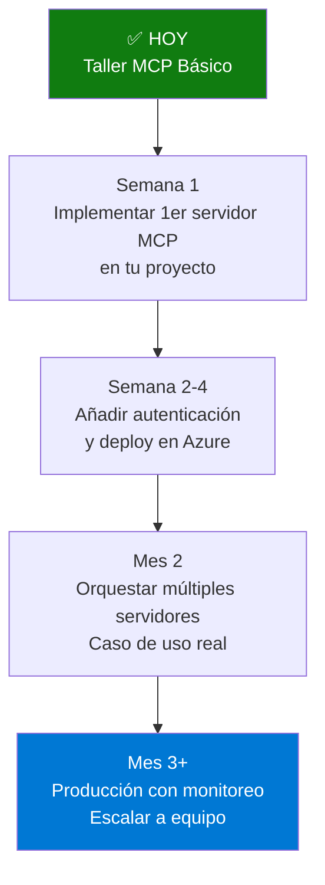

# Bloque 11: Cierre y Retrospectiva (10 minutos)

**Tipo**: Cierre interactivo  
**Duración**: 10 minutos (5 min retrospectiva + 5 min Q&A/buffer)  
**Nivel**: Todos  
**Objetivo**: Consolidar aprendizaje, recoger feedback, y guiar próximos pasos

---

## 🎯 Objetivos del Bloque

Al completar este bloque, habrás:

1. ✅ Reflexionado sobre lo aprendido en el taller
2. ✅ Identificado siguientes pasos en tu journey MCP
3. ✅ Compartido feedback para mejorar futuros talleres
4. ✅ Obtenido recursos para continuar aprendiendo

---

## 🔄 Retrospectiva Estructurada (5 minutos)

### Formato: 3-2-1

**Instrucciones para participantes**:

> "Tomen 2 minutos para reflexionar individualmente, luego compartiremos en grupo:"

#### 3 Cosas que Aprendiste

**Pregunta**: _¿Qué 3 conceptos o técnicas nuevas aprendiste hoy que puedes aplicar?_

**Ejemplos esperados**:

-   "Cómo crear un servidor MCP desde cero en C#"
-   "Diferencia entre recursos y herramientas MCP"
-   "Implementar autenticación JWT en servidores MCP"
-   "Orquestar múltiples servidores MCP con patrones paralelos"

**Acción del instructor**: Pedir a 3-4 voluntarios que compartan 1 aprendizaje cada uno.

---

#### 2 Cosas que Harás Mañana

**Pregunta**: _¿Qué 2 acciones concretas tomarás al volver a tu empresa/proyecto?_

**Ejemplos esperados**:

-   "Evaluar si MCP puede reemplazar nuestras 15 APIs REST internas"
-   "Crear un prototipo de servidor MCP para nuestro sistema de tickets"
-   "Presentar MCP a mi equipo de arquitectura"
-   "Investigar cómo conectar nuestro Cosmos DB a Claude Desktop"

**Acción del instructor**: Anotad las acciones más frecuentes para futuros talleres.

---

#### 1 Pregunta Sin Respuesta

**Pregunta**: _¿Qué 1 pregunta importante tienes que NO fue respondida en el taller?_

**Ejemplos esperados**:

-   "¿Cómo manejo autenticación con Azure AD en producción?"
-   "¿MCP funciona con modelos open source (Llama, Mistral)?"
-   "¿Cómo monitoreo la salud de 10 servidores MCP en producción?"
-   "¿Hay límites de throughput en servidores MCP?"

**Acción del instructor**: Responde brevemente o deriva a recursos (ver sección Recursos).

---

## 📊 Encuesta de Satisfacción (3 minutos)

### Formato: Escala 1-5 + Preguntas Abiertas

**Compartir enlace/QR**:

> "Por favor completen esta encuesta rápida (2-3 minutos). Su feedback mejora futuros talleres."

**Preguntas**:

#### Escala 1-5 (1=Muy insatisfecho, 5=Muy satisfecho)

1. **Contenido del taller**: ¿El temario cubrió tus expectativas?
2. **Claridad de las explicaciones**: ¿Las explicaciones fueron claras?
3. **Ritmo del taller**: ¿El ritmo fue adecuado?
4. **Ejercicios prácticos**: ¿Los ejercicios reforzaron el aprendizaje?
5. **Aplicabilidad**: ¿Puedes aplicar lo aprendido en tu trabajo?
6. **Satisfacción general**: ¿Recomendarías este taller?

#### Preguntas Abiertas

7. **¿Qué fue lo MEJOR del taller?**
8. **¿Qué MEJORARÍAS para la próxima edición?**
9. **¿Qué tema adicional te hubiera gustado cubrir?**

---

### Plantilla de Encuesta (Google Forms / Microsoft Forms)

**Código QR generado con**:

```powershell
# Generar QR con PowerShell (requiere módulo QRCoder)
Install-Module -Name QRCodeGenerator
New-QRCode -URL "https://forms.office.com/tu-encuesta-aqui" -OutPath ".\feedback-qr.png"
```

**Proyectar QR en pantalla** mientras participantes responden en móviles.

---

## 🚀 Próximos Pasos (2 minutos)

### Ruta de Aprendizaje Recomendada



### Acciones Inmediatas

1. **Día 1-7**: Revisa el código de los ejercicios, intenta ejecutarlos localmente
2. **Día 8-30**: Identifica 1 caso de uso en tu empresa, crea prototipo
3. **Día 31-60**: Implementa autenticación, pruebas, deploy en Azure
4. **Día 61+**: Escala a más fuentes de datos, monitorea, itera

---

## 📚 Recursos para Continuar

### Documentación Oficial

-   **Especificación MCP**: https://modelcontextprotocol.io/specification/2025-06-18
-   **SDK .NET**: https://github.com/modelcontextprotocol/dotnet-sdk
-   **Ejemplos oficiales**: https://github.com/modelcontextprotocol/servers

### Comunidad

-   **Discord oficial MCP**: https://discord.gg/modelcontextprotocol
-   **GitHub Discussions**: https://github.com/modelcontextprotocol/specification/discussions
-   **Stack Overflow**: Tag `model-context-protocol`

### Tutoriales Avanzados

-   **Azure Container Apps deployment**: https://learn.microsoft.com/azure/container-apps/
-   **JWT best practices**: https://auth0.com/docs/secure/tokens/json-web-tokens
-   **Distributed tracing con App Insights**: https://learn.microsoft.com/azure/azure-monitor/app/distributed-tracing

### Repositorio del Taller

-   **Código completo**: [URL del repo GitHub del taller]
-   **Soluciones de ejercicios**: `/src/McpWorkshop.Servers/`
-   **Scripts de verificación**: `/scripts/`

---

## 💬 Q&A Abierto (5 minutos)

### Estrategia del Instructor

**Invitación**:

> "Últimos 5 minutos: ¿alguna pregunta sobre MCP, los ejercicios, o implementación en vuestros proyectos?"

**Tipos de preguntas esperadas**:

#### Técnicas

-   "¿MCP soporta autenticación con certificados X.509?"

    -   **Respuesta**: Sí, puedes validar certificados en el middleware de autenticación. Ver docs de ASP.NET Core Client Certificate Authentication.

-   "¿Puedo exponer un servidor MCP en WebSocket en vez de HTTP?"
    -   **Respuesta**: La spec MCP soporta múltiples transportes. WebSocket está en roadmap Q2 2025. Ahora: HTTP (REST) o stdio.

#### De Negocio

-   "¿Cuánto cuesta Azure para hostear 10 servidores MCP?"

    -   **Respuesta**: ~500-750€/mes con Azure Container Apps (asumiendo tráfico moderado). Usa Azure Pricing Calculator para estimaciones precisas.

-   "¿Hay empresas usando MCP en producción?"
    -   **Respuesta**: Anthropic (creadores de Claude) usa MCP internamente. Varias startups en beta. Especificación es de Nov 2024, aún early adopters.

#### Roadmap

-   "¿Cuándo habrá soporte oficial para Java?"
    -   **Respuesta**: SDK comunitario ya existe (buscar en GitHub). SDK oficial: roadmap H2 2025 probable.

**Manejo de preguntas sin respuesta**:

> "Excelente pregunta. No tengo respuesta ahora, pero anota tu email y te envío info en 24-48h."

---

## 🎉 Cierre Final

### Script de Cierre (1 minuto)

> "¡Felicidades! En 3 horas habéis:
>
> -   ✅ Creado 4 servidores MCP funcionales
> -   ✅ Implementado recursos, herramientas, autenticación, orquestación
> -   ✅ Aprendido mejores prácticas de seguridad y arquitectura
>
> MCP es una tecnología emergente con potencial ENORME. Estáis entre los primeros en España en dominarla. Mi consejo:
>
> 1. **Empezad pequeño**: Un caso de uso, un servidor, pocas semanas.
> 2. **Iterad rápido**: Prototipo → Feedback → Mejora.
> 3. **Compartid conocimiento**: MCP es open source, la comunidad crece ayudándose.
>
> Gracias por vuestra energía, preguntas, y participación. ¡Estáis listos para construir el futuro de la IA conectada!
>
> **¿Alguna última pregunta antes de cerrar?**"

[PAUSA 10 segundos]

> "Perfecto. Nos vemos en futuros talleres. ¡Éxito con vuestros proyectos MCP!"

---

## 📧 Seguimiento Post-Taller

### Email de Seguimiento (Enviar en 24h)

**Asunto**: Recursos del Taller MCP - Data Saturday Madrid 2025

**Cuerpo**:

```
Hola [Nombre],

¡Gracias por participar en el taller de Model Context Protocol!

Aquí tienes todo lo prometido:

📂 Código completo:
[URL GitHub del repo]

📊 Resultados de la encuesta:
[Compartiremos resumen agregado en 1 semana]

💬 ¿Preguntas?
Responde a este email o únete al Discord.

🎯 Próximo paso:
¿Qué caso de uso implementarás primero? Comparte en el Discord (#projects).

¡Éxito!

[Tu Nombre]
Instructor Taller MCP
[Email] | [LinkedIn]
```

---

## 🏆 Certificado de Asistencia (Opcional)

### Plantilla de Certificado

```
╔════════════════════════════════════════════════╗
║                                                ║
║         CERTIFICADO DE ASISTENCIA              ║
║                                                ║
║  Se certifica que [NOMBRE COMPLETO]            ║
║                                                ║
║  Ha completado exitosamente el taller:         ║
║                                                ║
║  "Model Context Protocol (MCP) en C#"          ║
║                                                ║
║  Data Saturday Madrid - Noviembre 2025         ║
║  Duración: 3 horas                             ║
║                                                ║
║  Contenido:                                    ║
║  • Fundamentos de MCP                          ║
║  • Desarrollo de servidores MCP en .NET        ║
║  • Seguridad y autenticación JWT               ║
║  • Orquestación multi-fuente                   ║
║  • Despliegue en Azure                         ║
║                                                ║
║  [Firma Instructor]                            ║
║  [Fecha]                                       ║
║                                                ║
╚════════════════════════════════════════════════╝
```

**Generar con PowerShell**:

```powershell
param(
    [string]$Nombre,
    [string]$Fecha
)

$certificado = @"
╔════════════════════════════════════════════════╗
║         CERTIFICADO DE ASISTENCIA              ║
║  $Nombre                                       ║
║  Taller: Model Context Protocol (MCP) en C#    ║
║  Fecha: $Fecha                                 ║
╚════════════════════════════════════════════════╝
"@

$certificado | Out-File "certificado_$($Nombre -replace ' ', '_').txt"
Write-Host "Certificado generado para $Nombre" -ForegroundColor Green
```

---

## 📋 Checklist del Instructor (Post-Taller)

-   [ ] Recoger feedback encuesta (mínimo 50% respuestas)
-   [ ] Enviar email seguimiento con recursos en 24h
-   [ ] Publicar código completo en GitHub (si no estaba ya)
-   [ ] Actualizar material del taller según feedback
-   [ ] Responder preguntas individuales en 48h
-   [ ] Compartir resumen de encuesta con participantes en 1 semana
-   [ ] Documentar lecciones aprendidas para próxima edición

---

## 🎓 Métricas de Éxito del Taller

### KPIs Objetivo

| Métrica                     | Objetivo                     | Real                      |
| --------------------------- | ---------------------------- | ------------------------- |
| **Satisfacción general**    | ≥4.0/5.0                     | _[Completar post-taller]_ |
| **Aplicabilidad**           | ≥75% responde 4-5            | _[Completar post-taller]_ |
| **Completación ejercicios** | ≥80% completa 3/4 ejercicios | _[Completar post-taller]_ |
| **Recomendación**           | ≥70% recomendaría            | _[Completar post-taller]_ |

### Análisis de Mejora

**¿Qué funcionó bien?**

-   [Completar post-taller]

**¿Qué mejorar?**

-   [Completar post-taller]

**Cambios para próxima edición**:

-   [Completar post-taller]

---

**Preparado por**: Instructor del taller MCP  
**Versión**: 1.0.0  
**Última actualización**: Noviembre 2025

---

## 🙏 Agradecimientos Finales

> "Gracias especiales a:
>
> -   **Anthropic** por crear la especificación MCP
> -   **Microsoft** por el SDK .NET y Azure
> -   **Data Saturday Madrid** por la oportunidad de compartir
> -   **Y a VOSOTROS** por vuestro tiempo, energía, y pasión por aprender
>
> ¡Nos vemos en la próxima!"
