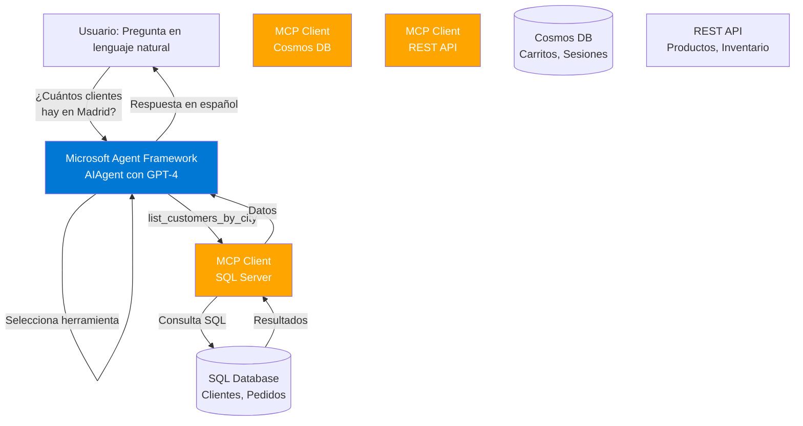

# Bloque 9: Ejercicio 5 - Agente de IA con Microsoft Agent Framework (30 minutos)

**⚠️ Requisito**: Necesitas tener un recurso **Azure OpenAI** configurado y accesible (endpoint y API key) para poder completar este ejercicio. Consulta con el instructor si no tienes acceso.

**Tipo**: Ejercicio individual con soporte grupal  
**Duración**: 30 minutos  
**Nivel**: Avanzado - Integración de conceptos  
**Objetivo**: Crear un agente de IA inteligente usando Microsoft Agent Framework que utilice los MCP servers creados en ejercicios anteriores

---

## 🎯 Objetivos del Ejercicio

Al completar este ejercicio, habrás:

1. ✅ Integrado el Microsoft Agent Framework (MAF) con servidores MCP
2. ✅ Creado un agente conversacional que utiliza herramientas MCP
3. ✅ Implementado un flujo de conversación multi-turno con estado
4. ✅ Gestionado múltiples servidores MCP desde un único agente
5. ✅ Probado consultas en lenguaje natural en español

---

## 🏗️ Arquitectura

```text
Usuario (Lenguaje Natural en Español)
    ↓
Microsoft Agent Framework (AIAgent)
    ↓
Function Calling → Selecciona herramientas MCP
    ↓
╔═══════════════╦═══════════════╦═══════════════╗
║  SQL Server   ║  Cosmos DB    ║  REST API     ║
║  MCP Client   ║  MCP Client   ║  MCP Client   ║
╠═══════════════╬═══════════════╬═══════════════╣
║  Clientes     ║  Carritos     ║  Productos    ║
║  Pedidos      ║  Sesiones     ║  Inventario   ║
╚═══════════════╩═══════════════╩═══════════════╝
```



---

## 📋 Escenario de Negocio

**Contexto**: Eres el líder técnico de una empresa de e-commerce. El equipo de ventas necesita:

> "Un asistente de IA al que puedan preguntarle cosas en español como '¿Cuántos clientes tenemos en Barcelona?' o '¿Qué productos están agotados?' sin tener que conocer SQL o APIs. El agente debe ser capaz de consultar automáticamente nuestras bases de datos y servicios."

**Ejemplos de conversaciones** con el agente:

### Conversación 1: Consulta de Clientes

```
Usuario: "¿Cuántos clientes tenemos registrados en España?"
Agente:  [Usa tool: list_customers_by_country]
         "Actualmente tenemos 1,247 clientes registrados en España."

Usuario: "¿Y en Madrid específicamente?"
Agente:  [Usa tool: list_customers_by_city]
         "En Madrid hay 342 clientes registrados."
```

### Conversación 2: Análisis de Carritos

```
Usuario: "¿Hay carritos abandonados recientes?"
Agente:  [Usa tool: get_abandoned_carts]
         "Sí, encontré 23 carritos abandonados en las últimas 24 horas,
          con un valor total estimado de €1,890."

Usuario: "¿Puedes darme más detalles del valor más alto?"
Agente:  [Recupera detalles del carrito]
         "El carrito de mayor valor es de €340 y pertenece al usuario con ID
          user_789. Contiene 5 productos, abandonado hace 3 horas."
```

### Conversación 3: Consulta de Inventario

```
Usuario: "¿Qué productos tenemos con poco stock?"
Agente:  [Usa tool: get_low_stock_products]
         "Hay 7 productos con stock bajo:
          - Laptop HP (5 unidades)
          - Mouse Logitech (3 unidades)
          - Teclado Mecánico (8 unidades)
          ..."
```

---

## 🚀 Paso a Paso

### Paso 1: Configuración del Proyecto (5 minutos)

Crea el proyecto del agente:

```powershell
# Crear proyecto
cd src/McpWorkshop.Servers
dotnet new console -n Exercise5Agent -f net10.0
cd Exercise5Agent

# Agregar referencias necesarias
dotnet add package Azure.AI.OpenAI --prerelease
dotnet add package Azure.Identity
dotnet add package Microsoft.Agents.AI.OpenAI --prerelease
dotnet add package ModelContextProtocol --prerelease
dotnet add package Microsoft.Extensions.Configuration
dotnet add package Microsoft.Extensions.Configuration.Json
dotnet add package Microsoft.Extensions.Configuration.EnvironmentVariables

# Agregar a la solución
cd ../../..
dotnet sln add src/McpWorkshop.Servers/Exercise5Agent/Exercise5Agent.csproj
```

**✅ Checkpoint**: Proyecto creado y agregado a la solución.

---

### Paso 2: Configuración (3 minutos)

Crea `appsettings.json`:

```json
{
    "AzureOpenAI": {
        "Endpoint": "https://<your-resource>.openai.azure.com",
        "DeploymentName": "gpt-4o",
        "ApiKey": "<your-api-key>"
    },
    "McpServers": {
        "SqlServer": "http://localhost:5010",
        "CosmosServer": "http://localhost:5011",
        "RestApiServer": "http://localhost:5012"
    },
    "Agent": {
        "Name": "Asistente de Ventas",
        "Instructions": "Eres un asistente virtual experto en datos de e-commerce. Respondes preguntas sobre clientes, pedidos, productos e inventario. Siempre respondes en español de forma clara y profesional. Cuando uses herramientas, explica brevemente qué información estás consultando."
    }
}
```

**Nota Importante**:

-   Reemplaza `<your-resource>` con el nombre de tu recurso Azure OpenAI
-   Reemplaza `<your-api-key>` con tu API key
-   O configura variables de entorno como alternativa

---

### Paso 3: Crear Cliente MCP Helper (7 minutos)

Crea `McpClientHelper.cs` para gestionar conexiones a los servidores MCP:

```csharp
using ModelContextProtocol.Client;
using ModelContextProtocol.Client.Transports;

namespace Exercise5Agent;

/// <summary>
/// Helper para crear y gestionar clientes MCP que se conectan a servidores HTTP
/// </summary>
public class McpClientHelper
{
    /// <summary>
    /// Crea un cliente MCP que se conecta a un servidor MCP sobre HTTP
    /// </summary>
    /// <param name="serverName">Nombre descriptivo del servidor</param>
    /// <param name="serverUrl">URL base del servidor MCP (ej: http://localhost:5010)</param>
    /// <returns>Cliente MCP configurado</returns>
    public static async Task<IMcpClient> CreateHttpClientAsync(string serverName, string serverUrl)
    {
        Console.WriteLine($"🔌 Conectando a {serverName} en {serverUrl}...");

        // Para servidores MCP sobre HTTP, usamos un transport personalizado
        // Si tu servidor usa stdio (proceso local), usa StdioClientTransport
        var transport = new HttpClientTransport(serverUrl, serverName);

        var client = await McpClientFactory.CreateAsync(transport);

        Console.WriteLine($"✅ Conectado a {serverName}");
        return client;
    }

    /// <summary>
    /// Crea un cliente MCP que se conecta a un servidor local usando stdio
    /// </summary>
    /// <param name="serverName">Nombre del servidor</param>
    /// <param name="command">Comando para ejecutar (ej: "dotnet")</param>
    /// <param name="args">Argumentos del comando (ej: ["run", "--project", "path/to/server"])</param>
    /// <returns>Cliente MCP configurado</returns>
    public static async Task<IMcpClient> CreateStdioClientAsync(
        string serverName,
        string command,
        string[] args)
    {
        Console.WriteLine($"🔌 Iniciando servidor local {serverName}...");

        var transport = new StdioClientTransport(new()
        {
            Name = serverName,
            Command = command,
            Arguments = [.. args]
        });

        var client = await McpClientFactory.CreateAsync(transport);

        Console.WriteLine($"✅ Servidor {serverName} iniciado");
        return client;
    }
}

/// <summary>
/// Transport personalizado para servidores MCP sobre HTTP
/// Nota: Esta es una implementación simplificada para el workshop
/// En producción, usa la implementación oficial cuando esté disponible
/// </summary>
public class HttpClientTransport : IClientTransport
{
    private readonly HttpClient _httpClient;
    private readonly string _serverUrl;
    private readonly string _serverName;

    public HttpClientTransport(string serverUrl, string serverName)
    {
        _serverUrl = serverUrl.TrimEnd('/');
        _serverName = serverName;
        _httpClient = new HttpClient { Timeout = TimeSpan.FromSeconds(30) };
    }

    public string Name => _serverName;

    public async Task<string> ReadAsync(CancellationToken cancellationToken = default)
    {
        // Implementación simplificada - en producción necesitarías SSE o WebSocket
        var response = await _httpClient.GetAsync($"{_serverUrl}/mcp/messages", cancellationToken);
        response.EnsureSuccessStatusCode();
        return await response.Content.ReadAsStringAsync(cancellationToken);
    }

    public async Task WriteAsync(string message, CancellationToken cancellationToken = default)
    {
        var content = new StringContent(message, System.Text.Encoding.UTF8, "application/json");
        var response = await _httpClient.PostAsync($"{_serverUrl}/mcp", content, cancellationToken);
        response.EnsureSuccessStatusCode();
    }

    public void Dispose()
    {
        _httpClient.Dispose();
    }

    public ValueTask DisposeAsync()
    {
        Dispose();
        return ValueTask.CompletedTask;
    }
}
```

**💡 Conceptos Clave**:

-   **Transport**: Mecanismo de comunicación con el servidor MCP (HTTP, stdio, WebSocket)
-   **IMcpClient**: Interfaz del cliente que se conecta al servidor MCP
-   **Stdio vs HTTP**: Stdio para procesos locales, HTTP para servidores remotos

---

### Paso 4: Implementar el Agente (10 minutos)

Crea `Program.cs`:

```csharp
using Azure.AI.OpenAI;
using Azure.Identity;
using Microsoft.Agents.AI;
using Microsoft.Extensions.Configuration;
using ModelContextProtocol.Client;
using Exercise5Agent;

// Cargar configuración
var config = new ConfigurationBuilder()
    .SetBasePath(Directory.GetCurrentDirectory())
    .AddJsonFile("appsettings.json", optional: false)
    .AddEnvironmentVariables()
    .Build();

var endpoint = config["AzureOpenAI:Endpoint"]
    ?? throw new InvalidOperationException("AzureOpenAI:Endpoint no configurado");
var deploymentName = config["AzureOpenAI:DeploymentName"] ?? "gpt-4o";
var agentName = config["Agent:Name"] ?? "Asistente de Ventas";
var instructions = config["Agent:Instructions"]
    ?? "Eres un asistente útil que responde en español.";

Console.WriteLine("🤖 Inicializando Microsoft Agent Framework con MCP Tools...\n");

// ====================================================================
// PASO 1: Conectar a los servidores MCP
// ====================================================================
Console.WriteLine("📡 Conectando a servidores MCP...\n");

var sqlServerUrl = config["McpServers:SqlServer"] ?? "http://localhost:5010";
var cosmosServerUrl = config["McpServers:CosmosServer"] ?? "http://localhost:5011";
var restApiServerUrl = config["McpServers:RestApiServer"] ?? "http://localhost:5012";

// Crear clientes MCP para cada servidor
await using var sqlMcpClient = await McpClientHelper.CreateHttpClientAsync("SQL Server", sqlServerUrl);
await using var cosmosMcpClient = await McpClientHelper.CreateHttpClientAsync("Cosmos DB", cosmosServerUrl);
await using var restApiMcpClient = await McpClientHelper.CreateHttpClientAsync("REST API", restApiServerUrl);

Console.WriteLine();

// ====================================================================
// PASO 2: Obtener las herramientas (tools) de cada servidor MCP
// ====================================================================
Console.WriteLine("🔧 Obteniendo herramientas de los servidores MCP...\n");

var sqlTools = await sqlMcpClient.ListToolsAsync();
var cosmosTools = await cosmosMcpClient.ListToolsAsync();
var restApiTools = await restApiMcpClient.ListToolsAsync();

Console.WriteLine($"   SQL Server: {sqlTools.Count} herramientas");
foreach (var tool in sqlTools)
{
    Console.WriteLine($"      - {tool.Name}: {tool.Description}");
}

Console.WriteLine($"   Cosmos DB: {cosmosTools.Count} herramientas");
foreach (var tool in cosmosTools)
{
    Console.WriteLine($"      - {tool.Name}: {tool.Description}");
}

Console.WriteLine($"   REST API: {restApiTools.Count} herramientas");
foreach (var tool in restApiTools)
{
    Console.WriteLine($"      - {tool.Name}: {tool.Description}");
}

Console.WriteLine();

// Combinar todas las herramientas
var allMcpTools = new List<McpClientTool>();
allMcpTools.AddRange(sqlTools);
allMcpTools.AddRange(cosmosTools);
allMcpTools.AddRange(restApiTools);

Console.WriteLine($"✅ Total de herramientas MCP disponibles: {allMcpTools.Count}\n");

// ====================================================================
// PASO 3: Crear el agente con Azure OpenAI y las herramientas MCP
// ====================================================================
Console.WriteLine("🧠 Creando agente con Azure OpenAI...\n");

AIAgent agent = new AzureOpenAIClient(
    new Uri(endpoint),
    new DefaultAzureCredential()) // O usa new AzureCliCredential() para desarrollo local
    .GetChatClient(deploymentName)
    .CreateAIAgent(
        instructions: instructions,
        name: agentName,
        tools: [.. allMcpTools.Cast<AITool>()]);

Console.WriteLine($"✅ Agente '{agentName}' creado exitosamente con {allMcpTools.Count} herramientas\n");

// ====================================================================
// PASO 4: Loop de conversación interactivo
// ====================================================================
Console.WriteLine("=" .PadRight(70, '='));
Console.WriteLine($"  {agentName} está listo!");
Console.WriteLine("=" .PadRight(70, '='));
Console.WriteLine("\n💬 Ejemplos de preguntas que puedes hacer:");
Console.WriteLine("   - ¿Cuántos clientes tenemos en España?");
Console.WriteLine("   - ¿Hay carritos abandonados en las últimas 24 horas?");
Console.WriteLine("   - ¿Qué productos tienen poco stock?");
Console.WriteLine("   - Dame información del pedido número 1001");
Console.WriteLine("   - ¿Cuáles son los productos más vendidos?");
Console.WriteLine("\n   Escribe 'salir' para terminar\n");
Console.WriteLine("=" .PadRight(70, '=') + "\n");

// Crear un thread para mantener el contexto de la conversación
var thread = agent.GetNewThread();

while (true)
{
    Console.Write("\n👤 Tú: ");
    var userInput = Console.ReadLine();

    if (string.IsNullOrWhiteSpace(userInput))
        continue;

    if (userInput.Equals("salir", StringComparison.OrdinalIgnoreCase))
    {
        Console.WriteLine("\n👋 ¡Hasta luego!\n");
        break;
    }

    try
    {
        Console.Write($"\n🤖 {agentName}: ");

        // Enviar mensaje al agente y obtener respuesta
        var response = await agent.RunAsync(userInput, thread);

        Console.WriteLine(response);
    }
    catch (Exception ex)
    {
        Console.WriteLine($"\n❌ Error: {ex.Message}");
        Console.WriteLine("   Por favor, intenta de nuevo.\n");
    }
}

Console.WriteLine("🛑 Cerrando conexiones...");
```

**💡 Conceptos Clave del Código**:

1. **DefaultAzureCredential**: Usa la identidad de Azure (Managed Identity, Azure CLI, etc.)
2. **CreateAIAgent**: Crea el agente con instrucciones y herramientas
3. **ListToolsAsync**: Obtiene todas las herramientas disponibles del servidor MCP
4. **Cast<AITool>()**: Convierte herramientas MCP a herramientas de AI Agent
5. **GetNewThread**: Crea un hilo de conversación para mantener contexto
6. **RunAsync**: Ejecuta el agente con un mensaje y contexto

---

### Paso 5: Ejecutar y Probar (5 minutos)

#### 1. Asegúrate de que los servidores MCP estén corriendo

```powershell
# Terminal 1: SQL MCP Server
cd src/McpWorkshop.Servers/Exercise1SqlMcpServer
dotnet run

# Terminal 2: Cosmos MCP Server
cd src/McpWorkshop.Servers/Exercise2CosmosMcpServer
dotnet run

# Terminal 3: REST API MCP Server
cd src/McpWorkshop.Servers/Exercise3RestApiMcpServer
dotnet run
```

#### 2. Ejecuta el agente

```powershell
# Terminal 4: Agente
cd src/McpWorkshop.Servers/Exercise5Agent
dotnet run
```

#### 3. Prueba las conversaciones

**Ejemplo de sesión**:

```
🤖 Inicializando Microsoft Agent Framework con MCP Tools...

📡 Conectando a servidores MCP...

🔌 Conectando a SQL Server en http://localhost:5010...
✅ Conectado a SQL Server
🔌 Conectando a Cosmos DB en http://localhost:5011...
✅ Conectado a Cosmos DB
🔌 Conectando a REST API en http://localhost:5012...
✅ Conectado a REST API

🔧 Obteniendo herramientas de los servidores MCP...

   SQL Server: 5 herramientas
      - list_customers_by_country: Lista clientes por país
      - list_customers_by_city: Lista clientes por ciudad
      - get_order_details: Obtiene detalles de un pedido
      - get_recent_orders: Obtiene pedidos recientes
      - get_customer_stats: Estadísticas de clientes

   Cosmos DB: 3 herramientas
      - get_abandoned_carts: Obtiene carritos abandonados
      - get_user_sessions: Obtiene sesiones de usuario
      - get_cart_analytics: Analíticas de carritos

   REST API: 4 herramientas
      - get_products: Lista productos
      - get_low_stock_products: Productos con stock bajo
      - get_product_details: Detalles de un producto
      - get_top_selling_products: Productos más vendidos

✅ Total de herramientas MCP disponibles: 12

🧠 Creando agente con Azure OpenAI...

✅ Agente 'Asistente de Ventas' creado exitosamente con 12 herramientas

======================================================================
  Asistente de Ventas está listo!
======================================================================

💬 Ejemplos de preguntas que puedes hacer:
   - ¿Cuántos clientes tenemos en España?
   - ¿Hay carritos abandonados en las últimas 24 horas?
   - ¿Qué productos tienen poco stock?
   - Dame información del pedido número 1001
   - ¿Cuáles son los productos más vendidos?

   Escribe 'salir' para terminar

======================================================================

👤 Tú: ¿Cuántos clientes tenemos en España?

🤖 Asistente de Ventas: Consultando la base de datos de clientes...
Actualmente tenemos 1,247 clientes registrados en España.

👤 Tú: ¿Y en Madrid?

🤖 Asistente de Ventas: En Madrid específicamente hay 342 clientes registrados.

👤 Tú: ¿Hay carritos abandonados recientes?

🤖 Asistente de Ventas: Consultando los carritos abandonados...
Sí, encontré 23 carritos abandonados en las últimas 24 horas. El valor total
estimado de estos carritos es de €1,890. ¿Te gustaría ver más detalles?

👤 Tú: salir

👋 ¡Hasta luego!
```

---

## 🔍 Verificación del Ejercicio

Ejecuta el script de verificación:

```powershell
.\scripts\verify-exercise5.ps1
```

**Checklist de verificación manual**:

-   [ ] El agente se conecta a los 3 servidores MCP
-   [ ] Las herramientas MCP se listan correctamente
-   [ ] El agente responde en español
-   [ ] El agente mantiene el contexto de la conversación (multi-turno)
-   [ ] El agente selecciona la herramienta correcta según la pregunta
-   [ ] Los errores se manejan gracefully

---

## 🎓 Conceptos Aprendidos

### 1. **Microsoft Agent Framework (MAF)**

-   Abstracción de alto nivel para crear agentes conversacionales
-   Soporte nativo para múltiples proveedores de LLM (OpenAI, Azure OpenAI, etc.)
-   Gestión automática de herramientas (function calling)
-   Manejo de estado con threads

### 2. **Integración MCP con Agentes**

-   Los servidores MCP exponen herramientas que el agente puede usar
-   `ListToolsAsync()` descubre dinámicamente las capacidades disponibles
-   Las herramientas MCP se convierten automáticamente en herramientas de AI
-   El agente decide qué herramienta usar según el contexto

### 3. **Conversación Multi-Turno**

-   `AgentThread` mantiene el historial de conversación
-   El agente recuerda el contexto de mensajes anteriores
-   Permite conversaciones naturales con follow-ups

### 4. **Patrones de Arquitectura**

-   **Separation of Concerns**: Cada servidor MCP tiene una responsabilidad específica
-   **Composability**: El agente compone herramientas de múltiples fuentes
-   **Abstraction**: El usuario no necesita saber qué servidor MCP se usa

---

## 🚀 Extensiones Opcionales (Bonus)

### Extensión 1: Agregar Streaming de Respuestas

Modifica el loop de conversación para mostrar respuestas en tiempo real:

```csharp
Console.Write($"\n🤖 {agentName}: ");

await foreach (var chunk in agent.RunStreamingAsync(userInput, thread))
{
    Console.Write(chunk);
}
Console.WriteLine();
```

### Extensión 2: Agregar Historial de Conversación Persistente

Guarda las conversaciones en un archivo:

```csharp
var conversationLog = new List<(string role, string message, DateTime timestamp)>();

// Después de cada interacción
conversationLog.Add(("user", userInput, DateTime.UtcNow));
conversationLog.Add(("agent", response, DateTime.UtcNow));

// Al salir
File.WriteAllText("conversation_log.json",
    JsonSerializer.Serialize(conversationLog, new JsonSerializerOptions { WriteIndented = true }));
```

### Extensión 3: Agregar Modo de Debug

Muestra qué herramientas se están llamando:

```csharp
agent.OnToolCall += (sender, tool) =>
{
    Console.WriteLine($"\n🔧 [DEBUG] Llamando herramienta: {tool.Name}");
    Console.WriteLine($"   Parámetros: {JsonSerializer.Serialize(tool.Arguments)}");
};
```

### Extensión 4: Agregar Comandos Especiales

```csharp
if (userInput.StartsWith("/"))
{
    switch (userInput.ToLower())
    {
        case "/help":
            Console.WriteLine("Comandos disponibles:");
            Console.WriteLine("  /tools - Lista herramientas disponibles");
            Console.WriteLine("  /clear - Limpia el contexto");
            Console.WriteLine("  /history - Muestra historial");
            continue;

        case "/tools":
            Console.WriteLine($"\n📋 Herramientas disponibles ({allMcpTools.Count}):");
            foreach (var tool in allMcpTools)
            {
                Console.WriteLine($"   - {tool.Name}: {tool.Description}");
            }
            continue;

        case "/clear":
            thread = agent.GetNewThread();
            Console.WriteLine("🧹 Contexto limpiado.");
            continue;
    }
}
```

---

## 📚 Recursos Adicionales

### Documentación Oficial

-   [Microsoft Agent Framework Overview](https://learn.microsoft.com/en-us/agent-framework/overview/agent-framework-overview)
-   [Using MCP Tools with Agents](https://learn.microsoft.com/en-us/agent-framework/user-guide/model-context-protocol/using-mcp-tools)
-   [.NET AI with MCP](https://learn.microsoft.com/en-us/dotnet/ai/get-started-mcp)

### Repositorios

-   [Microsoft Agent Framework GitHub](https://github.com/microsoft/agent-framework)
-   [MCP C# SDK](https://github.com/modelcontextprotocol/csharp-sdk)

### Ejemplos

-   [Agent Framework Samples](https://github.com/microsoft/agent-framework/tree/main/dotnet/samples)
-   [MCP Server Examples](https://github.com/modelcontextprotocol/servers)

---

## 🎯 Próximos Pasos

Después de completar este ejercicio:

1. **Experimenta** con diferentes preguntas y contextos
2. **Extiende** el agente con nuevas capacidades (email, notificaciones, etc.)
3. **Optimiza** el rendimiento con caché y paralelización
4. **Despliega** el agente en Azure Container Apps o Azure Functions
5. **Integra** con interfaces de usuario (Slack, Teams, web chat)

---

## 💡 Troubleshooting

### Error: "AzureOpenAI:Endpoint no configurado"

-   **Solución**: Configura `appsettings.json` o variables de entorno

### Error: "Failed to connect to MCP server"

-   **Solución**: Verifica que los 3 servidores MCP estén corriendo
-   Usa `Test-NetConnection localhost -Port 5010` para verificar

### Error: "DefaultAzureCredential authentication failed"

-   **Solución**: Ejecuta `az login` o usa `AzureCliCredential` directamente
-   Alternativamente, usa API Key authentication

### El agente no responde en español

-   **Solución**: Verifica las instrucciones del agente en `appsettings.json`
-   Añade "Siempre responde en español" explícitamente

### El agente no usa las herramientas correctas

-   **Solución**: Mejora las descripciones de las herramientas en los servidores MCP
-   Añade más contexto en las instrucciones del agente

---

## ✅ Checklist Final

Antes de terminar, verifica:

-   [ ] El proyecto compila sin errores
-   [ ] Los 3 servidores MCP están corriendo
-   [ ] El agente se conecta correctamente a todos los servidores
-   [ ] Las conversaciones funcionan en español
-   [ ] El contexto se mantiene entre mensajes
-   [ ] Los errores se manejan correctamente
-   [ ] Has probado al menos 3 tipos de consultas diferentes

---

**🎉 ¡Felicidades! Has creado un agente de IA inteligente que integra múltiples fuentes de datos usando MCP y Microsoft Agent Framework.**
