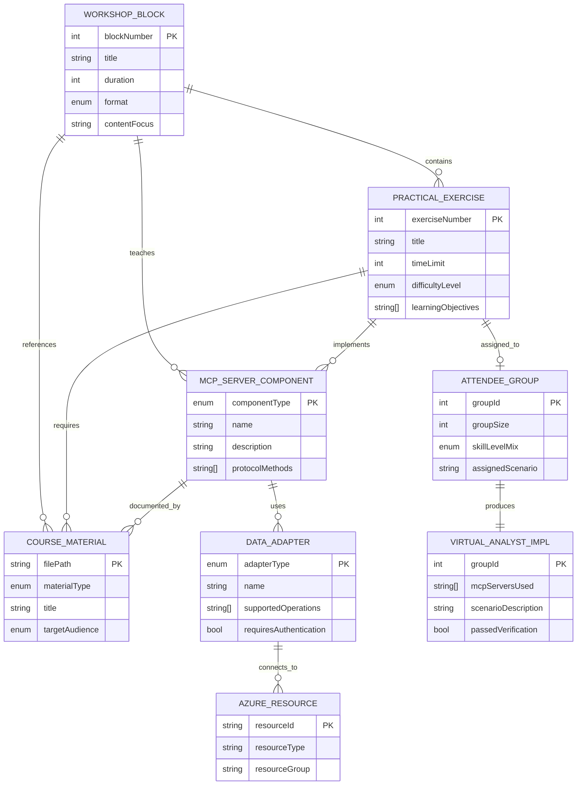
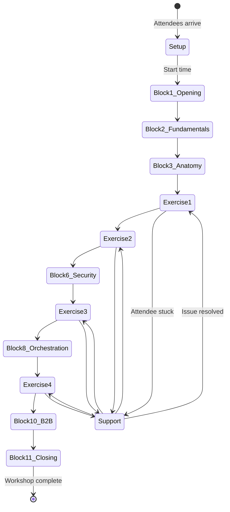
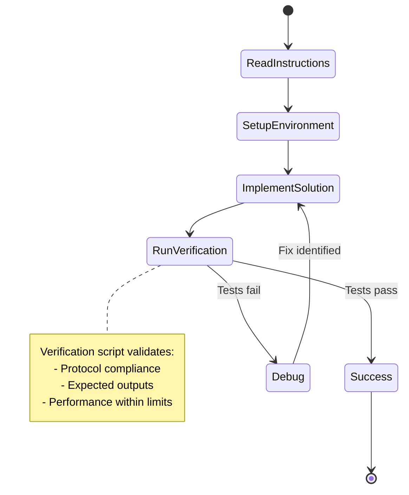

# Data Model: MCP Workshop Course

**Feature**: `001-mcp-workshop-course`  
**Date**: 2025-11-17  
**Purpose**: Define entities, relationships, and state models for workshop domain

## Overview

This data model defines the conceptual entities that comprise the MCP workshop course. These entities guide the implementation of course materials, exercise structures, and MCP server examples without prescribing specific implementation details.

---

## Core Entities

### 1. WorkshopBlock

Represents a discrete segment of the 3-hour workshop with defined learning objectives and delivery format.

**Attributes**:

- `blockNumber` (integer, 1-11): Sequential identifier for ordering
- `title` (string): Descriptive name (e.g., "Fundamentos", "Anatomía de un Proveedor")
- `duration` (integer, minutes): Allocated time (10-30 minutes)
- `format` (enum): Delivery mode
  - `Plenario`: Full group presentation
  - `Charla`: Lecture-style delivery
  - `Demo`: Instructor demonstration
  - `LiveCoding`: Real-time coding session
  - `PracticoGuiado`: Guided hands-on exercise
  - `Practico`: Independent hands-on exercise
  - `Grupo`: Collaborative group activity
- `contentFocus` (string): Primary topic or learning objective
- `prerequisites` (array of blockNumber): Blocks that must precede this one
- `deliverables` (array of string): Outputs expected from this block

**Relationships**:

- Has zero or more `PracticalExercise` entities
- References zero or more `CourseMaterial` entities
- May reference `McpServerComponent` for technical content

**State Transitions**:

```text
NotStarted → InProgress → Completed
```

**Validation Rules**:

- Total duration of all blocks must not exceed 180 minutes
- `blockNumber` must be unique and sequential
- `format` must be appropriate for `duration` (e.g., LiveCoding requires ≥15 min)

---

### 2. PracticalExercise

Represents a hands-on activity where attendees implement MCP concepts.

**Attributes**:

- `exerciseNumber` (integer, 1-4): Sequential identifier
- `title` (string): Exercise name
- `timeLimit` (integer, minutes): Maximum duration (15-30 minutes)
- `difficultyLevel` (enum): Complexity indicator
  - `Guided`: Template-based with step-by-step instructions
  - `Moderate`: Scaffold provided, requires problem-solving
  - `Advanced`: Open-ended, synthesis of prior knowledge
- `learningObjectives` (array of string): Skills to be acquired
- `successCriteria` (array of string): Measurable outcomes for completion
- `starterTemplateUri` (string): Path to initial code scaffold
- `referenceImplementationUri` (string): Path to complete solution
- `verificationScriptUri` (string): Path to automated validation script

**Relationships**:

- Belongs to one `WorkshopBlock`
- Produces zero or more `McpServerComponent` implementations
- Requires zero or more `CourseMaterial` entities
- May depend on previous `PracticalExercise` completion

**State Transitions**:

```text
NotStarted → InProgress → Verified → Completed
                      ↓
                   Failed → InProgress (retry)
```

**Validation Rules**:

- `timeLimit` must align with containing `WorkshopBlock.duration`
- `difficultyLevel` should increase with `exerciseNumber`
- `verificationScriptUri` must be executable and return clear pass/fail

---

### 3. McpServerComponent

Represents a technical element of MCP architecture taught in the workshop.

**Attributes**:

- `componentType` (enum): Category of MCP element
  - `Manifest`: Server metadata and capabilities declaration
  - `Resource`: Read-only data exposure via URI
  - `Tool`: Executable function with parameters
  - `Prompt`: AI-friendly template or instruction
  - `Authentication`: Identity and authorization mechanism
  - `RateLimiting`: Request throttling logic
  - `Logging`: Observability and diagnostics
- `name` (string): Component identifier
- `description` (string): Purpose and use case
- `protocolMethods` (array of string): JSON-RPC methods (e.g., "resources/read")
- `codeExampleUri` (string): Path to reference implementation
- `diagramUri` (string): Optional Mermaid diagram path

**Relationships**:

- Taught in one or more `WorkshopBlock` entities
- Implemented in one or more `PracticalExercise` entities
- May depend on other `McpServerComponent` entities (e.g., Tool depends on Resource)

**State Transitions**:

```text
Defined → Demonstrated → Practiced → Mastered
```

**Validation Rules**:

- `protocolMethods` must align with MCP specification (JSON-RPC 2.0)
- `codeExampleUri` must reference valid C# code file
- `componentType` sequence should follow pedagogical progression (Resource → Tool → Auth)

---

### 4. CourseMaterial

Represents supporting documentation or media for workshop delivery.

**Attributes**:

- `materialType` (enum): Content category
  - `Markdown`: Instructional documentation
  - `Diagram`: Mermaid or image visualization
  - `CodeSnippet`: Embeddable code example
  - `Slides`: Presentation deck (optional)
  - `Video`: Pre-recorded demonstration (backup)
  - `Checklist`: Verification or prerequisite list
- `title` (string): Material name
- `filePath` (string): Relative path in repository
- `targetAudience` (enum): Intended reader
  - `Instructor`: Delivery notes and facilitation guide
  - `Attendee`: Self-paced learning content
  - `Both`: Shared reference material
- `language` (string): Content language (default: "es" for Spanish)

**Relationships**:

- Referenced by one or more `WorkshopBlock` entities
- May support zero or more `PracticalExercise` entities
- Can include references to `McpServerComponent` entities

**State Transitions**:

```text
Draft → Review → Published → Archived
```

**Validation Rules**:

- `filePath` must exist in repository
- Markdown files must pass linting (no broken links)
- Diagrams must render correctly in Mermaid preview

---

### 5. AttendeeGroup

Represents a collaborative team for Exercise 4 (group challenge).

**Attributes**:

- `groupId` (integer): Unique identifier
- `groupSize` (integer, 3-5): Number of participants
- `skillLevelMix` (enum): Diversity indicator
  - `Homogeneous`: Similar experience levels
  - `Mixed`: Varied backgrounds (preferred)
- `assignedScenario` (string): Use case for Exercise 4
- `completionStatus` (enum): Progress tracking
  - `Forming`: Initial group setup
  - `Working`: Active collaboration
  - `Presenting`: Demo preparation
  - `Completed`: Deliverable submitted

**Relationships**:

- Assigned to `PracticalExercise` #4
- Produces one `VirtualAnalystImplementation` (see below)

**State Transitions**:

```text
Forming → Working → Presenting → Completed
```

**Validation Rules**:

- `groupSize` should be 3-5 for optimal collaboration
- All groups must have unique `assignedScenario` for variety

---

### 6. DataAdapter

Represents an abstraction layer connecting MCP servers to data sources.

**Attributes**:

- `adapterType` (enum): Data source category
  - `SqlDatabase`: Azure SQL relational data
  - `CosmosDb`: Azure Cosmos NoSQL data
  - `RestApi`: External HTTP API
  - `LocalFile`: JSON files (offline scenarios)
  - `BlobStorage`: Azure Blob files
- `name` (string): Adapter identifier
- `connectionConfigUri` (string): Path to configuration template
- `supportedOperations` (array of enum): Capabilities
  - `Read`: Resource retrieval
  - `Query`: Parameterized search
  - `Write`: Data modification (advanced)
- `requiresAuthentication` (boolean): Security flag

**Relationships**:

- Implements `IDataAdapter` interface (technical)
- Used by `McpServerComponent` of type Resource or Tool
- Demonstrated in specific `PracticalExercise` entities

**State Transitions**:

```text
Configured → Tested → Deployed → Active
```

**Validation Rules**:

- `adapterType` determines required configuration properties
- `SqlDatabase` and `CosmosDb` require Azure connection strings
- `LocalFile` must have valid `DataDirectory` path

---

## Domain Relationships

### Entity Relationship Diagram



---

## Derived Entities

### VirtualAnalystImplementation

Represents the output of Exercise 4 group challenge.

**Attributes**:

- `groupId` (foreign key): Reference to `AttendeeGroup`
- `mcpServersUsed` (array of string): List of integrated MCP servers
- `dataSourcesAccessed` (array of `DataAdapter.adapterType`): Data diversity
- `scenarioDescription` (string): Business use case addressed
- `implementationUri` (string): Path to submitted code
- `passedVerification` (boolean): Automated test result

**Relationships**:

- Produced by one `AttendeeGroup`
- Integrates multiple `McpServerComponent` entities
- Accesses multiple `DataAdapter` entities

**Validation Rules**:

- Must use at least 2 different `mcpServersUsed`
- `dataSourcesAccessed` should include ≥2 different adapter types
- `passedVerification` requires successful HTTP requests to all servers

---

### AzureResource

Represents cloud infrastructure provisioned via Terraform.

**Attributes**:

- `resourceId` (string): Azure resource ID
- `resourceType` (enum): Azure service type
  - `ContainerApp`: MCP server hosting
  - `AppServicePlan`: App Service infrastructure
  - `SqlDatabase`: Relational data storage
  - `CosmosDbAccount`: NoSQL data storage
  - `StorageAccount`: Blob and file storage
  - `LogAnalyticsWorkspace`: Observability
- `resourceGroup` (string): Azure resource group name
- `region` (string): Azure region (e.g., "eastus", "westeurope")
- `terraformModuleUri` (string): Path to Terraform module

**Relationships**:

- Connected to by `DataAdapter` entities
- Provisioned for specific `PracticalExercise` scenarios
- Monitored by shared `LogAnalyticsWorkspace`

**State Transitions**:

```text
Planned (Terraform) → Provisioned → Active → Deprovisioned
```

**Validation Rules**:

- `resourceType` determines required Terraform variables
- All resources must belong to same `resourceGroup` for cost tracking
- `region` should align with workshop venue location (latency)

---

## State Management

### Workshop Session State



### Exercise Completion Flow



---

## Aggregates and Bounded Contexts

### Workshop Delivery Context

**Aggregate Root**: `WorkshopBlock`

**Invariants**:

- Total duration must equal 180 minutes
- Block sequence must be pedagogically sound (prerequisites satisfied)
- Format transitions maintain engagement (no more than 2 consecutive lectures)

**Entities**:

- `WorkshopBlock` (root)
- `CourseMaterial`
- `McpServerComponent`

---

### Exercise Execution Context

**Aggregate Root**: `PracticalExercise`

**Invariants**:

- Exercise cannot start until prerequisite blocks completed
- Verification must pass before marking completed
- Time limit cannot be exceeded without instructor approval

**Entities**:

- `PracticalExercise` (root)
- `AttendeeGroup` (Exercise 4 only)
- `VirtualAnalystImplementation`

---

### Infrastructure Context

**Aggregate Root**: `AzureResource`

**Invariants**:

- All resources must exist in same subscription
- Resource group must be provisioned before dependent resources
- Terraform state must be consistent

**Entities**:

- `AzureResource` (root)
- `DataAdapter` (logical connection)

---

## Data Validation Rules

### Cross-Entity Constraints

1. **Time Budget**: `SUM(WorkshopBlock.duration) = 180 minutes`
2. **Exercise Sequencing**: `PracticalExercise[n].prerequisites ⊆ {PracticalExercise[1..n-1]}`
3. **Component Dependencies**: `McpServerComponent(Tool) → McpServerComponent(Resource)` (tools can reference resources)
4. **Group Size**: `SUM(AttendeeGroup.groupSize) ≈ TotalAttendees` (all attendees assigned)

### Business Rules

1. **80% Success Rate**: At least 80% of attendees must complete Exercise 1 (per SC-002)
2. **70% Success Rate**: At least 70% of attendees must complete Exercise 2 (per SC-003)
3. **90% Group Success**: At least 90% of groups must produce working Exercise 4 solution (per SC-004)
4. **Instructor Intervention Threshold**: If >20% of attendees require help, pause and address common issues

---

## Summary

This data model defines the conceptual entities for the MCP workshop without prescribing implementation details. Key entities include:

- **WorkshopBlock**: Course structure and sequencing
- **PracticalExercise**: Hands-on learning activities
- **McpServerComponent**: Technical concepts and protocol elements
- **CourseMaterial**: Supporting documentation and media
- **DataAdapter**: Data source abstraction layer
- **AttendeeGroup**: Collaborative teams for group challenge
- **AzureResource**: Cloud infrastructure components

These entities guide the implementation of course content, exercise scaffolding, and MCP server examples while maintaining flexibility for different delivery contexts (in-person vs. remote, local vs. Azure-hosted).

**Next Artifacts**:

- `contracts/` directory with MCP protocol specifications
- `quickstart.md` with environment setup guide
