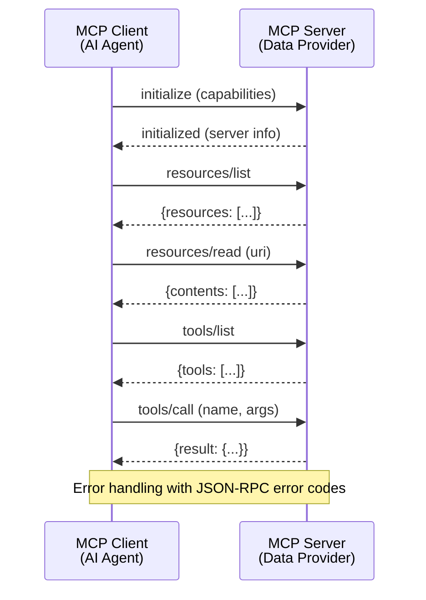
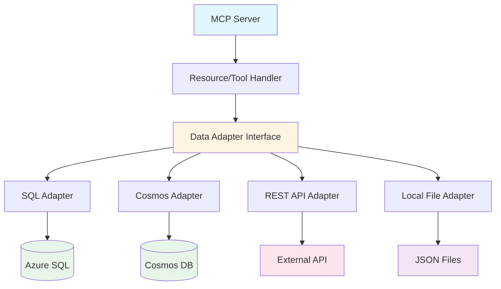

# Research: MCP Workshop Course

**Feature**: `001-mcp-workshop-course`  
**Date**: 2025-11-17  
**Purpose**: Resolve technical unknowns and document technology choices for MCP workshop implementation

## Research Areas

This document consolidates research findings for:

1. ModelContextProtocol C# library capabilities and patterns
2. Azure deployment architecture for MCP servers
3. Workshop pedagogical best practices
4. MCP protocol specifications and testing strategies
5. Data source integration patterns

---

## 1. ModelContextProtocol C# Library

### Decision: Use ModelContextProtocol (prerelease) from NuGet

**Rationale**:

- Official C# implementation of MCP protocol
- Provides strongly-typed abstractions for servers, resources, tools, and prompts
- Integrates with Microsoft.Extensions.\* ecosystem (DI, logging, configuration)
- Supports both stdio and HTTP transport layers
- Active development with prerelease versions available on NuGet

**Key Capabilities**:

- **Server Abstraction**: `McpServer` class handles protocol negotiation and request routing
- **Resource Management**: Declarative resource registration with URI templates
- **Tool Definitions**: Type-safe tool registration with JSON Schema validation
- **Transport Flexibility**: Stdio transport for CLI scenarios, HTTP transport for web hosting
- **Middleware Support**: Request/response pipeline for authentication, logging, rate limiting

**Usage Pattern for Workshop**:

```csharp
// Server initialization
var builder = WebApplication.CreateBuilder(args);
builder.Services.AddMcp(options => {
    options.ServerInfo = new ServerInfo {
        Name = "workshop-server",
        Version = "1.0.0"
    };
});

// Resource registration
app.MapMcpResource("/data/customers", async context => {
    // Return resource content
});

// Tool registration
app.MapMcpTool("query_data", async (QueryRequest request) => {
    // Execute tool logic
});
```

**Alternatives Considered**:

- **Build from scratch**: Rejected due to time constraints and protocol complexity
- **Python MCP SDK**: Rejected to align with C# requirement and Azure .NET ecosystem
- **Community implementations**: Rejected due to lack of official support and documentation

**Workshop Integration**:

- Exercise 1: Demonstrate basic server setup and static resource registration
- Exercise 2: Show tool registration with parameter validation
- Exercise 3: Implement middleware for security concerns
- Exercise 4: Orchestrate multiple MCP servers using client library

**Documentation Needs**:

- NuGet package installation instructions (including --prerelease flag)
- Server lifecycle and configuration patterns
- Resource vs. Tool decision framework
- Transport selection guidance (stdio for CLI tools, HTTP for services)

---

## 2. Azure Deployment Architecture

### Decision: Azure Container Apps as primary hosting platform with App Service alternative

**Rationale**:

- **Container Apps** provides Kubernetes-based hosting without cluster management overhead
- Native support for microservices patterns (multiple MCP servers as separate containers)
- Built-in scaling, logging integration with Log Analytics, and managed ingress
- Cost-effective for workshop scenarios with pay-per-use pricing
- **App Service** alternative for simpler single-server deployments

**Architecture Pattern**:

```text
┌─────────────────────────────────────────────────────────┐
│                 Azure Container Apps                    │
│                                                         │
│  ┌──────────────┐  ┌──────────────┐  ┌──────────────┐   │
│  │ MCP Server 1 │  │ MCP Server 2 │  │ MCP Server N │   │
│  │ (SQL Data)   │  │ (Cosmos Data)│  │ (REST API)   │   │
│  └──────────────┘  └──────────────┘  └──────────────┘   │
│                                                         │
│              Managed Ingress / HTTPS                    │
└─────────────────────────────────────────────────────────┘
                           │
                           ▼
            ┌──────────────────────────────┐
            │  Azure API Management        │
            │  (Optional: Rate limiting,   │
            │   authentication, analytics) │
            └──────────────────────────────┘
                           │
              ┌────────────┴────────────┐
              ▼                         ▼
    ┌─────────────────┐      ┌─────────────────┐
    │ Azure SQL       │      │ Cosmos DB       │
    │ Database        │      │ (NoSQL)         │
    └─────────────────┘      └─────────────────┘
              │                         │
              └─────────┬───────────────┘
                        ▼
              ┌─────────────────┐
              │ Log Analytics   │
              │ Workspace       │
              └─────────────────┘
```

**Terraform Module Structure**:

```hcl
# Container Apps Environment
module "container_apps_environment" {
  source = "./modules/container-apps"
  # Shared environment for all MCP servers
}

# Individual MCP Servers
module "sql_mcp_server" {
  source = "./modules/mcp-server"
  container_app_env_id = module.container_apps_environment.id
  # SQL-specific configuration
}

module "cosmos_mcp_server" {
  source = "./modules/mcp-server"
  container_app_env_id = module.container_apps_environment.id
  # Cosmos-specific configuration
}
```

**Storage Layer Choices**:

- **Azure SQL Database**: Relational data scenarios, demonstrates T-SQL via MCP
- **Azure Cosmos DB**: NoSQL scenarios, multi-model capabilities
- **Azure Blob Storage**: Static resource hosting, file-based data
- **Local JSON files**: Offline exercise capability

**Alternatives Considered**:

- **Azure Functions**: Rejected due to cold start concerns and complexity with MCP protocol state
- **AKS (Kubernetes)**: Rejected as overkill for workshop scope, too complex to teach
- **VM-based hosting**: Rejected due to management overhead and inconsistent with cloud-native patterns

**Workshop Integration**:

- Terraform modules introduced in Block 8 (Orchestration)
- Exercise 4 deploys multiple MCP servers to Container Apps
- Infrastructure provisioning demonstrated during live coding
- Optional Azure deployment for advanced attendees

---

## 3. Workshop Pedagogical Approach

### Decision: Scaffolded learning with incremental complexity and immediate feedback

**Rationale**:

- Adult learners benefit from hands-on practice with immediate application
- 3-hour constraint requires efficient knowledge transfer
- Mixed skill levels necessitate tiered exercises with bonus challenges
- MCP protocol is novel - requires progressive concept introduction

**Pedagogical Framework**:

**Bloom's Taxonomy Application**:

1. **Remember** (Block 2: Fundamentals): Define MCP, identify components
2. **Understand** (Block 3: Anatomy): Explain server structure, compare to plugins
3. **Apply** (Exercises 1-2): Implement resources and tools from templates
4. **Analyze** (Exercise 3): Break down security requirements, select patterns
5. **Evaluate** (Block 8: Orchestration): Assess multi-source strategies
6. **Create** (Exercise 4): Design integrated virtual analyst solution

**Exercise Scaffolding Strategy**:

- **Exercise 1** (15 min): Highly guided, template-based, single concept (static resource)
- **Exercise 2** (20 min): Moderately guided, introduces parameterization, builds on Ex1
- **Exercise 3** (20 min): Less guided, integrates security patterns, requires synthesis
- **Exercise 4** (30 min): Open-ended group challenge, requires all prior knowledge

**Immediate Feedback Mechanisms**:

- Each exercise includes verification script (curl commands, test runners)
- Expected vs. actual output comparisons
- Instructor circulates during exercises for troubleshooting
- Pair programming encouraged for peer learning

**Materials Design Principles**:

- **Markdown for accessibility**: Plain text, version-controllable, works offline
- **Mermaid diagrams**: Visual learners benefit from architecture diagrams
- **Code snippets**: Copy-paste ready, syntax-highlighted in VS Code
- **Callout boxes**: Tips, warnings, and common pitfalls highlighted

**Time Management**:

- 40% theory/demo (55 min): Blocks 2, 3, 6, 8, 10
- 47% hands-on (85 min): Exercises 1-4
- 13% admin (20 min): Opening, closing, breaks

**Alternatives Considered**:

- **Lecture-heavy approach**: Rejected - passive learning ineffective for technical skills
- **Unguided discovery**: Rejected - too slow for 3-hour constraint
- **Pre-recorded videos**: Rejected - lacks interaction and adaptation to attendee needs

---

## 4. MCP Protocol Specifications & Testing

### Decision: Implement JSON-RPC 2.0 over stdio/HTTP with schema validation

**Rationale**:

- MCP is built on JSON-RPC 2.0 standard
- Supports request/response and notification patterns
- Schema validation ensures protocol compliance
- Transport-agnostic (stdio for CLI, HTTP for web services)

**Protocol Flow**:



**Core Protocol Messages**:

1. **Initialization**:

    ```json
    {
        "jsonrpc": "2.0",
        "method": "initialize",
        "params": {
            "protocolVersion": "2024-11-05",
            "capabilities": {},
            "clientInfo": { "name": "workshop-client", "version": "1.0.0" }
        },
        "id": 1
    }
    ```

2. **Resource Discovery**:

    ```json
    {
        "jsonrpc": "2.0",
        "method": "resources/list",
        "id": 2
    }
    ```

3. **Tool Invocation**:

    ```json
    {
        "jsonrpc": "2.0",
        "method": "tools/call",
        "params": {
            "name": "query_customers",
            "arguments": { "filter": "active=true" }
        },
        "id": 3
    }
    ```

**Testing Strategy**:

**Unit Tests** (xUnit):

```csharp
[Fact]
public async Task ResourceRead_ReturnsCorrectContent() {
    var server = new TestMcpServer();
    var response = await server.ReadResourceAsync("test://data");
    Assert.NotNull(response.Contents);
}
```

**Protocol Validation Tests**:

```csharp
[Theory]
[InlineData("resources/list")]
[InlineData("tools/call")]
public async Task ProtocolMessage_FollowsJsonRpcSpec(string method) {
    var message = CreateTestMessage(method);
    var validator = new JsonRpcValidator();
    Assert.True(validator.IsValid(message));
}
```

**Integration Tests**:

```csharp
[Fact]
public async Task EndToEnd_ClientServerCommunication() {
    using var server = await StartTestServer();
    var client = new McpClient(server.Endpoint);
    await client.InitializeAsync();
    var resources = await client.ListResourcesAsync();
    Assert.NotEmpty(resources);
}
```

**Manual Verification Scripts** (PowerShell):

```powershell
# Test resource endpoint
curl -X POST http://localhost:5000/mcp `
  -H "Content-Type: application/json" `
  -d '{"jsonrpc":"2.0","method":"resources/list","id":1}'

# Validate response structure
$response | ConvertFrom-Json | Select-Object jsonrpc, result, error
```

**Workshop Integration**:

- Exercise 1: Introduce protocol basics, validate with curl
- Exercise 2: Schema validation for tool parameters
- Exercise 3: Error handling patterns (4xx/5xx codes)
- All exercises include verification scripts

---

## 5. Data Source Integration Patterns

### Decision: Adapter pattern with MCP resource/tool abstraction layer

**Rationale**:

- Clean separation between data access and MCP protocol
- Enables testing of business logic independently from protocol
- Supports multiple data sources with consistent interface
- Facilitates offline scenarios with mock data sources

**Architecture Pattern**:



**Interface Definition**:

```csharp
public interface IDataAdapter {
    Task<IEnumerable<Resource>> DiscoverResourcesAsync();
    Task<ResourceContent> ReadResourceAsync(string uri);
    Task<object> ExecuteQueryAsync(string query, Dictionary<string, object> parameters);
}
```

**SQL Adapter Implementation**:

```csharp
public class SqlDataAdapter : IDataAdapter {
    private readonly SqlConnection _connection;
    private readonly ILogger<SqlDataAdapter> _logger;

    public async Task<ResourceContent> ReadResourceAsync(string uri) {
        // Parse URI: sql://database/schema/table
        var (database, schema, table) = ParseUri(uri);

        var query = $"SELECT * FROM [{schema}].[{table}]";
        using var command = new SqlCommand(query, _connection);

        var results = await command.ExecuteReaderAsync();
        return new ResourceContent {
            Uri = uri,
            MimeType = "application/json",
            Text = SerializeToJson(results)
        };
    }
}
```

**Cosmos DB Adapter**:

```csharp
public class CosmosDataAdapter : IDataAdapter {
    private readonly CosmosClient _client;
    private readonly ILogger<CosmosDataAdapter> _logger;

    public async Task<object> ExecuteQueryAsync(string query, Dictionary<string, object> parameters) {
        var container = _client.GetContainer("workshop-db", "entities");

        var queryDefinition = new QueryDefinition(query);
        foreach (var param in parameters) {
            queryDefinition.WithParameter($"@{param.Key}", param.Value);
        }

        var iterator = container.GetItemQueryIterator<dynamic>(queryDefinition);
        var results = new List<object>();

        while (iterator.HasMoreResults) {
            var response = await iterator.ReadNextAsync();
            results.AddRange(response);
        }

        return results;
    }
}
```

**Local File Adapter** (for offline scenarios):

```csharp
public class LocalFileAdapter : IDataAdapter {
    private readonly string _dataDirectory;

    public async Task<ResourceContent> ReadResourceAsync(string uri) {
        // Parse URI: file://workshop/customers.json
        var filePath = Path.Combine(_dataDirectory, ParseFilePath(uri));

        if (!File.Exists(filePath)) {
            throw new ResourceNotFoundException(uri);
        }

        var content = await File.ReadAllTextAsync(filePath);
        return new ResourceContent {
            Uri = uri,
            MimeType = "application/json",
            Text = content
        };
    }
}
```

**Configuration-Based Selection**:

```json
{
    "DataAdapters": {
        "Enabled": ["sql", "cosmos", "local"],
        "Sql": {
            "ConnectionString": "...",
            "Schemas": ["dbo", "analytics"]
        },
        "Cosmos": {
            "Endpoint": "...",
            "Database": "workshop-db"
        },
        "Local": {
            "DataDirectory": "./sample-data"
        }
    }
}
```

**Workshop Integration**:

- Exercise 1: Local file adapter (simple, no Azure dependencies)
- Exercise 2: SQL adapter with parameterized queries
- Exercise 3: Add authentication to adapter layer
- Exercise 4: Orchestrate multiple adapters (SQL + Cosmos + REST)

**Testing Benefits**:

- Mock adapters for unit testing
- In-memory adapters for integration testing
- Offline scenarios use local file adapter
- Production uses Azure-backed adapters

---

## Summary of Technology Decisions

| Component               | Technology Choice                 | Key Reason                                                         |
| ----------------------- | --------------------------------- | ------------------------------------------------------------------ |
| **MCP Library**         | ModelContextProtocol (prerelease) | Official C# implementation, Microsoft.Extensions.\* integration    |
| **Runtime**             | .NET 10.0                         | Latest version, cross-platform, enhanced performance               |
| **Hosting**             | Azure Container Apps (primary)    | Microservices-friendly, managed scaling, Log Analytics integration |
| **Alternative Hosting** | Azure App Service                 | Simpler deployment for single-server scenarios                     |
| **Infrastructure**      | Terraform                         | Declarative IaC, Azure provider maturity, workshop-appropriate     |
| **Data - Relational**   | Azure SQL Database                | Enterprise-grade, T-SQL compatibility, familiar to attendees       |
| **Data - NoSQL**        | Azure Cosmos DB                   | Multi-model, global distribution, demonstrates diversity           |
| **Data - Files**        | Azure Blob Storage + Local JSON   | Hybrid cloud/local scenarios, offline capability                   |
| **Testing**             | xUnit + AspNetCore.Mvc.Testing    | Standard .NET testing, HTTP integration testing support            |
| **Documentation**       | Markdown + Mermaid                | Plain text, version control, visual diagrams, IDE support          |
| **Protocol Transport**  | HTTP (primary), stdio (examples)  | Web-friendly, debuggable with curl, stdio for CLI tools            |
| **Observability**       | Azure Log Analytics + ILogger     | Unified logging, query-based troubleshooting, built-in .NET        |

---

## Open Questions Resolved

All research areas have been resolved with concrete technology choices. No remaining "NEEDS CLARIFICATION" items from technical context.

**Next Phase**: Proceed to Phase 1 (Design) - Create data-model.md, contracts/, and quickstart.md.
