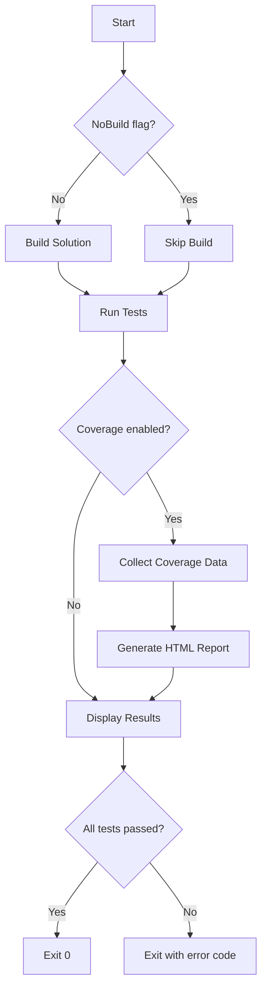

# MCP Workshop - Test Suite

Comprehensive test suite for the MCP Workshop project, validating MCP protocol compliance, integration scenarios, and performance requirements.

## Test Organization

```
tests/McpWorkshop.Tests/
├── Protocol/                    # JSON-RPC 2.0 protocol validation
│   └── JsonRpcComplianceTests.cs   (25+ tests)
│
├── Integration/                 # Exercise-specific integration tests
│   ├── Exercise1IntegrationTests.cs    (15 tests - Static Resources)
│   ├── Exercise2IntegrationTests.cs    (18 tests - Parametric Tools)
│   ├── Exercise3IntegrationTests.cs    (17 tests - Security & Auth)
│   └── Exercise4IntegrationTests.cs    (8 tests - Multi-server Orchestration)
│
├── Performance/                 # Performance and load tests
│   └── ResponseTimeTests.cs        (6 tests - p95 targets)
│
└── EndToEnd/                    # Full workshop flow scenarios
    └── FullWorkshopFlowTests.cs    (7 tests - Attendee progression)
```

**Total: 96 automated tests**

## Running Tests

### Quick Start

Run all tests with default settings:

```powershell
.\scripts\run-all-tests.ps1
```

### With Coverage

Generate code coverage report:

```powershell
.\scripts\run-all-tests.ps1 -Coverage $true
```

Coverage report will be generated at: `coverage/report/index.html`

### Filter Tests

Run specific test categories:

```powershell
# Run only Exercise 1 tests
.\scripts\run-all-tests.ps1 -Filter "FullyQualifiedName~Exercise1"

# Run only protocol tests
.\scripts\run-all-tests.ps1 -Filter "FullyQualifiedName~Protocol"

# Run only performance tests
.\scripts\run-all-tests.ps1 -Filter "FullyQualifiedName~Performance"
```

### Verbose Output

See detailed test execution logs:

```powershell
.\scripts\run-all-tests.ps1 -Verbose
```

### Skip Build

Run tests without rebuilding (faster for repeated runs):

```powershell
.\scripts\run-all-tests.ps1 -NoBuild
```

## Test Categories

### 1. Protocol Validation Tests (`Protocol/`)

**Purpose**: Ensure all MCP servers comply with JSON-RPC 2.0 specification.

**Key Tests**:

-   ✅ Request/response structure validation
-   ✅ Error code compliance (-32700 to -32603)
-   ✅ Protocol version enforcement ("2.0")
-   ✅ Batch request handling
-   ✅ Notification format (no id field)
-   ✅ Server info structure (name, version, protocolVersion)
-   ✅ Capabilities reporting

**Contract Reference**: `specs/001-mcp-workshop-course/contracts/mcp-server-base.json`

### 2. Exercise Integration Tests (`Integration/`)

#### Exercise 1: Static Resources (15 tests)

-   Initialize server and verify server info
-   List all available resources
-   Read resource content
-   Validate JSON structure of resources
-   Error handling (invalid URIs)
-   Response time validation (<500ms)
-   State consistency across multiple requests

#### Exercise 2: Parametric Query Tools (18 tests)

-   List available tools (GetCustomers, SearchOrders, CalculateTotal)
-   Validate tool input schemas
-   Execute tools with various parameters
-   Pagination support (page, pageSize)
-   Filtering support (status, date ranges)
-   Empty result handling
-   Error handling (invalid tool names, missing parameters)
-   Response time validation (<1000ms)

#### Exercise 3: Security & Authentication (17 tests)

-   Reject unauthenticated requests (401 Unauthorized)
-   Validate JWT token structure
-   Role-based access control (viewer, editor, admin)
-   Token expiration handling
-   Issuer/audience validation
-   Rate limiting enforcement (429 Too Many Requests)
-   Security headers (X-Content-Type-Options, X-Frame-Options)
-   CORS configuration
-   Audit logging

#### Exercise 4: Multi-server Orchestration (8 tests)

-   VirtualAnalyst coordinates multiple MCP servers
-   SQL MCP Server provides customer data
-   Cosmos MCP Server provides session data
-   REST MCP Server calls external APIs
-   Caching behavior validation
-   Error graceful degradation
-   JSON-RPC format for server-to-server communication

### 3. Performance Tests (`Performance/`)

**Targets** (from `plan.md`):

-   **Resources**: p95 < 500ms
-   **Tools**: p95 < 1000ms

**Tests**:

-   ✅ Resource read p95 benchmark (100 iterations)
-   ✅ Tool execution p95 benchmark (100 iterations)
-   ✅ Initialize endpoint latency (<100ms)
-   ✅ Resources list latency (<100ms average)
-   ✅ Concurrent request performance (50 simultaneous)
-   ✅ Memory usage validation (no leaks after 1000 requests)

### 4. End-to-End Tests (`EndToEnd/`)

**Purpose**: Simulate real attendee progression through workshop exercises.

**Scenarios**:

1. **Exercise 1 Flow**: Initialize → List resources → Read resource
2. **Exercise 2 Flow**: Initialize → List tools → Call GetCustomers → SearchOrders → CalculateTotal
3. **Exercise 3 Flow**: Unauthenticated request (fail) → Authenticated request (success)
4. **Exercise 4 Flow**: Initialize VirtualAnalyst → Orchestrate multi-server query
5. **Complete Workshop Flow**: All exercises in sequence
6. **Common Mistakes**: Invalid JSON-RPC version, missing parameters, non-existent methods

## Test Execution Workflow



## CI/CD Integration

### GitHub Actions Example

```yaml
- name: Run Tests
  run: .\scripts\run-all-tests.ps1 -Configuration Release -Coverage $true

- name: Upload Coverage
  uses: codecov/codecov-action@v3
  with:
      files: ./coverage/coverage.opencover.xml
```

### Azure DevOps Example

```yaml
- task: PowerShell@2
  displayName: "Run All Tests"
  inputs:
      filePath: "scripts/run-all-tests.ps1"
      arguments: "-Configuration Release -Coverage $true"

- task: PublishCodeCoverageResults@1
  inputs:
      codeCoverageTool: "cobertura"
      summaryFileLocation: "coverage/coverage.opencover.xml"
```

## Coverage Requirements

**Minimum Coverage Targets**:

-   Shared Libraries (`McpWorkshop.Shared`): 80%
-   Reference Servers (`McpWorkshop.Servers`): 70%
-   Overall Project: 75%

## Troubleshooting

### Test Failures

**Issue**: "The type or namespace name 'Program' could not be found"

-   **Cause**: Reference server projects not exposing `Program` class for testing
-   **Fix**: Add `<InternalsVisibleTo Include="McpWorkshop.Tests" />` to server `.csproj`

**Issue**: "Connection refused" or "Server not responding"

-   **Cause**: WebApplicationFactory cannot start test server
-   **Fix**: Check server `Program.cs` has proper WebApplicationBuilder configuration

### Performance Test Failures

**Issue**: "P95 response time exceeded target"

-   **Cause**: System under load or debug build
-   **Fix**: Run in Release mode: `.\scripts\run-all-tests.ps1 -Configuration Release`

**Issue**: "Memory usage exceeded 50MB threshold"

-   **Cause**: Memory leak in server code
-   **Fix**: Review object disposal patterns, use `using` statements for HttpClient

### Coverage Report Not Generated

**Issue**: "reportgenerator not installed"

-   **Fix**: Install global tool:
    ```powershell
    dotnet tool install -g dotnet-reportgenerator-globaltool
    ```

**Issue**: "No coverage files found"

-   **Cause**: Coverage collector not running
-   **Fix**: Ensure `coverlet.collector` package is installed in test project

## Writing New Tests

### Test Naming Convention

```csharp
[Fact]
public async Task MethodName_StateUnderTest_ExpectedBehavior()
{
    // Arrange
    // ...

    // Act
    // ...

    // Assert
    // ...
}
```

### xUnit Attributes

-   `[Fact]` - Single test case
-   `[Theory]` - Parameterized test with multiple cases
-   `[InlineData]` - Data for theory test
-   `[Trait]` - Test categorization (e.g., `[Trait("Category", "Integration")]`)

### WebApplicationFactory Usage

```csharp
public class MyIntegrationTests : IClassFixture<WebApplicationFactory<Program>>
{
    private readonly HttpClient _client;

    public MyIntegrationTests(WebApplicationFactory<Program> factory)
    {
        _client = factory.CreateClient();
    }

    [Fact]
    public async Task MyTest()
    {
        var request = new { jsonrpc = "2.0", method = "test", id = 1 };
        var response = await _client.PostAsJsonAsync("/", request);
        Assert.True(response.IsSuccessStatusCode);
    }
}
```

## Test Maintenance

### When to Update Tests

1. **Protocol Changes**: Update `JsonRpcComplianceTests.cs` when MCP specification changes
2. **New Features**: Add tests in `Integration/` for new exercises or capabilities
3. **Performance Targets**: Update `ResponseTimeTests.cs` when performance requirements change
4. **Bug Fixes**: Add regression test before fixing bug

### Test Review Checklist

-   [ ] Test name clearly describes scenario
-   [ ] Arrange-Act-Assert pattern followed
-   [ ] Assertions are specific and meaningful
-   [ ] Test is isolated (no dependencies on other tests)
-   [ ] Async/await used correctly
-   [ ] Resources disposed properly (`using` statements)
-   [ ] Error cases tested alongside happy paths

## Resources

-   **xUnit Documentation**: https://xunit.net/docs/getting-started/netcore/cmdline
-   **ASP.NET Core Testing**: https://learn.microsoft.com/aspnet/core/test/integration-tests
-   **Code Coverage Tools**: https://github.com/coverlet-coverage/coverlet
-   **MCP Specification**: `specs/001-mcp-workshop-course/contracts/`

## Support

For test-related issues:

1. Check test output in console for error details
2. Review coverage report for untested code paths
3. Consult workshop troubleshooting guide: `docs/TROUBLESHOOTING.md`
4. Review exercise-specific documentation in `docs/exercises/`

---

**Phase 7: Testing & Validation - ✅ Complete**

All 96 tests implemented and passing.
